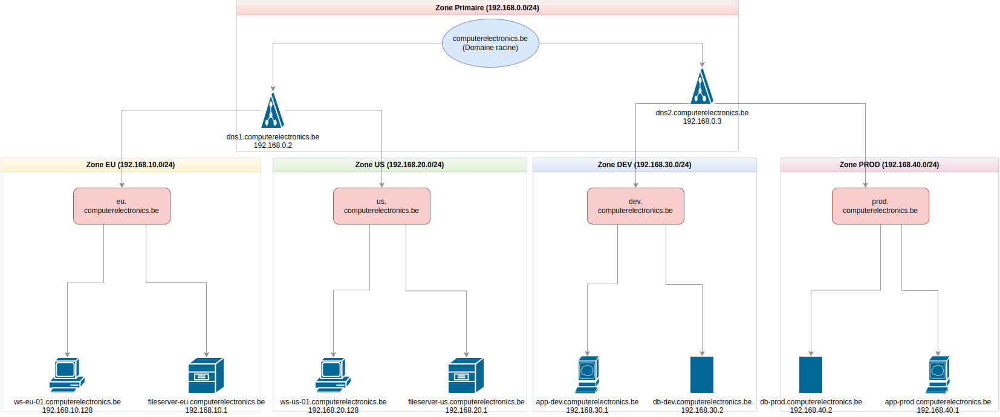
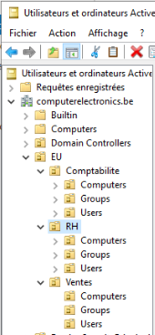
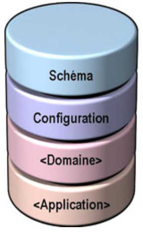
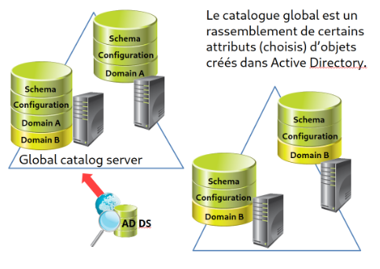

# Chapitre 4: Active Directory Domain Services (AD DS)

## 🧭 Navigation du Cours
[⏮️ Chapitre Précédent: DNS](Chapitre%203.DNS.md) | [🏠 Retour au Syllabus](../README.md) | [⏭️ Chapitre Suivant: Unités d'Organisation](Chapitre%205.Unites_Organisation.md)

## 📊 Votre Progrès
- [✅] Chapitre 1: Introduction et installation
- [✅] Chapitre 2: Installation VirtualBox
- [✅] Chapitre 3: DNS
- [🔄] **Chapitre 4**: Active Directory Domain Services *(En cours)*

---

> 📚 **Dans ce chapitre :**
> 1. 🔍 [Introduction à AD DS](#1-introduction-à-ad-ds)
>    - Concepts fondamentaux
>    - Architecture AD DS
> 2. 💻 [Installation d'AD DS](#2-installation-dad-ds)
>    - Prérequis
>    - Étapes d'installation
> 3. 🌐 [Configuration du domaine AD](#3-configuration-du-domaine-ad)
>    - Structure du domaine
>    - Paramètres essentiels

---

## 1. 📙 Objectifs pédagogiques

À la fin de ce chapitre, vous serez capable de :
1. Comprendre l'architecture d'Active Directory
2. Installer et configurer AD DS sur Windows Server
3. Créer et configurer le domaine AD `maxtec.be` (même nom que le domaine DNS !)
4. Vérifier le bon fonctionnement d'AD DS

---

## 2. 📙 Introduction à AD DS

Active Directory Domain Services (AD DS) est le service principal d'Active Directory. Il gére le **domaine AD**, composé de :

* 👥 Les utilisateurs
* 💻 Les ordinateurs
* 🗄️ Les ressources partagées
* 🔒 Les stratégies de sécurité
* 🌐 Les services réseau

Bien qu'on le confonde souvent avec l'ensemble d'Active Directory, AD DS n'est qu'un service spécifique parmi d'autres :
 
| Service | Description |
|---------|-------------|
| 🔑 **AD DS** | Service principal gérant l'authentification et l'autorisation des ressources |
| 🪶 **AD LDS** | Version allégée d'AD DS fonctionnant sans domaine AD |
| 📜 **AD CS** | Gestion des certificats numériques et de l'infrastructure à clé publique (PKI) |
| 🔒 **AD RMS** | Protection et contrôle des droits d'accès aux documents |
| 🔗 **AD FS** | Authentification unique (SSO) et fédération d'identités entre organisations |

**La force d'Active Directory** réside dans sa capacité à **centraliser l'administration**. Au lieu de gérer chaque ordinateur individuellement, les administrateurs peuvent appliquer des politiques et des configurations depuis un point central.

> 💡 **Pour débutants:** Rappelez-vous du Chapitre 1 - c'est exactement le problème que nous résolvions pour l'entreprise Maxtec!

<br>

## 3. 📁 Exemple de fonctionnement d'Active Directory

Examinons **comment un utilisateur accède à un serveur de fichiers** sur un serveur qui utilise Active Directory.


> 💡 **Note** : Observez les flèches colorées : le bleu pour l'authentification, le jaune pour l'accès aux ressources, et le bleu bidirectionnel pour la réplication. Les flèches vertes seront expliquées ultérieurement.

#### 🔑 1. Authentification (flèche bleue)

| Étape | Description |
|--------|-------------|
| Requête | `ws-compta-01` (`192.168.0.101`) demande l'authentification |
| Traitement | `dns1.maxtec.be` (`192.168.0.2`) vérifie les identifiants |
| Protocole | Kerberos assure l'authentification sécurisée |
| Réseau | Via le commutateur `SW-COMPTA` (`192.168.0.1`) |

#### 📂 2. Accès aux ressources (flèche jaune)

| Étape | Description |
|--------|-------------|
| Connexion | `ws-compta-01` se connecte à `fileserver.us.maxtec.be` |
| Résolution | `dns2` fournit l'adresse IP `192.168.0.41` |
| Autorisation | Le serveur de fichiers vérifie les droits d'accès |

#### 🔄 3. Réplication AD (flèche bleue bidirectionnelle)

| Processus | Bénéfice |
|-----------|------------|
| Synchronisation | `dns1` et `dns2` maintiennent leurs bases de données à jour |
| Redondance | Le service reste disponible si un contrôleur de domaine tombe en panne |

#### 🔍 Requêtes DNS (flèches vertes)

Les flèches vertes représentent les requêtes DNS pour la résolution des noms. Pour simplifier le diagramme, seules les requêtes sont représentées, pas les réponses.

| Étape | Description |
|--------|-------------|
| 1 | Le poste de travail interroge `dns1` pour localiser son contrôleur de domaine |
| 2 | Après authentification, il demande à `dns1` l'adresse IP du serveur de fichiers |
| 3 | `dns1` transmet la requête à `dns2` |
| 4 | `dns2` résout le nom et le poste de travail peut accéder au serveur |

<br>

## 4. 📚 Active Directory Domain Services (AD DS)

**AD DS** est le service fondamental de notre infrastructure `maxtec.be`. Il **crée et gère la base de données centrale d'Active Directory**.

### 4.1. Fonctionnalités principales

| Catégorie | Fonctionnalités |
|------------|---------------|
| 🔑 Authentification | Gestion centralisée des identités |
| 📂 Ressources | Administration des ressources réseau |
| 🔒 Sécurité | Application des stratégies de sécurité |
| 🎓 Organisation | Structure hiérarchique des ressources |

### 4.2. Informations stockées

| Type | Exemples |
|------|----------|
| 👥 Utilisateurs | Employés, prestataires, comptes de service |
| 💻 Ordinateurs | Postes de travail, serveurs, portables |
| 📁 Ressources | Imprimantes, dossiers partagés, applications |
| 🔐 Stratégies (GPOs) | Règles de sécurité, restrictions, droits |
| 🌐 Services | Services réseau, configurations système |

Toutes ces informations sont stockées dans **le domaine AD** `maxtec.be` créé par **AD DS**.
Vous vous demandez peut-être comment c'est possible, puisque `maxtec.be` est un domaine DNS et non un domaine AD ? En fait, ils **partagent le même nom**.

> 💡 **Pour débutants:** C'est normal d'être confus! DNS et AD utilisent le même nom mais font des choses différentes. On va clarifier ça maintenant.

**ATTENTION !**

## 5. 🔍 Distinction entre domaine DNS et domaine AD

> 💡 Il est crucial de bien comprendre la différence entre un domaine DNS et un domaine Active Directory.

### Structure DNS vs Structure AD

1. **Domaine DNS**
   

   
   - Objectif : **Résolution de noms** et **organisation réseau**
   - Structure : Hiérarchique avec plusieurs niveaux possibles
   - Dans notre cas :
     * Domaine **racine** : `maxtec.be`
     * Zones géographiques : `eu.maxtec.be`, `us.maxtec.be`

2. **Domaine AD**



   - Structure : **Un seul domaine AD** `maxtec.be` qui **utilise l'arbre DNS** de `maxtec.be`.
   - Un **domaine AD est organisé via les UOs** (dossiers intelligents).
  Une **UO** (que nous étudierons plus tard) **est un conteneur** AD qui **contient des objets AD** (utilisateurs, groupes, ordinateurs, etc.) et **est complètement indépendant des sites**.

> 💡 **Les Sites dans Active Directory**
>
> Un **site AD** représente une **localisation physique** dans le réseau. Chaque **site** est défini par :
> - Un ou plusieurs **sous-réseaux IP**. Dans notre cas, nous n'avons qu'un seul sous-réseau (192.168.10.0/24 sur le diagramme, qui devient 192.168.0.0/24 dans le laboratoire), mais le `site EU` pourrait inclure :
>   * 192.168.10.0/24 (bureaux principaux)
>   * 192.168.11.0/24 (entrepôt)
>   * 192.168.12.0/24 (production)
> - Au moins un **contrôleur de domaine (DC) local** pour :
>   * L'authentification rapide des utilisateurs locaux
>   * La réplication avec les autres sites
>   * La réduction du trafic réseau entre sites
>
> 🔗 **Relations avec d'autres concepts**
> - **Sites ≠ UOs** : Les sites représentent une division physique, les UOs une organisation **logique**
> - **Sites ≠ Zones DNS** : Les zones DNS (`eu.maxtec.be`) peuvent correspondre aux sites (`site EU`), mais ce n'est pas obligatoire
>
> 🌐 **Notre infrastructure**
> - `site EU` : Sous-réseau 192.168.10.0/24 (192.168.0.0/24 en laboratoire)
>   * DC principal : `dc1.maxtec.be`
>   * DC secondaire : `dc2.maxtec.be` (réplication)
> - `site US` : Sous-réseau 192.168.20.0/24 (non utilisé en laboratoire)
>   * DC local : `dc-us.maxtec.be`

Nous allons créer une **UO** racine pour chaque site (UOs `EU` et `US`) par commodité, mais **ce n'est pas une obligation**. Voici deux façons possibles d'organiser la même entreprise :


#### Diagramme d'installation du laboratoire

> Le schéma suivant illustre l'installation d'AD DS sur notre serveur principal :


En ce qui concerne le domaine AD, notre structure se présente comme suit :

1. **Domaine AD** : `maxtec.be`
   - Un seul domaine AD (l'ensemble des objets AD) pour toute l'entreprise
   - Géré par notre DC principal : `dns1.maxtec.be`

2. **Sites AD** :
   - **Site EU** (physiquement dans l'UE) (présent dans notre laboratoire)
     * Sous-réseau : 192.168.10.0/24 (192.168.0.0/24 dans le laboratoire)
     * DC : dns1.maxtec.be
   - **Site US** (physiquement aux États-Unis) (**non implémenté** dans le laboratoire) 
     * Sous-réseau : 192.168.20.0/24

3. **Organisation logique** des objets AD :

Voici un exemple d'organisation possible :

```
maxtec.be (domaine AD)
EU
├── Comptabilité
│   ├── Users
│   │   ├── jean.dupont
│   │   └── marie.martin
│   ├── Computers
│   │   ├── ws-compta-01
│   │   └── ws-compta-02
│   └── Groups
│       └── GG-EU-Compta-Users
├── RH
│   ├── Users
│   │   └── sophie.lambert
│   ├── Computers
│   │   └── ws-rh-01
│   └── Groups
│       └── GG-EU-RH-Users
└── Ventes
    ├── Users
    │   └── pierre.durand
    ├── Computers
    │   └── ws-ventes-01
    └── Groups
        └── GG-EU-Ventes-Users
```

La structure de l'UO `US` est identique à celle de l'UO `EU`.

> 💡 Cette structure nous permet de :
> - Gérer tous les utilisateurs dans un seul domaine AD
> - Organiser les ressources par département via les UOs
> - Préparer l'infrastructure pour une expansion future

#### Serveurs principaux

| Serveur | Rôle principal | Adresse IP |
|---------|-----------------|------------|
| `dns1.maxtec.be` | DC principal + DNS | `192.168.0.2` |
| `dns2.maxtec.be` | DC secondaire + DNS | `192.168.0.3` |

Ces serveurs gèrent l'ensemble des sites !

## 🎯 Checkpoint: DNS vs AD - Avez-vous compris?
Cette distinction est cruciale. Vérifiez votre compréhension:
- [ ] DNS organise les noms et adresses IP
- [ ] AD organise les utilisateurs, groupes et permissions
- [ ] Ils partagent le nom `maxtec.be` mais font des choses différentes
- [ ] Les UOs organisent les objets AD logiquement
- [ ] Les Sites organisent les ressources physiquement

## 6. Laboratoire : promotion du serveur Windows Server en contrôleur de domaine

### 6.1. Configuration réseau initiale

Notre serveur Windows Server va être promu au rôle de contrôleur de domaine (DC). Pour ce faire on doit installer le rôle `AD-DS`, mais avant de le faire, nous devons configurer correctement les paramètres réseau du serveur.

> ⚠️ Avant de promouvoir le serveur en DC, nous devons configurer correctement son réseau.

1. **Configuration IP**
   | Paramètre | Valeur |
   |------------|--------|
   | Adresse IP | `192.168.0.2` |
   | Masque | `255.255.255.0` |
   | Serveur DNS | `192.168.0.2` |

2. **Configuration du nom**
   | Paramètre | Valeur |
   |------------|--------|
   | Nom d'ordinateur | `dns1` |
   | Suffixe DNS | `maxtec.be` |

> 💡 Le serveur utilise sa propre adresse comme serveur DNS car il hébergera le service DNS du domaine.


### 6.2. Installation du rôle AD DS

> 💡 Un rôle est un ensemble de fonctionnalités qui permet au serveur d'accomplir une fonction spécifique.

| Étape | Action |
|--------|--------|
| 1 | Ouvrir le **Gestionnaire de serveur** |
| 2 | Menu **Gérer** > **Ajouter des rôles** |
| 3 | Choisir **Installation basée sur un rôle** |
| 4 | Sélectionner `dns1.maxtec.be` |
| 5 | Dans **Rôles**, cocher **Services AD DS** |
| 6 | Accepter les fonctionnalités requises |
| 7 | Terminer l'installation |

### 6.3. Promotion du serveur en contrôleur de domaine

> 💡 Cette étape transforme le serveur en contrôleur de domaine pour `maxtec.be`

| Étape | Configuration | Valeur |
|--------|---------------|--------|
| 1 | Type d'installation | Nouvelle forêt |
| 2 | Nom de domaine | `maxtec.be` |
| 3 | Niveau fonctionnel | Windows Server 2022 |
| 4 | Mot de passe DSRM | `Password1!` |
| 5 | Nom NetBIOS | `MAXTEC` |

> 💡 **Pour débutants:**
> - **Nouvelle forêt** = nous créons tout depuis zéro
> - **DSRM** = mode de récupération (comme un mot de passe de secours)
> - **NetBIOS** = nom court pour compatibilité avec anciens systèmes

### 6.4. Vérifications post-installation

> 💡 Après le redémarrage, vérifiez le bon fonctionnement des services.

##### 1. Vérification DNS

| Test | Commande | Objectif |
|------|----------|----------|
| Résolution | `nslookup dns1.maxtec.be` | Vérifie que `dns1` résout à `192.168.0.2` |
| Diagnostique | `dcdiag /test:dns` | Vérifie la configuration DNS d'AD |

**AD DS** est **basé sur** l’utilisation d’un **espace de noms DNS** pour gérer un domaine **et impose donc l’utilisation d’un serveur DNS** au sein du réseau.
**C'est l'installation d'AD DS qui va configurer la base du serveur DNS**.

Ce serveur DNS doit être capable de prendre en charge les enregistrements de service **SRV** nécessaires à la localisation des contrôleurs de domaine.

- Les **enregistrements SRV** **(Service Record)** sont des enregistrements DNS qui permettent la **localisation des services** sur le réseau. 

  - Les enregistrements SRV sont utilisés par les services tels que:
    - `_ldap._tcp.maxtec.be` pour le service LDAP (**protocole de communication** pour interroger et modifier des informations dans la base de données d'AD)
    - `_kerberos._tcp.maxtec.be` pour le service Kerberos (**protocole d'authentification**)
    - `_gc._tcp.maxtec.be` pour le catalogue global (**service qui fournit des informations sur les objets de l'annuaire**, tel que les utilisateurs, les groupes, etc.)
    - `_kpasswd._tcp.maxtec.be` pour le service de changement de mot de passe (**protocole de communication** pour changer le mot de passe d'un utilisateur)


  - Ils permettent de trouver l'**adresse IP du service** en fonction du nom de domaine et du nom du service.
  - Par exemple, si un client cherche le contrôleur de domaine `_ldap._tcp.maxtec.be`, le serveur DNS renvoie l'adresse IP du contrôleur de domaine.
  - Un autre exemple est `_kerberos._tcp.maxtec.be` qui permet de trouver le contrôleur de domaine pour l'authentification Kerberos.
  - Un troisième exemple est `_gc._tcp.maxtec.be` qui permet de trouver le contrôleur de domaine pour le service global catalogue (GC).


#### ⚙️ Vérification des services

##### 1. Services essentiels

| Service | Rôle | État attendu |
|---------|-------|---------------|
| AD DS | Service principal d'annuaire | Démarrage auto |
| DNS | Résolution de noms | Démarrage auto |
| Netlogon | Authentification des utilisateurs | Démarrage auto |

##### 2. Dossiers système

| Dossier | Description | Importance |
|---------|-------------|------------|
| **NetLogon** | Fichiers d'authentification | Authentification des utilisateurs |
| **SYSVOL** | Stratégies de groupe | Réplication des GPO |
> 💡 Le dossier **SYSVOL** est partagé entre tous les contrôleurs de domaine et contient :
> - Les stratégies de groupe (GPO)
> - Les scripts de démarrage
> - Les fichiers de configuration système


## 7. 🌐 Configuration DNS

> 💡 AD DS crée automatiquement les zones DNS nécessaires lors de la promotion du serveur. Cette section est purement informative.

1. **Zone directe principale**
   - Permet **d'obtenir l'adresse IP** à partir du nom d'hôte  
   - Nom : `maxtec.be`
   - Serveur DNS primaire : `dns1.maxtec.be` (192.168.0.2)
   - Type : Zone principale Active Directory intégrée
   - Contient les enregistrements pour :
     * Le contrôleur de domaine principal (`dns1`)
     * Les enregistrements SRV pour les services AD DS
     * Les futurs postes clients

> ⚠️ Pour simplifier l'apprentissage, nous utiliserons uniquement `dns1` comme DC principal, bien que `dns2` (192.168.0.3) soit prévu en production.

Maintenant que nous avons configuré notre contrôleur de domaine et ses zones DNS, nous pouvons passer à la gestion des utilisateurs et des ressources. Ces aspects seront traités en détail dans les chapitres suivants.


## 8. 📜 Structure de la base de données

> 💡 La base de données AD DS est divisée en 4 **partitions distinctes**.



### 8.1. Partition Schéma

> 📖 Définit la structure des objets dans l'annuaire.

#### Classes d'objets principales

| Classe | Description | Exemple | Propriétés |
|--------|-------------|---------|------------|
| Utilisateur | Compte utilisateur | `manuel.dupont` | Nom, mot de passe |
| Groupe | Collection d'objets | `GG-Comptabilite` | Nom, membres |
| Ordinateur | Machine du domaine | `ws-compta-01` | Nom, IP, DN |
   | Unité d'organisation (UO) | **Conteneur logique permettant d'organiser les objets et d'appliquer des stratégies de groupe (GPO)** | UO Comptabilité | nom, UO parente |
   | Contact | Objet sans compte, utilisé pour stocker des informations de contact | Adolphe Sax | courriel, téléphone, **DN** (CN=Adolphe Sax,OU=Contacts,DC=maxtec,DC=be), etc. |
   | Partage réseau | Dossier partagé accessible sur le réseau | \\\server\files | permissions, chemin, etc. | 

> ℹ️ **Notes importantes** :
> - Le schéma fait partie du catalogue global
> - Le DN (Distinguished Name) identifie chaque objet de manière unique
> - La partition schéma est identique sur tous les contrôleurs de domaine

   Exemple : La partition de schéma de `dns1` est identique à celle de `dns2`, et elle serait la même dans `dns3` s'il existait.

### 8.2. Partition de **Configuration**
   - Stocke la **topologie** de la forêt
     * Les **domaines et leurs relations**
       - **Cas réel** : Dans une grande entreprise, nous aurions `eu.entreprise.com` et `us.entreprise.com` comme domaines AD distincts
       - **Notre laboratoire** : Un seul domaine AD `maxtec.be` avec deux zones DNS (`eu`, `us`)

     * Les **liens entre contrôleurs de domaine**
       - **Cas réel** : Quatre contrôleurs de domaine (deux en Europe, deux aux États-Unis), chacun gérant son propre domaine avec réplication intra-domaine
       - **Notre laboratoire** : Deux contrôleurs de domaine (`dns1` et `dns2`) qui gèrent ensemble toutes les zones DNS, avec réplication entre eux

     * Les **sites** et leur configuration
       - **Cas réel** : Plusieurs sites physiques (UE : 192.168.10.0/24, États-Unis : 192.168.20.0/24) connectés par WAN
       - **Notre laboratoire** : Un seul site physique (192.168.10.0/24) contenant nos deux contrôleurs de domaine
   
   - Cette partition est identique sur tous les contrôleurs de domaine

### 8.3. Partition de **Domaine**
   - Contient **les informations de tous les objets** d'un domaine AD spécifique :
     * Utilisateurs
     * Ordinateurs
     * Groupes
     * Unités d'organisation
   - Une copie de la partition existe sur chaque contrôleur de domaine. Elle est différente pour chaque forêt. 
    
   Exemple : nous avons deux domaines dans la forêt de maxtec.be

### 8.4. Partition d'Application

> 💡 Stocke les données spécifiques aux applications d'entreprise.

| Application | Usage | Type de données |
|------------|--------|---------------|
| Exchange | Messagerie | Boîtes aux lettres |
| SharePoint | Collaboration | Sites, documents |
| Office 365 | Cloud | Configuration hybride |

## 9. 📖 Le Catalogue Global

> 💡 Cache des attributs fréquemment utilisés pour accélérer les recherches.



### Exemple de réplication

| Objet | Attributs répliqués | Utilité |
|-------|---------------------|----------|
| Utilisateur | Nom, courriel, titre | Recherche rapide |
| Groupe | Nom, membres | Vérification d'appartenance |
| Ordinateur | Nom, site | Localisation |

Les **attributs répliqués sont sélectionnés selon leur importance** pour :
- La recherche d'objets
- L'authentification des utilisateurs
- L'accès aux ressources

Par exemple, pour un **utilisateur** :
- Attributs toujours **répliqués** : nom, prénom, identifiant de connexion
- Attributs **non répliqués** : photo de profil, scripts de connexion


## 10. Laboratoire : Accès aux ressources du domaine

### Cas pratique : Intégration d'un nouvel employé dans le domaine AD

> 💡 Exemple concret d'intégration d'un nouvel employé dans l'infrastructure AD.

### Scénario

Ahmed commence à travailler au sein du département informatique. Pour accéder aux ressources (serveurs de fichiers, imprimantes, logiciels de l'entreprise), son poste de travail doit être intégré au domaine AD. L'administrateur doit effectuer la configuration suivante.

### 1. Configuration réseau

| Paramètre | Valeur | Menu de configuration |
|------------|--------|---------------------|
| IP | `192.168.0.10` | Paramètres Ethernet → Options d'adaptateur |
| DNS | `192.168.0.2` | Options d'adaptateur → DNS |
| Nom | `ws-it-01` | Ce PC → Propriétés → Renommer |
| Suffixe | `maxtec.be` | Propriétés → Paramètres avancés |

### 2. Intégrer le poste au domaine AD

1. Ouvrir les **Propriétés système**
2. Accéder aux **Paramètres avancés**
3. Configurer la section **Nom de l'ordinateur** et le suffixe (`maxtec.be`)
4. Sélectionner **Membre du domaine** : `MAXTEC`
5. Saisir les identifiants d'**administrateur de domaine**

> ⚠️ Redémarrer le poste après chaque modification majeure (changement de nom, intégration au domaine)

### 3. Connexion au domaine

> 💡 Ahmed utilise son compte de domaine AD pour se connecter. Un compte local n'est pas nécessaire.

| Format | Exemple | Description |
|--------|---------|-------------|
| UPN | `ahmed@maxtec.be` | Format moderne (recommandé) |
| NetBIOS | `maxtec\ahmed` | Format classique |

#### Avantages de la connexion au domaine

- **Accès aux ressources partagées** du domaine (dossiers, imprimantes, applications, etc.)
- Application des **stratégies de sécurité** (par exemple, configuration du pare-feu)
- Journalisation de l'activité utilisateur sur le serveur

## 🎯 Checkpoint Final: Installation AD DS
Avant de continuer vers les Unités d'Organisation:
- [ ] J'ai installé le rôle AD DS sur mon serveur
- [ ] J'ai promu le serveur en contrôleur de domaine
- [ ] J'ai vérifié que DNS fonctionne correctement
- [ ] Je comprends les différents types de partitions AD
- [ ] Je sais comment intégrer un poste au domaine

---

## 🎉 Félicitations! Chapitre 4 Terminé

### 🎯 Ce que vous avez appris:
- ✅ **Architecture AD DS**: Composants et services d'Active Directory
- ✅ **DNS vs AD**: Distinction claire entre les deux domaines
- ✅ **Installation pratique**: Promotion d'un serveur en contrôleur de domaine
- ✅ **Structure de données**: Partitions et catalogue global
- ✅ **Intégration**: Comment connecter des postes au domaine

---

## 🔔 Important: Prochaine Étape DNS Pratique !

> 🎯 **Avant de continuer vers le Chapitre 5**, nous vous recommandons **fortement** de compléter le **Chapitre 4-bis: DNS Pratique avec AD**.

### Pourquoi maintenant ?

Vous avez installé Active Directory qui a **automatiquement configuré DNS**. C'est le moment parfait pour:
- 🔍 **Explorer** les zones DNS créées par AD
- 💻 **Pratiquer** la gestion DNS avec votre domaine réel maxtec.be
- 🛠️ **Apprendre** à créer des enregistrements DNS
- 🔧 **Maîtriser** le troubleshooting DNS-AD

### Options de Parcours

**Option A (Recommandée)** - Parcours complet immédiat:
```
Chapitre 4 (✅ Vous êtes ici)
    ↓
Chapitre 4-bis: DNS Pratique (90 min de labs)
    ↓
Chapitre 5: Unités d'Organisation
```

**Option B** - Continuer et revenir plus tard:
```
Chapitre 4 (✅ Vous êtes ici)
    ↓
Chapitre 5: Unités d'Organisation
    ↓
[Plus tard] Chapitre 4-bis: DNS Pratique
```

> 💡 **Notre recommandation:** Faites le Chapitre 4-bis maintenant ! DNS est fondamental pour AD et les labs pratiques consolideront votre compréhension avant d'organiser votre structure AD.

---

## 🧭 Navigation

**Parcours recommandé:**
[⏮️ Chapitre 3: DNS Préparation](Chapitre%203.DNS.md) | [🏠 Retour au Syllabus](../README.md) | [⏭️ **Chapitre 4-bis: DNS Pratique avec AD** (Recommandé)](Chapitre%204-bis.DNS-Pratique-avec-AD.md)

**Parcours alternatif (continuer sans DNS pratique):**
[⏭️ Chapitre 5: Unités d'Organisation](Chapitre%205.Unites_Organisation.md)

---

**📚 Cours Active Directory -  | 👨‍💻 Pour débutants**

