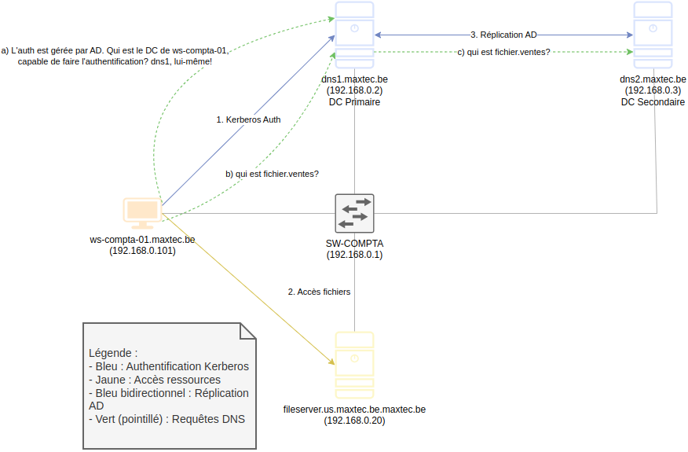
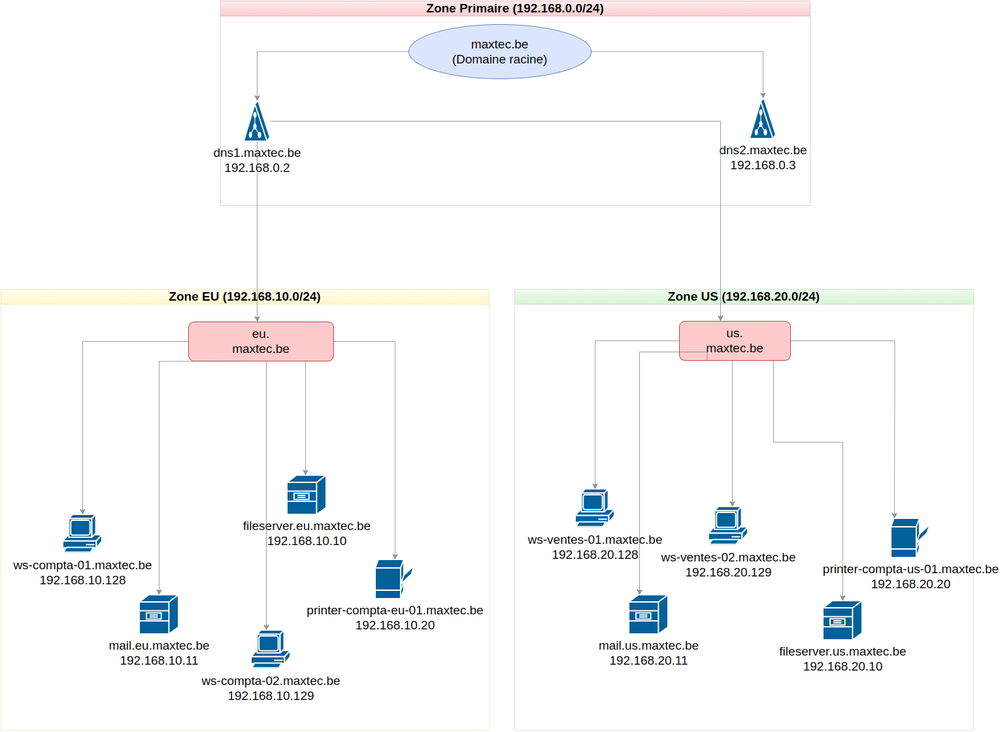
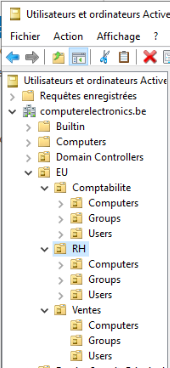
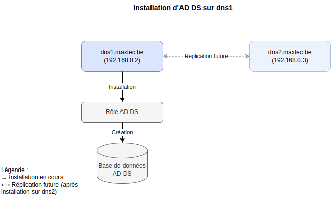
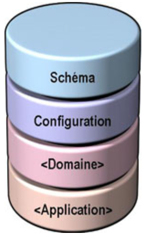
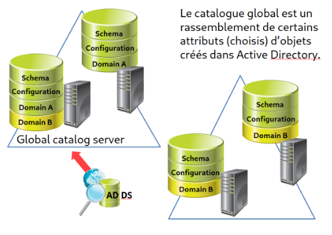

# Chapitre 4: Active Directory Domain Services (AD DS)

## Navigation du cours
[Chapitre précédent : DNS](Chapitre%203.DNS.md) | [Retour au Syllabus](index.md) | [Chapitre suivant : DNS Pratique avec AD](Chapitre%205.DNS-Pratique-avec-AD.md)

!!! abstract "Objectifs"
    À la fin de ce chapitre, vous savez :

    - distinguer domaine DNS, domaine AD, site et unité d'organisation ;
    - promouvoir `dns1` en premier contrôleur de domaine de la forêt `maxtec.be`, et vérifier avec `dcdiag /test:dns` et `nslookup -type=SRV` que le DNS du domaine répond ;
    - identifier le détenteur des rôles FSMO (`netdom query fsmo`) et contrôler la source d'heure (`w32tm /query /status`) ;
    - joindre `ws-IT-01` au domaine et le déplacer dans son OU.


## 1. Introduction à AD DS

Active Directory Domain Services (AD DS) est le service principal d'Active Directory. Il gère le **domaine AD**, composé de :

* Les utilisateurs
* Les ordinateurs
* Les ressources partagées
* Les stratégies de sécurité
* Les services réseau

On le confond souvent avec l'ensemble d'Active Directory, mais AD DS n'est qu'un service parmi d'autres :

| Service | Description |
|---------|-------------|
| **AD DS** | Service principal gérant l'authentification et l'autorisation des ressources |
| **AD LDS** | Version allégée d'AD DS fonctionnant sans domaine AD |
| **AD CS** | Gestion des certificats numériques et de l'infrastructure à clé publique (PKI) |
| **AD RMS** | Protection et contrôle des droits d'accès aux documents |
| **AD FS** | Authentification unique (SSO) et fédération d'identités entre organisations |

**La force d'Active Directory** est de **centraliser l'administration** : au lieu de gérer chaque ordinateur individuellement, les administrateurs appliquent des politiques et des configurations depuis un point central. C'est la réponse au problème posé au Chapitre 1 pour Maxtec.

<br>

## 2. Exemple de fonctionnement d'Active Directory

Examinons **comment un utilisateur accède à un serveur de fichiers** dans un réseau qui utilise Active Directory.



> **Note** : les flèches bleues représentent l'authentification, les jaunes l'accès aux ressources, la bleue bidirectionnelle la réplication. Les flèches vertes (DNS) sont expliquées plus bas. Le schéma montre l'infrastructure complète de Maxtec ; le lab n'en utilise qu'une partie (un seul DC, `dns1`).

#### 1. Authentification (flèche bleue)

| Étape | Description |
|--------|-------------|
| Requête | `ws-compta-01` (`192.168.0.101`) demande l'authentification |
| Traitement | `dns1.maxtec.be` (`192.168.0.2`) vérifie les identifiants |
| Protocole | Kerberos assure l'authentification sécurisée |
| Réseau | Via le commutateur `SW-COMPTA` (`192.168.0.1`) |

#### 2. Accès aux ressources (flèche jaune)

| Étape | Description |
|--------|-------------|
| Connexion | `ws-compta-01` se connecte à `fileserver.us.maxtec.be` |
| Résolution | `dns2` fournit l'adresse IP `192.168.0.41` |
| Autorisation | Le serveur de fichiers vérifie les droits d'accès |

#### 3. Réplication AD (flèche bleue bidirectionnelle)

| Processus | Bénéfice |
|-----------|------------|
| Synchronisation | `dns1` et `dns2` maintiennent leurs bases de données à jour |
| Redondance | Le service reste disponible si un contrôleur de domaine tombe en panne |

#### Requêtes DNS (flèches vertes)

Seules les requêtes sont représentées, pas les réponses.

| Étape | Description |
|--------|-------------|
| 1 | Le poste de travail interroge `dns1` pour localiser son contrôleur de domaine |
| 2 | Après authentification, il demande à `dns1` l'adresse IP du serveur de fichiers |
| 3 | `dns1` transmet la requête à `dns2` |
| 4 | `dns2` résout le nom et le poste de travail peut accéder au serveur |

<br>

## 3. Active Directory Domain Services (AD DS)

**AD DS** est le service fondamental de notre infrastructure `maxtec.be`. Il **crée et gère la base de données centrale d'Active Directory**.

### 3.1. Fonctionnalités principales

| Catégorie | Fonctionnalités |
|------------|---------------|
| Authentification | Gestion centralisée des identités |
| Ressources | Administration des ressources réseau |
| Sécurité | Application des stratégies de sécurité |
| Organisation | Structure hiérarchique des ressources |

### 3.2. Informations stockées

| Type | Exemples |
|------|----------|
| Utilisateurs | Employés, prestataires, comptes de service |
| Ordinateurs | Postes de travail, serveurs, portables |
| Ressources | Imprimantes, dossiers partagés publiés |
| Stratégies (GPO) | Règles de sécurité, restrictions, droits |
| Services | Emplacement des services, configuration de la topologie |

Toutes ces informations sont stockées dans **le domaine AD** `maxtec.be` créé par **AD DS**.
Mais `maxtec.be` est aussi un domaine DNS. Comment est-ce possible ? Les deux **partagent le même nom**, mais ce sont deux choses différentes.

## 4. Distinction entre domaine DNS et domaine AD

Cette distinction est la source de confusion la plus fréquente du cours.

### Structure DNS vs Structure AD

1. **Domaine DNS**

    

    - Objectif : **résolution de noms** et **organisation réseau**
    - Structure : hiérarchique, avec plusieurs niveaux possibles
    - Dans notre cas :
        * Domaine **racine** : `maxtec.be`
        * Sous-domaines géographiques : `eu.maxtec.be`, `us.maxtec.be`

2. **Domaine AD**

    

    - Structure : **un seul domaine AD** `maxtec.be`, qui **utilise l'espace de noms DNS** `maxtec.be`.
    - Un domaine AD est **organisé en UOs** (unités d'organisation). Une **UO** (Chapitre 6) **est un conteneur** AD qui **contient des objets AD** (utilisateurs, groupes, ordinateurs, etc.) et **est indépendante des sites**.

!!! tip "Les sites dans Active Directory"

    Un **site AD** représente une **localisation physique** du réseau, reliée aux autres par des liens plus lents (WAN). Un site est défini par :

    - **Un ou plusieurs sous-réseaux IP** : le lab n'a qu'un sous-réseau (`192.168.10.0/24` sur le diagramme, `192.168.0.0/24` dans le lab), mais le site `EU` pourrait inclure :
        - `192.168.10.0/24` (bureaux principaux)
        - `192.168.11.0/24` (entrepôt)
        - `192.168.12.0/24` (production)

    Un site **n'a pas besoin de son propre contrôleur de domaine**. Sans DC local, ses postes s'authentifient auprès d'un DC d'un autre site. On place un DC dans un site quand le lien WAN est lent ou peu fiable, ou quand le site a beaucoup d'utilisateurs. Les sites servent à :

    - diriger les postes vers le DC le plus proche ;
    - planifier la réplication entre sites pour limiter le trafic WAN.

!!! info "Relations avec d'autres concepts"

    - **Sites ≠ UOs** : les sites représentent une division **physique**, les UOs une organisation **logique**
    - **Sites ≠ Zones DNS** : les zones DNS (`eu.maxtec.be`) peuvent correspondre aux sites (`site EU`), mais ce n'est pas obligatoire

!!! example "Notre infrastructure"

    **Site EU** : sous-réseau `192.168.10.0/24` (`192.168.0.0/24` en laboratoire)

    - DC principal : `dns1.maxtec.be`
    - DC secondaire : `dns2.maxtec.be` (réplication, non installé dans le lab)

    **Site US** : sous-réseau `192.168.20.0/24` (non utilisé en laboratoire)

    - Un DC local est possible mais pas obligatoire

Nous créons une **UO** racine `EU` par commodité (une UO `US` suivrait le même modèle), mais **ce n'est pas une obligation** : les UOs ne sont pas liées aux sites.


## 5. Diagramme d'installation du laboratoire

Le schéma suivant illustre l'installation d'AD DS sur notre serveur principal :



Côté AD, notre structure se présente ainsi :

1. **Domaine AD** : `maxtec.be`
    - Un seul domaine AD pour toute l'entreprise
    - Géré par notre DC : `dns1.maxtec.be`

2. **Sites AD** :
    - **Site EU** (présent dans le lab)
        * Sous-réseau : `192.168.10.0/24` (`192.168.0.0/24` dans le lab)
        * DC : `dns1.maxtec.be`
    - **Site US** (**non implémenté** dans le lab)
        * Sous-réseau : `192.168.20.0/24`

3. **Organisation logique** des objets AD, telle que créée par le script du lab ([`creation_structure.ps1`](Labo%20et%20Exercices/Labo/PowerShell-scriptsStructure/creation_structure.md)) :

```
maxtec.be (domaine AD)
└── EU
    ├── Ventes
    │   ├── Users       vanessa, valeria, victor, valentin
    │   ├── Computers
    │   └── Groups      GG-EU-Ventes-Users, GG-EU-Ventes-Admin
    ├── RH
    │   ├── Users       richard, rebecca, rene
    │   ├── Computers   ws-RH-01
    │   └── Groups      GG-EU-RH-Users, GG-EU-RH-Admin
    ├── Comptabilite
    │   ├── Users       charlotte, cindy, charles
    │   ├── Computers
    │   └── Groups      GG-EU-Compta-Users, GG-EU-Compta-Admin
    └── IT
        ├── Users       irene, ivan, ines
        ├── Computers   ws-IT-01
        └── Groups      GG-EU-IT-Users, GG-EU-IT-Admin
```

Cette structure permet de :

- gérer tous les utilisateurs dans un seul domaine AD ;
- organiser les ressources par département via les UOs ;
- préparer une expansion future (une UO `US` avec le même modèle).

Le détail complet (utilisateurs, groupes, partages) est dans la [Référence du lab Maxtec](Labo%20et%20Exercices/Labo/Reference_Lab_Maxtec.md).

#### Serveurs principaux

| Serveur | Rôle principal | Adresse IP |
|---------|-----------------|------------|
| `dns1.maxtec.be` | DC + DNS | `192.168.0.2` |
| `dns2.maxtec.be` | DC secondaire + DNS (production uniquement, pas dans le lab) | `192.168.0.3` |

## Checkpoint : DNS vs AD

!!! info "Vérification de compréhension"

    - [ ] DNS organise les noms et adresses IP
    - [ ] AD organise les utilisateurs, groupes et permissions
    - [ ] Ils partagent le nom `maxtec.be` mais font des choses différentes
    - [ ] Les UOs organisent les objets AD logiquement
    - [ ] Les sites décrivent la topologie physique du réseau

## 6. Laboratoire : promotion du serveur Windows Server en contrôleur de domaine

!!! tip "Guide rapide"

    Vous préférez un guide pas à pas sans la théorie ? Toutes les étapes pratiques (nom du serveur, IP, rôle AD DS, promotion en DC et intégration du poste client) sont regroupées ici :
    **[Guide rapide - Installation AD-DS](Labo%20Annexe%201-Guide%20de%20base%20installation%20AD-DS.md)**

### 6.1. Configuration réseau initiale

Le serveur va être promu contrôleur de domaine (DC). Il faut d'abord installer le rôle `AD-DS`, et avant cela, vérifier son nom et son réseau (déjà faits au Chapitre 1 ou 2).

1. **Configuration IP** (une seule carte réseau, réseau interne)

    | Paramètre | Valeur |
    |------------|--------|
    | Adresse IP | `192.168.0.2` |
    | Masque | `255.255.255.0` |
    | Serveur DNS | `192.168.0.2` |

2. **Configuration du nom**

    | Paramètre | Valeur |
    |------------|--------|
    | Nom d'ordinateur | `dns1` |
    | Suffixe DNS | `maxtec.be` |

Le serveur utilise sa propre adresse comme serveur DNS car il hébergera le DNS du domaine. Renommez le serveur **avant** la promotion : renommer un DC ensuite est une procédure à part.


### 6.2. Installation du rôle AD DS

Un rôle est un ensemble de fonctionnalités qui permet au serveur d'accomplir une fonction spécifique.

| Étape | Action |
|--------|--------|
| 1 | Ouvrir le **Gestionnaire de serveur** |
| 2 | Menu **Gérer** > **Ajouter des rôles et fonctionnalités** |
| 3 | Choisir **Installation basée sur un rôle** |
| 4 | Sélectionner `dns1.maxtec.be` |
| 5 | Dans **Rôles**, cocher **Services AD DS** |
| 6 | Accepter les fonctionnalités requises |
| 7 | Terminer l'installation |

### 6.3. Promotion du serveur en contrôleur de domaine

Cette étape transforme le serveur en contrôleur de domaine pour `maxtec.be` (drapeau jaune du Gestionnaire de serveur → **Promouvoir ce serveur en contrôleur de domaine**).

| Étape | Configuration | Valeur |
|--------|---------------|--------|
| 1 | Type d'installation | Ajouter une nouvelle forêt |
| 2 | Nom de domaine racine | `maxtec.be` |
| 3 | Niveau fonctionnel de la forêt et du domaine | **Windows Server 2016** (c'est le niveau maximal avec un DC 2022 : il n'existe pas de niveau « 2022 ») |
| 4 | Serveur DNS / Catalogue global | Cochés (par défaut) |
| 5 | Mot de passe DSRM | `Password1!` |
| 6 | Nom NetBIOS | `MAXTEC` |

- **Nouvelle forêt** : nous créons tout depuis zéro ; `maxtec.be` sera le premier domaine de la forêt.
- **DSRM** (Directory Services Restore Mode) : mot de passe du mode de restauration de l'annuaire, utilisé pour réparer un DC qui ne démarre plus normalement.
- **NetBIOS** : nom court (`MAXTEC\ivan`), gardé pour la compatibilité.
- L'avertissement « Impossible de créer une délégation pour ce serveur DNS » est attendu (voir [Chapitre 3](Chapitre%203.DNS.md)).

!!! warning "Mot de passe de lab"
    `Password1!` pour le DSRM est acceptable dans un lab isolé. En production, c'est un mot de passe fort, unique par DC et conservé dans un coffre.

### 6.4. Vérifications post-installation

Après le redémarrage, connectez-vous en `MAXTEC\Administrateur` et vérifiez.

##### 1. Vérification DNS

| Test | Commande | Objectif |
|------|----------|----------|
| Résolution | `nslookup dns1.maxtec.be` | `dns1` résout en `192.168.0.2` |
| Localisation du DC | `nslookup -type=SRV _ldap._tcp.dc._msdcs.maxtec.be` | L'enregistrement SRV pointe vers `dns1.maxtec.be` |
| Diagnostic | `dcdiag /test:dns` | Vérifie la configuration DNS d'AD |

**AD DS** repose sur un **espace de noms DNS** et **impose donc un serveur DNS** sur le réseau. **C'est la promotion qui installe et configure la base du serveur DNS.**

Ce serveur DNS doit prendre en charge les enregistrements **SRV** (Service Record), qui permettent de **localiser un service** (quel serveur, quel port) à partir d'un nom :

| Enregistrement | Service |
|----------------|---------|
| `_ldap._tcp.dc._msdcs.maxtec.be` | Les contrôleurs de domaine de `maxtec.be` (celui que cherche un poste qui veut joindre le domaine) |
| `_kerberos._tcp.maxtec.be` | Authentification **Kerberos** |
| `_gc._tcp.maxtec.be` | Catalogue global |
| `_kpasswd._tcp.maxtec.be` | Changement de mot de passe |

Le détail et les commandes de vérification sont au [Chapitre 3 §4](Chapitre%203.DNS.md#4-les-enregistrements-srv-dun-controleur-de-domaine).


#### Vérification des services

##### 1. Services essentiels

| Service | Rôle | État attendu |
|---------|-------|---------------|
| AD DS (`NTDS`) | Service d'annuaire | Démarrage auto |
| DNS | Résolution de noms | Démarrage auto |
| Netlogon | Localisation du DC, enregistrements SRV, canal sécurisé | Démarrage auto |

Pour le vérifier : Win+R → `services.msc` (ou Gestionnaire de serveur → **Outils** → **Services**). Repérez **Services de domaine Active Directory**, **Serveur DNS** et **Netlogon** : colonne **État** = « En cours d'exécution », colonne **Type de démarrage** = « Automatique ».

**En PowerShell** (aperçu, vu au chapitre 9) :

```powershell
Get-Service NTDS, DNS, Netlogon
```

##### 2. Dossiers partagés système

| Partage | Contenu | Rôle |
|---------|-------------|------------|
| **SYSVOL** | Stratégies de groupe (GPO) et scripts | Répliqué entre tous les DC du domaine |
| **NETLOGON** | Scripts d'ouverture de session (sous-dossier `scripts` de SYSVOL) | Lu par les postes à la connexion |

Pour le vérifier : Gestionnaire de serveur → **Outils** → **Gestion de l'ordinateur** → **Dossiers partagés** → **Partages**, ou en invite de commandes (`SYSVOL` et `NETLOGON` doivent apparaître dans les deux cas) :

```cmd
net share
```


## 7. Configuration DNS

AD DS crée automatiquement les zones DNS nécessaires lors de la promotion. Cette section est informative.

1. **Zone de recherche directe principale**
    - Permet **d'obtenir l'adresse IP** à partir du nom d'hôte
    - Nom : `maxtec.be`
    - Serveur DNS : `dns1.maxtec.be` (`192.168.0.2`)
    - Type : zone principale **intégrée à Active Directory**
    - Contient les enregistrements pour :
        * le contrôleur de domaine (`dns1`)
        * les enregistrements SRV des services AD DS
        * les postes clients, qui s'enregistrent eux-mêmes après la jonction

2. **Zone de recherche inverse** : **non créée** par la promotion. Vous la créerez au [Chapitre 5](Chapitre%205.DNS-Pratique-avec-AD.md).

Nous utilisons uniquement `dns1` comme DC ; en production, un deuxième DC (`dns2`, `192.168.0.3`) serait indispensable.


## 8. Structure de la base de données

La base AD DS (fichier `C:\Windows\NTDS\ntds.dit`) est divisée en **partitions** (ou « contextes de nommage »). Chaque partition a sa propre portée de réplication.



| Partition | Contenu | Répliquée vers |
|-----------|---------|----------------|
| **Schéma** | Définition des classes d'objets et de leurs attributs | Tous les DC de la **forêt** (identique partout) |
| **Configuration** | Topologie : domaines, sites, sous-réseaux, liens entre DC | Tous les DC de la **forêt** (identique partout) |
| **Domaine** | Les objets du domaine : utilisateurs, ordinateurs, groupes, UOs | Tous les DC du **domaine** (différente pour chaque domaine) |
| **Application** | Données d'applications avec une portée choisie ; dans AD, surtout les zones DNS | Les DC choisis (ex. tous les DC DNS du domaine) |

### 8.1. Partition Schéma

Le schéma définit **quels types d'objets existent** et **quels attributs ils peuvent avoir**.

| Classe | Description | Exemple dans le lab | Attributs |
|--------|-------------|---------|------------|
| Utilisateur | Compte utilisateur | `cindy` | nom, mot de passe, `Department` |
| Groupe | Collection d'objets | `GG-EU-Compta-Users` | nom, membres |
| Ordinateur | Machine du domaine | `ws-IT-01` | nom, système d'exploitation, DN |
| Unité d'organisation (UO) | Conteneur logique pour organiser les objets et lier des GPO | UO `Comptabilite` | nom, UO parente |
| Contact | Objet sans compte, pour stocker des coordonnées | Adolphe Sax | courriel, téléphone, DN (`CN=Adolphe Sax,OU=Contacts,DC=maxtec,DC=be`) |

Le DN (Distinguished Name) identifie chaque objet de manière unique par son emplacement, par exemple `CN=Cindy,OU=Users,OU=Comptabilite,OU=EU,DC=maxtec,DC=be`.

### 8.2. Partition de configuration

Elle stocke la **topologie** de la forêt :

- **Les domaines** de la forêt. La pratique actuelle est **un seul domaine**, même pour une entreprise multinationale : les différences géographiques se gèrent avec des **sites** (pour le réseau) et des **UOs** (pour l'administration). Plusieurs domaines ne se justifient que par des contraintes particulières (isolement légal, filiale autonome), et ajoutent de la complexité.
- **Les sites et sous-réseaux** : Maxtec aurait deux sites (EU `192.168.10.0/24`, US `192.168.20.0/24`) reliés par WAN, dans un seul domaine `maxtec.be`. Le lab n'a qu'un site.
- **Les liens de réplication** entre contrôleurs de domaine.

### 8.3. Partition de domaine

Elle contient **tous les objets d'un domaine** : utilisateurs, ordinateurs, groupes, UOs. Chaque DC du domaine en a une copie complète ; elle est **différente pour chaque domaine** de la forêt. Chez Maxtec, il n'y a qu'un domaine, donc une seule partition de domaine.

### 8.4. Partitions d'application

Une partition d'application contient des données dont on choisit la portée de réplication. Dans un domaine AD, les exemples concrets sont les zones DNS intégrées à AD, créées lors de la promotion :

| Partition | Contenu | Répliquée vers |
|-----------|---------|----------------|
| `DomainDnsZones` (`DC=DomainDnsZones,DC=maxtec,DC=be`) | Zone `maxtec.be` | Tous les DC **DNS** du domaine |
| `ForestDnsZones` (`DC=ForestDnsZones,DC=maxtec,DC=be`) | Zone `_msdcs.maxtec.be` | Tous les DC **DNS** de la forêt |

## 9. Catalogue global et rôles FSMO

### 9.1. Le catalogue global



Le **catalogue global** (GC) est un rôle de DC. Un DC catalogue global contient une **réplique partielle de tous les objets de la forêt** : tous les objets de tous les domaines, mais seulement une sélection de leurs attributs (nom, UPN, courriel, appartenance aux groupes universels…). Ce n'est pas un cache : c'est une partition répliquée comme les autres.

Il sert à :

- **rechercher** un objet dans toute la forêt sans interroger chaque domaine ;
- **résoudre un UPN** (`ivan@maxtec.be`) à l'ouverture de session ;
- **connaître l'appartenance aux groupes universels** au moment de l'ouverture de session : sans GC joignable, la connexion d'un utilisateur peut échouer.

Dans une forêt à un seul domaine comme la nôtre, le GC a peu d'effet visible. Le premier DC (`dns1`) est catalogue global par défaut.

| Objet | Exemples d'attributs dans le GC | Exemples d'attributs absents du GC |
|-------|---------------------|----------|
| Utilisateur | nom, UPN, courriel | photo, script de connexion |
| Groupe (universel) | nom, membres | — |
| Ordinateur | nom, nom DNS | — |

### 9.2. Les rôles FSMO (maîtres d'opérations)

La plupart des modifications peuvent se faire sur n'importe quel DC (réplication multimaître). Cinq opérations, elles, sont confiées à un seul DC à la fois :

- **Forêt** (un par forêt) : **maître de schéma** (modifications du schéma), **maître d'attribution des noms de domaine** (ajout/suppression de domaines).
- **Domaine** (un par domaine) : **maître RID** (distribue les blocs de RID qui forment les SID), **maître d'infrastructure** (références vers les objets d'autres domaines).
- **Domaine** : **émulateur PDC** (changements de mot de passe urgents, verrouillages de compte, **source d'heure du domaine**, éditeur de GPO par défaut).

Dans le lab, `dns1` détient les cinq rôles. Pour le vérifier, en invite de commandes (sur `dns1`) :

```cmd
netdom query fsmo
```

Les cinq lignes doivent indiquer `dns1.maxtec.be`. En interface graphique, les trois rôles de domaine sont visibles dans **Utilisateurs et ordinateurs Active Directory** : clic droit sur `maxtec.be` → **Maîtres d'opérations…** (onglets **RID**, **Contrôleur principal de domaine**, **Infrastructure**).

**En PowerShell** (aperçu, vu au chapitre 9) :

```powershell
Get-ADDomain | Select-Object PDCEmulator, RIDMaster, InfrastructureMaster
Get-ADForest | Select-Object SchemaMaster, DomainNamingMaster
```

### 9.3. L'heure : pourquoi elle compte

Kerberos refuse un ticket si l'horloge du client et celle du DC diffèrent de **plus de 5 minutes** (valeur par défaut). Symptôme typique : connexions refusées sans raison apparente, erreurs « l'heure ne correspond pas ».

La hiérarchie est automatique : les postes se synchronisent sur un DC, les DC sur l'**émulateur PDC**, et l'émulateur PDC sur une source externe (à configurer en production).

```powershell
w32tm /query /status   # source actuelle, dernière synchronisation
w32tm /query /source   # sur un poste : doit indiquer un DC (dns1.maxtec.be)
```

!!! tip "Dans une VM"
    La synchronisation d'heure de l'hyperviseur (services d'intégration Hyper-V, Guest Additions VirtualBox) peut entrer en concurrence avec celle du domaine. Si un poste a une heure décalée, vérifiez d'abord `w32tm /query /source`, puis l'heure de l'hôte.


## 10. Laboratoire : Joindre un poste au domaine

### Scénario

Ivan commence à travailler au département IT. Pour accéder aux ressources de l'entreprise (serveurs de fichiers, imprimantes, logiciels), son poste de travail `ws-IT-01` doit être intégré au domaine AD.

!!! tip "Guide pas à pas"
    Toutes les étapes détaillées (configuration IP, nom, jonction au domaine, dépannage) se trouvent dans le **[Guide rapide - Partie B : Joindre un poste client au domaine](Labo%20Annexe%201-Guide%20de%20base%20installation%20AD-DS.md#partie-b-joindre-un-poste-client-au-domaine)**.

### Déplacer le poste dans son OU

Après la jonction, `ws-IT-01` se trouve dans le conteneur par défaut `CN=Computers`, **où aucune GPO d'OU ne s'applique**. Une fois la structure du lab créée ([`creation_structure.ps1`](Labo%20et%20Exercices/Labo/PowerShell-scriptsStructure/creation_structure.md), Chapitre 6), déplacez-le dans `OU=Computers,OU=IT,OU=EU` depuis **Utilisateurs et ordinateurs Active Directory** : conteneur **Computers** > clic droit sur `WS-IT-01` > **Déplacer…** > `EU` > `IT` > `Computers`. Étapes détaillées et vérification : [Guide rapide, étape B7](Labo%20Annexe%201-Guide%20de%20base%20installation%20AD-DS.md#b7-deplacer-le-poste-dans-son-ou). Valeurs pour `ws-RH-01` : [Référence du lab Maxtec](Labo%20et%20Exercices/Labo/Reference_Lab_Maxtec.md).

**En PowerShell** (aperçu, vu au chapitre 9) :

```powershell
Get-ADComputer ws-IT-01 | Move-ADObject -TargetPath "OU=Computers,OU=IT,OU=EU,DC=maxtec,DC=be"

# Vérification
Get-ADComputer ws-IT-01 | Select-Object DistinguishedName
```

### Formats de connexion au domaine

Une fois le poste joint au domaine, les utilisateurs peuvent se connecter avec deux formats :

| Format | Exemple | Description |
|--------|---------|-------------|
| **UPN** | `ivan@maxtec.be` | Format moderne (recommandé) |
| **NetBIOS** | `MAXTEC\ivan` | Format classique |

Les deux fonctionnent de manière identique. Le format UPN est plus lisible ; c'est aussi celui de Microsoft 365.

### Avantages de la connexion au domaine

!!! info "Pourquoi joindre un poste au domaine ?"

    - **Accès aux ressources partagées** du domaine (dossiers, imprimantes, applications)
    - **Application automatique des stratégies** (GPO) configurées par l'administrateur
    - **Authentification centralisée** : un seul compte pour accéder à toutes les ressources
    - **Journalisation** de l'activité sur le serveur (monitoring, audit)

