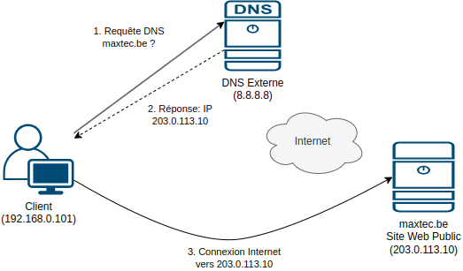
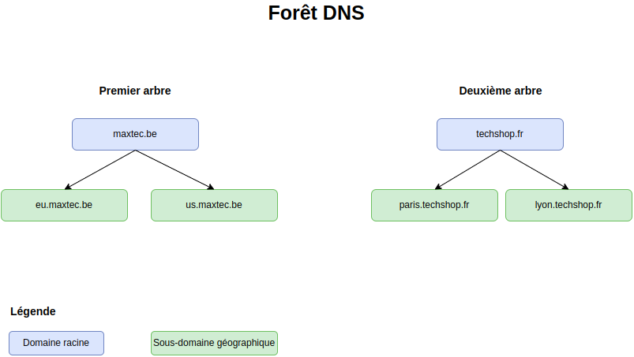
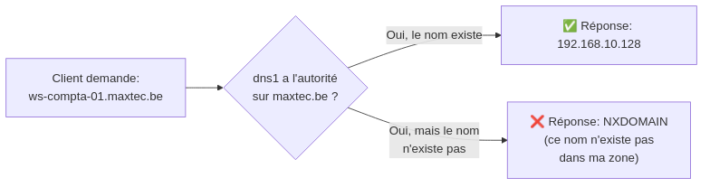
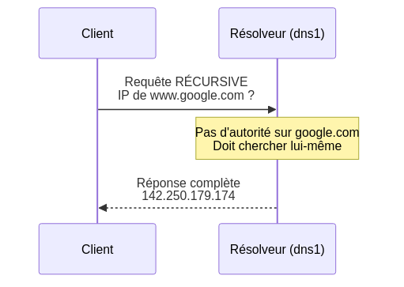
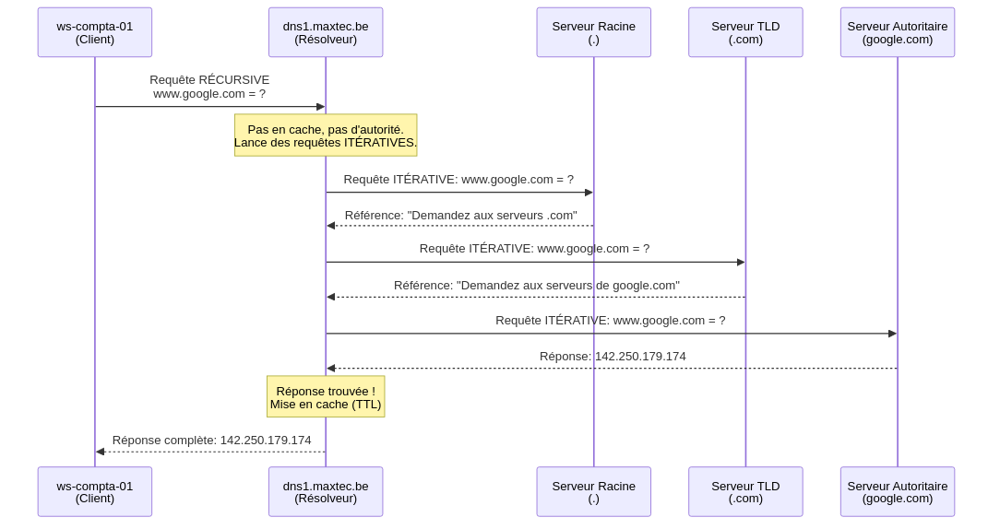
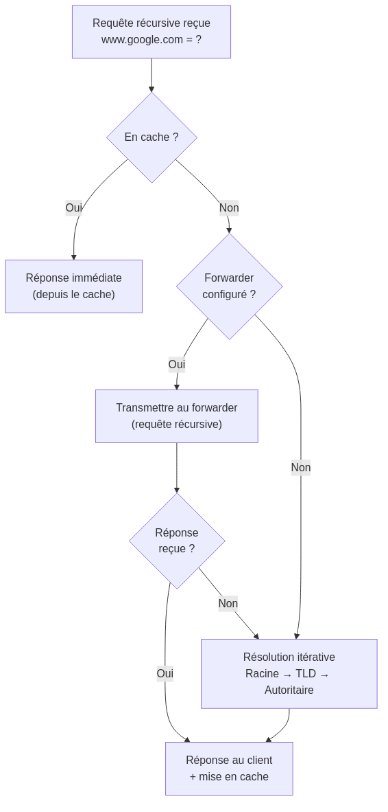

# Annexe A: DNS - Concepts Avancés (Référence)

## 🧭 Navigation
[⏮️ Chapitre Précédent: DNS Pratique](Chapitre%205.DNS-Pratique-avec-AD.md) | [🏠 Retour au Syllabus](index.md) | [⏭️ Chapitre Suivant: Unités d'Organisation](Chapitre%206.Unites_Organisation.md)

---

!!! info "À propos de cette annexe:"
    Ceci est une **ressource de référence avancée** pour approfondir vos connaissances DNS au-delà des labs pratiques.
    
    **Parcours recommandé:**
    
    1. Complétez d'abord le [Chapitre 3: DNS Préparation](Chapitre%203.DNS.md)
    2. Installez Active Directory (Chapitre 4)
    3. Complétez les [Labs DNS Pratiques (Chapitre 5)](Chapitre%205.DNS-Pratique-avec-AD.md)
    4. Ensuite, consultez cette annexe pour la théorie approfondie
    
    **Public cible:** Étudiants avancés, admins expérimentés, ou pour consultation/révision

---

## 📙 Contenu de cette Annexe

Cette annexe couvre en détail:

1. Principes fondamentaux DNS
2. Processus de résolution (récursive vs itérative)
3. Architecture DNS (espace de noms, zones, délégation)
4. Configuration avancée DNS dans Windows Server
5. Enregistrements DNS spécialisés
6. Structures multi-sites et géographiques

---

## 1. Le service DNS

Le **DNS** (Domain Name System) est un service fondamental qui agit comme l'**annuaire téléphonique de l'internet** (on ne parle pas de l'annuaire tel que base de données d'Active Directory!). 
**Il transforme les noms de domaine en adresses IP et vice versa**.
Il est essentiel pour deux raisons principales :

| Aspect | Description | Exemple |
|--------|-------------|----------|
| **Internet** | Permet de naviguer sur internet en utilisant des noms au lieu d'IPs | `www.google.com` → `142.250.179.174` |
| **Active Directory** | Sert de base pour notre infrastructure Active Directory | `dns1.maxtec.be` → `192.168.0.2` |

> **Point clé:** Sans DNS, nous devrions mémoriser les adresses IP de chaque service et ordinateur!

Le DNS offre deux types de résolution :

- **Directe** : Nom → IP (`www.google.com` → `142.250.179.174`)
- **Inverse** : IP → Nom (`142.250.179.174` → `www.google.com`)


### Exercice Pratique: Explorer le DNS

> **Objectif:** Comprendre comment le DNS fonctionne dans votre environnement

??? info "Instructions"
    1. **Préparation:**
       - Ouvrez une console PowerShell ou CMD
       - Assurez-vous d'être connecté à Internet
    
    2. **Tests de résolution DNS:**
       ```powershell
       # Test d'un domaine public
       ping -4 www.google.com
       
       # Test de notre futur domaine
       ping -4 maxtec.be
       ```
    
    3. **Analyse:**
       - Observez les adresses IP retournées
       - Notez les différences entre les réponses
       - Réfléchissez aux raisons des échecs
    
    > **Note:** L'option `-4` force l'utilisation de l'IPv4


### Exemple de resolution inverse sous Windows

Imaginons que vous souhaitez connaître le nom de domaine associé à l'adresse IP `8.8.8.8` (serveur DNS public de Google). Voici comment faire une résolution inverse sous Windows :

1. **Ouvrez l'invite de commandes** (CMD) ou PowerShell.
2. Tapez la commande suivante :
   ```powershell
   nslookup 8.8.8.8
   ```

3. **Analysez le résultat** :  
   Vous verrez une réponse similaire à :
   ```
   Nom :    dns.google
   Address: 8.8.8.8
   ```
   Cela signifie que l'adresse IP `8.8.8.8` correspond au nom de domaine `dns.google`.

> **À tester aussi** : Essayez avec l'adresse IP de votre serveur DNS interne (par exemple `192.168.0.2`) une fois le contrôleur de domaine promu (Chapitre 4)


## 🎯 Checkpoint: Concept DNS de Base

!!! info "Vérification de compréhension"
    
    Avant de continuer, assurez-vous de comprendre:
    
    - [ ] Pourquoi on utilise des noms au lieu d'adresses IP
    - [ ] Pourquoi `maxtec.be` ne répond pas encore

---

## 2. Processus de Résolution DNS

### Comment fonctionne la résolution DNS?

> **Point clé:** Le processus de résolution DNS diffère selon que la ressource est interne (une poste de travail cherche une ressource locale) ou externe (on essaie de se connecter au réseau depuis l'extérieur - l'Internet)

#### Résolution DNS Externe

> **Conseil:** C'est quand quelqu'un de l'extérieur essaie de se connecter à notre entreprise



| Étape | Action | Détails |
|---------|---------|----------|
| 1 | **Requête Client** | Le **client** (extérieur) **demande** l'IP de `maxtec.be` |
| 2 | **DNS Public** | **Consultation** des serveurs DNS publics |
| 3 | **Réponse** | Le serveur **envoie au client l'IP** publique |
| 4 | **Connexion** | Le **client** se **connecte** via Internet |

#### Résolution DNS Interne

> **Conseil:** C'est quand nos employés utilisent leurs ordinateurs au bureau

| Étape | Action | Détails |
|---------|---------|----------|
| 1 | **Requête Client** | Un **poste** de travail (interne) **demande l'IP** d'une ressource locale |
| 2 | **Réponse DNS** | Notre **serveur DNS interne** (`dns1.maxtec.be`) **fournit** l'IP |
| 3 | **Connexion** | Le poste de travail se connecte directement à la ressource à l'intérieur du réseau |


## 3. L'Espace de Noms DNS 

Un **espace de noms DNS** est **l'ensemble de noms DNS** organisés sous la forme d'un **arbre DNS**, une structure hiérarchique où **chaque nœud est un domaine** (ici: `maxtec.be`, `eu.maxtec.be`, `us.maxtec.be`).


### Structure DNS de Maxtec

| Niveau | Description | Exemples |
|--------|-------------|----------|
| **Domaine Racine** | Domaine principal | `maxtec.be` |
| **Zones Géographiques** | Régions | `eu.maxtec.be`<br>`us.maxtec.be` |
| **Ressources** | Appareils et services | `ws-compta-01.maxtec.be`<br>`printer-01.maxtec.be` |


### Arbres et forêts : un vocabulaire d'Active Directory

La « forêt » n'est **pas** une notion DNS. Le DNS n'a qu'**un seul arbre**, mondial, qui part de la racine (`.`) ; `maxtec.be` et `techshop.fr` en sont deux branches.

Les termes **arbre** et **forêt** appartiennent à **Active Directory** :

- un **arbre AD** est un ensemble de domaines AD qui partagent un espace de noms contigu (`maxtec.be`, `eu.maxtec.be`) ;
- une **forêt AD** regroupe un ou plusieurs arbres qui partagent le même schéma, la même configuration et un catalogue global.

**Exemple de fusion d'entreprises :** Maxtec rachète TechShop. On pourrait ajouter `techshop.fr` comme deuxième arbre dans la forêt `maxtec.be`. Côté DNS, ce sont simplement deux domaines distincts.



**Dans le lab, la forêt AD a un seul arbre et un seul domaine** (`maxtec.be`).

### Cas Pratique: Maxtec

**Maxtec** est une entreprise internationale avec:

- Opérations en Europe
- Opérations aux États-Unis

#### Organisation DNS

Voici l'arbre DNS de Maxtec, on voit aussi l'ensemble des sous-domaines et les ressources (ordinateurs, imprimantes, etc)


??? tip "Avantages de cette structure"
    - **Séparation Géographique**
      * Meilleure gestion du trafic réseau
      * Répartition logique des ressources
    
    - **Séparation des Environnements**
    
      * Sécurité renforcée
    
    - **Gestion des Ressources**
      * Organisation claire
      * Maintenance simplifiée
    


### Structure DNS Hybride

> **Point clé:** Notre infrastructure utilise une approche hybride pour optimiser la gestion des ressources: structure plate et hiérarchique. Voici l'explication:

#### Structure Plate (Flat DNS) 

Observez que les sous-domaines (`eu`, `usa`) **ne sont pas utilisés pour les postes de travail et imprimantes**

Au lieu de 

```plaintext
ws-compta-01.eu.maxtec.be
printer-rh-01.usa.maxtec.be
```

on aura 

```plaintext
ws-compta-01.maxtec.be
printer-rh-01.maxtec.be
```


C'est fait exprès :

- un poste joint au domaine prend comme **suffixe DNS principal** le nom du domaine AD (`maxtec.be`) et **s'enregistre lui-même** dans la zone `maxtec.be`. Le mettre dans `eu.maxtec.be` demanderait de changer le suffixe de chaque poste et de gérer une zone de plus, sans bénéfice ;
- le nom d'un poste ne doit pas dépendre de son emplacement : un portable qui passe du bureau EU au bureau US garde le même nom ;
- l'emplacement physique est déjà décrit ailleurs : par les **sites AD** (sous-réseaux) et par les UOs.

Les **sous-domaines** sont utilisés uniquement pour les serveurs et services (observez les adresses)

```plaintext
# Pour les serveurs et services
auth.eu.maxtec.be
```


## 4. Les Zones DNS

### Qu'est-ce qu'une Zone DNS?

Une **zone DNS** est tout simplement **une partie de l'espace de noms DNS** (une partie de l'arbre DNS) contenant les enregistrements d'un domaine spécifique. 

### Architecture DNS Centralisée

> **Note:** Pour une petite ou moyenne entreprise, les serveurs DNS sont simplement les contrôleurs de domaine. Le lab n'a que `dns1` ; en production on aurait au moins `dns1` et `dns2`.

Avec des **zones intégrées à Active Directory**, il n'y a pas de serveur « primaire » et « secondaire » : la zone est stockée dans AD et **chaque DC DNS en détient une copie modifiable** (réplication multimaître, par la réplication AD).

| Serveur | Rôle | Fonction |
|---------|------|----------|
| **DNS1** | DC + DNS, zone intégrée à AD | - Copie modifiable de la zone<br>- Accepte les mises à jour dynamiques |
| **DNS2** | DC + DNS, zone intégrée à AD | - Copie modifiable de la zone (même rôle que DNS1)<br>- Redondance et répartition de charge |

Le modèle **primaire / secondaire** (une zone maître modifiable, des copies en lecture seule) existe aussi, mais il concerne les zones **standard** (fichiers) : voir [§9 Zones secondaires](#9-zones-secondaires).


### Avantages de la Division en Zones

??? tip "Organisation Logique"
    - Séparation par région (EU, US)
    - Séparation par environnement (DEV, PROD)
    - Gestion claire des ressources


??? tip "Sécurité"
    - Politiques par zone
    - Contrôle d'accès granulaire
    - Isolation des environnements


??? tip "Performance"
    - Optimisation du trafic
    - Répartition de charge
    - Redondance améliorée


### Structure du Réseau


> **Note:** Ce diagramme est hybride - il montre à la fois:
>
> - La structure **logique** (zones DNS, sous-domaines)
> - L'organisation **physique** (répartition géographique, adressage IP)

**Bien que les ressources soient physiquement réparties entre l'Europe et les États-Unis, la gestion DNS reste centralisée sur notre serveur principal `dns1.maxtec.be`.**


## 5. Analyse des Zones DNS

### Structure Hiérarchique

> **Point clé:** Notre infrastructure DNS utilise une hiérarchie logique à plusieurs niveaux, mais avec une gestion centralisée

#### Niveau Racine (`maxtec.be`)

| Type | Description |
|------|-------------|
| **Postes** | Directement sous la racine (structure plate, les noms n'incluent pas .eu ni .us: **ws-compta01.maxtec.be**) |
| **Serveurs** | Dans les sous-domaines (structure hiérarchique) |
| **Gestion** | Centralisée sur `dns1.maxtec.be` |

#### Sous-domaines Géographiques

| Type | Sous-domaine | Usage |
|------|--------------|--------|
| **Europe** | `eu.maxtec.be` | Opérations européennes |
| **USA** | `us.maxtec.be` | Opérations américaines |

> **Point Important**: La structure DNS est une **organisation logique** qui peut être **totalement indépendante** de l'emplacement physique des ressources.

## 6. Structure Physique vs Logique

### Structure Logique (DNS)

**Structure de noms** (domaines et sous-domaines, ressources)

!!! info "Organisation des noms"
    
    - Domaine racine: maxtec.be
    - Sous-domaines géographiques: eu.maxtec.be, us.maxtec.be
    - Ressources: ws-compta-01.maxtec.be, printer-rh-01.maxtec.be

> **Note:** La structure logique (DNS) permet d'organiser les ressources **indépendamment de leur emplacement physique** (IP)


### Structure Physique (IP)

**Elements physiques** (machines) ayant leurs IPs.

!!! info "Réseaux physiques"
    
    - Infrastructure: 192.168.0.0/24 (dns1, dns2)
    - Zone EU: 192.168.10.0/24 (postes EU, services EU)
    - Zone US: 192.168.20.0/24 (postes US, services US)


## 7. Autorité DNS

> **Définition:** Un serveur DNS a l'**autorité** sur un espace de noms quand il possède les informations nécessaires pour répondre directement aux requêtes.

### Serveur DNS avec Autorité

| Serveur | Zone d'Autorité | Sous-domaines |
|---------|-----------------|---------------|
| `dns1.maxtec.be` | `maxtec.be` | Oui |
| `dns2.maxtec.be` | `maxtec.be` | Oui |

Un serveur avec autorité possède **directement** les données de la zone dans ses fichiers. Il n'a besoin de consulter personne d'autre pour répondre.

**Concrètement, `dns1.maxtec.be` peut répondre à tout ce qui concerne `*.maxtec.be`:**



Dans les deux cas, la réponse est **immédiate** car `dns1` possède toutes les données de la zone `maxtec.be` localement. Il ne contacte aucun autre serveur.

!!! info "Différence clé avec un serveur sans autorité"
    Un serveur **avec** autorité peut affirmer qu'un nom **n'existe pas** (NXDOMAIN). Un serveur **sans** autorité ne peut pas le savoir: il doit d'abord demander au serveur autoritaire.


### Serveur DNS sans Autorité: Requêtes Récursives et Itératives

Quand `dns1.maxtec.be` reçoit une requête pour `www.google.com`, il n'a pas la zone `google.com`. Il doit demander à d'autres serveurs. Mais **comment** demande-t-il ?

#### L'analogie du concierge

Imaginez que vous êtes à l'hôtel et vous voulez l'adresse d'un restaurant:

| Approche | Vous faites quoi ? | Le concierge fait quoi ? |
|----------|-------------------|--------------------------|
| **Récursive** | Vous demandez au concierge: *"Trouvez-moi l'adresse"* et vous attendez | Le concierge appelle l'office de tourisme, puis le restaurant, et revient avec la réponse complète |
| **Itérative** | Vous demandez: *"Qui pourrait savoir ?"* | Le concierge répond: *"Essayez l'office de tourisme"*. Vous y allez, ils disent *"Essayez le quartier sud"*. Vous y allez... |

Dans le monde DNS, c'est pareil:

- **Récursive**: le client dit à `dns1` → *"Donne-moi la réponse complète, débrouille-toi"*
- **Itérative**: `dns1` dit aux autres serveurs → *"Que sais-tu sur ce nom ?"* et suit les pistes lui-même

---

### Requête Récursive

> Le client demande une **réponse complète** à son résolveur. Une seule question, une seule réponse.

`ws-compta-01` demande l'IP de `www.google.com` à `dns1`. Il ne sait pas (et ne veut pas savoir) comment `dns1` trouvera la réponse. Il attend, c'est tout.



---

### Requête Itérative

> Le serveur interrogé donne **la meilleure piste qu'il connaît**. Le résolveur suit les pistes de serveur en serveur jusqu'à trouver la réponse.

C'est ce que `dns1` fait **en coulisses** pour honorer la requête récursive du client. Le client ne voit rien de tout ça:



Chaque serveur dit *"Je ne sais pas, mais essayez là-bas"*. Le résolveur suit les références jusqu'au serveur qui possède la zone (`google.com`) et qui donne la réponse finale.

---

### Les deux travaillent ensemble

La requête récursive et les requêtes itératives ne sont **pas deux alternatives**. Elles se combinent dans chaque résolution:

1. Le **client** envoie **une requête récursive** à `dns1` → *"trouve-moi la réponse"*
2. `dns1` effectue **plusieurs requêtes itératives** (racine → `.com` → `google.com`) → *"que sais-tu ?"*
3. `dns1` retourne la réponse au client et la garde **en cache** (pour la prochaine fois)

**Le client ne fait qu'une seule requête. Le résolveur fait tout le travail.**

#### Autorité ≠ Type de requête

!!! warning "Attention à cette confusion"
    On pourrait croire que *"réponse complète = récursive"* et donc qu'un serveur avec autorité fait des requêtes récursives. **Non.** Ce sont deux choses différentes:

    - **L'autorité** = est-ce que le serveur **possède** la zone ? (propriété du serveur)
    - **Récursive/Itérative** = **comment** la question est posée ? (propriété de la requête)

    `dns1` peut recevoir une requête récursive **ou** itérative pour `ws-compta-01.maxtec.be`. Dans les deux cas, il répond directement car il a les données. Le type de requête ne change rien quand le serveur a l'autorité. Ça ne compte que quand il **ne l'a pas**.

??? info "Pour aller plus loin: les flags DNS"
    Techniquement, c'est un flag dans l'en-tête de la requête DNS qui détermine le type:

    | Flag | Valeur | Signification |
    |------|--------|---------------|
    | **RD** (Recursion Desired) | `1` | *"Je veux une réponse complète"* (récursive) |
    | **RD** (Recursion Desired) | `0` | *"Donne-moi ce que tu sais"* (itérative) |
    | **RA** (Recursion Available) | `1` | Le serveur confirme qu'il accepte de faire la récursion |

    - Votre poste de travail envoie `RD=1` à `dns1`
    - `dns1`, quand il interroge d'autres serveurs, envoie `RD=0`

---

### Résumé: que fait `dns1` quand il ne connaît pas la réponse ?

Quand `dns1` reçoit une requête récursive pour un nom hors de ses zones, il essaie dans cet ordre:



1. **Cache DNS** → Si l'adresse a déjà été résolue récemment, réponse immédiate (valide jusqu'à expiration du TTL)
2. **Forwarder** → Si configuré, transmet la requête à un autre résolveur (souvent celui du FAI) qui fait le travail à sa place
3. **Résolution itérative** → En dernier recours, interroge les serveurs racine et suit les références lui-même

<br>


### Exercice: Testez votre compréhension

`dns1.maxtec.be` reçoit les requêtes suivantes. Pour chacune, répondez: **est-ce que `dns1` a l'autorité ? Que se passe-t-il ?**

1. `ws-compta-01.maxtec.be`
2. `www.google.com`
3. `fileserver.us.maxtec.be`

??? success "Solution"
    **1. `ws-compta-01.maxtec.be`**
    
    `dns1` **a l'autorité** sur `maxtec.be`. Il possède les données de cette zone.
    → Réponse immédiate: `192.168.10.128`. Aucune requête externe.
    
    **2. `www.google.com`**
    
    `dns1` **n'a pas l'autorité** sur `google.com`. Il doit chercher:

    - Le client envoie une requête **récursive** à `dns1`
    - `dns1` vérifie son cache → pas trouvé
    - `dns1` transmet au forwarder (si configuré), sinon lance une résolution **itérative**: racine → `.com` → `google.com`
    - `dns1` obtient `142.250.179.174`, la met en cache, et la retourne au client
    
    **3. `fileserver.us.maxtec.be`**
    
    Dans le lab, `us.maxtec.be` n'est **pas délégué** : c'est un sous-domaine créé **à l'intérieur de la zone** `maxtec.be`, hébergée par `dns1`. `dns1` **a donc l'autorité**.
    → Réponse immédiate: `192.168.20.10`. Aucune requête externe.

    Si `us.maxtec.be` était **délégué** à un autre serveur (`dns.us`, voir §8), `dns1` n'aurait plus l'autorité sur ce sous-domaine : il suivrait l'enregistrement NS de délégation et interrogerait `dns.us`.


<br>

## 8. Délégation DNS

> **Définition:** La délégation DNS permet de distribuer la gestion des zones DNS entre différents serveurs de manière hiérarchique.

### Architecture Multi-niveaux

??? info "Niveau Internet (DNS Public)"
    | Composant | Rôle |
    |-----------|-------|
    | Registrar | Gère `maxtec.be` |
    | DNS Public | Pointe vers nos serveurs |
    | Services | Site web, email, etc. |
    
    ```plaintext
    # Exemple d'enregistrements publics
    maxtec.be.    NS    ns1.registrar.com
    www.maxtec.be A     203.0.113.10
    ```


??? info "Niveau Entreprise (DNS Interne) : exemple avec délégation"
    Dans une **grande** infrastructure, on pourrait déléguer chaque sous-domaine géographique à ses propres serveurs DNS :

    | Zone | Serveur | Rôle |
    |------|---------|-------|
    | `maxtec.be` | `dns1` (192.168.0.2), `dns2` (192.168.0.3) | Zone intégrée à AD, les deux modifiables |
    | `eu.maxtec.be` | `dns.eu` (192.168.10.2) | Zone déléguée, services EU |
    | `us.maxtec.be` | `dns.us` (192.168.20.2) | Zone déléguée, services US |

    La délégation se fait par des enregistrements NS (et l'adresse du serveur délégué) placés **dans la zone parente** `maxtec.be` :

    ```plaintext
    # Dans la zone maxtec.be : délégation des sous-domaines
    eu.maxtec.be.     IN  NS  dns.eu.maxtec.be.
    dns.eu.maxtec.be. IN  A   192.168.10.2
    us.maxtec.be.     IN  NS  dns.us.maxtec.be.
    dns.us.maxtec.be. IN  A   192.168.20.2
    ```

    Chaque ligne NS dit : « pour ce sous-domaine, demandez à tel serveur ». `dns1` perd alors l'autorité sur `eu.maxtec.be` et `us.maxtec.be`.

**Chez Maxtec (et dans le lab), on ne délègue pas.** `eu` et `us` sont de simples sous-domaines créés **dans la zone** `maxtec.be` (clic droit sur la zone → **Nouveau domaine...**). `dns1` garde l'autorité sur tout `*.maxtec.be`, et les services utilisent ces sous-domaines (ex : `fileserver.eu.maxtec.be`). La délégation ne se justifie que si une autre équipe ou un autre site doit gérer son propre DNS.


## 9. Zones Secondaires

> **Définition:** Une zone secondaire est une copie en lecture seule synchronisée d'une zone principale.

### Caractéristiques Principales

??? info "Architecture"
    | Aspect | Description |
    |--------|-------------|
    | Données | Copie exacte de la zone principale |
    | Synchronisation | Automatique via transfert de zone |
    | Permissions | Lecture seule uniquement |


??? info "Bénéfices"
    1. **Haute Disponibilité**
       - Redondance en cas de panne
       - Basculement automatique
    
    2. **Performance**
       - Répartition de charge
       - Proximité géographique
    
    3. **Sécurité**
       - Protection des données principales
       - Isolation des modifications


### Exemple : quand utiliser une zone secondaire

Les zones secondaires se synchronisent avec leur zone principale par **transfert de zone** (complet, AXFR, ou incrémental, IXFR), à l'initiative du serveur secondaire selon les délais du SOA.

**Dans un domaine AD, on n'en a pas besoin entre DC** : `dns1` et `dns2` hébergent tous deux la zone `maxtec.be` intégrée à AD, modifiable sur chacun, et c'est la réplication AD qui la synchronise. Les transferts de zone sont d'ailleurs désactivés par défaut sur une zone intégrée à AD.

Une zone secondaire sert plutôt à donner une copie en lecture seule à un serveur **qui n'est pas un DC** :

```plaintext
# Exemple : serveur DNS Linux (BIND) d'une filiale
Zone principale : maxtec.be sur dns1 (intégrée à AD)
Zone secondaire : maxtec.be sur ns-filiale (192.168.30.2), lecture seule
Transfert de zone : autorisé uniquement vers 192.168.30.2 (onglet "Transferts de zone" de la zone)
```

!!! note "Sécurité des mises à jour : GSS-TSIG"
    Dans une zone intégrée à AD, les mises à jour dynamiques « sécurisées » utilisent **GSS-TSIG** : chaque machine s'authentifie avec Kerberos (son compte d'ordinateur) avant de modifier son propre enregistrement. Ce n'est pas le TSIG classique à clé partagée de BIND, qu'on configure à la main entre deux serveurs.


### 9.1. Zones de Recherche Directe

Une **zone de recherche directe** (Direct Lookup Zone) contient des **enregistrements** pour faire correspondre un nom d'hôte à une adresse IP.

Il y a deux catégories d'enregistrements :

##### Enregistrement de base

| Type | Fonction | Exemple |
|------|----------|----------|
| A | Nom → IPv4 | `ws-compta-01 → 192.168.10.128` |
| AAAA | Nom → IPv6 | `ws-compta-01 → 2001:db8::128` |
| CNAME | Alias | `www → ws-web-01` |

   
##### Enregistrement de service

| Type | Usage | Exemple |
|------|--------|----------|
| MX | Email | `maxtec.be → mail.eu (10)` |
| SRV | Services | `_ldap._tcp → dns1 (port 389)` |
| NS | DNS | `eu → dns.eu.maxtec.be` (seulement en cas de délégation) |

#### Exemple: Zone maxtec.be

```plaintext
# Postes de travail
ws-compta-01    IN A    192.168.10.128
ws-compta-02    IN A    192.168.10.129

# Services
mail.eu         IN A    192.168.10.11
fileserver.eu   IN A    192.168.10.10

# Alias
www             IN CNAME ws-web-01
ftp             IN CNAME ws-files-01
```

Notez que dans les enregistrements A pour les postes, nous avons uniquement le nom de la machine, sans l'extension du domaine, car le domaine est déjà défini dans la zone ! Le nom complet de la machine s’appelle « FQDN » (Fully Qualified Domain Name) et sera `ws-compta-01.maxtec.be`.


### 9.2. Zones de Recherche Inverse

Une **zone de recherche inverse** (Reverse Lookup Zone) **convertit les adresses IP en noms** d'hôtes.

Ex: `192.168.10.128` devient `ws-compta-01.maxtec.be`.


#### Utilisations Principales

| Aspect | Description |
|--------|-------------|
| Authentification | Vérification des hôtes |
| Contrôle d'accès | Validation des connexions |
| Anti-spam | Vérification des serveurs mail |

#### Administration

| Usage | Bénéfice |
|-------|------------|
| Dépannage | Identification rapide des hôtes |
| Journalisation | Logs plus lisibles |
| Monitoring | Surveillance du réseau |

#### Exemple : zones inverses

Une zone inverse couvre un réseau : `0.168.192.in-addr.arpa` pour `192.168.0.0/24`, `10.168.192.in-addr.arpa` pour `192.168.10.0/24`. Dans la zone, on n'écrit que la partie de l'adresse qui manque.

```plaintext
# Zone 0.168.192.in-addr.arpa (192.168.0.0/24, celle du lab)
2     IN PTR   dns1.maxtec.be.
3     IN PTR   dns2.maxtec.be.
10    IN PTR   ws-IT-01.maxtec.be.

# Zone 10.168.192.in-addr.arpa (192.168.10.0/24, site EU de l'infrastructure complète)
128   IN PTR   ws-compta-01.maxtec.be.
129   IN PTR   ws-compta-02.maxtec.be.
10    IN PTR   fileserver.eu.maxtec.be.
```

### 9.3. Relations entre Types de Zones (opt)

> **Concept:** Une zone DNS combine deux aspects indépendants: son autorité et sa direction de recherche.

#### Classification des Zones

??? info "Par Autorité"
    | Type | Description | Exemple |
    |------|-------------|----------|
    | Principale | Source modifiable (sur tous les DC DNS si intégrée à AD) | `dns1 → maxtec.be` |
    | Secondaire | Copie en lecture seule, par transfert de zone | `ns-filiale → maxtec.be` |


??? info "Par Direction"
    | Type | Conversion | Exemple |
    |------|------------|----------|
    | Directe | Nom → IP | `ws-compta-01 → 192.168.10.128` |
    | Inverse | IP → Nom | `192.168.10.128 → ws-compta-01` |


#### Exemple: Configuration DNS1

```plaintext
# Zones Principales
maxtec.be      # Directe
0.168.192.in-addr.arpa     # Inverse

# Sous-domaines (dans la zone maxtec.be, non délégués)
eu.maxtec.be
us.maxtec.be
```

## 10.  Enregistrement DNS en détail (opt)

> **Concept:** Les enregistrements DNS sont les briques de base qui définissent le comportement et la structure d'une zone DNS.

### Enregistrements de Base

??? info "Adressage (A/AAAA)"
    | Type | Usage | Exemple |
    |------|--------|----------|
    | A | IPv4 | `ws-compta-01 IN A 192.168.10.128` |
    | AAAA | IPv6 | `ws-compta-01 IN AAAA 2001:db8::128` |


??? info "Alias (CNAME)"
    | Usage | Description | Exemple |
    |-------|-------------|----------|
    | Alias | Redirection | `www IN CNAME ws-web-01` |
    | Service | Flexibilité | `mail IN CNAME mx1.eu` |


### Enregistrements de Service

??? info "Infrastructure"
    | Type | Usage | Exemple |
    |------|--------|----------|
    | NS | Serveurs DNS | `@ IN NS dns1` (ou `eu IN NS dns.eu` pour une délégation) |
    | SOA | Zone Info | `@ IN SOA dns1 admin.ce.be` |
    | PTR | IP vers Nom | `2 IN PTR dns1` (zone `0.168.192.in-addr.arpa`) |


??? info "Services"
    | Type | Usage | Exemple |
    |------|--------|----------|
    | MX | Email | `@ IN MX 10 mail.eu` |
    | SRV | Services | `_ldap._tcp IN SRV 0 100 389 dns1` |
    | TXT | Vérification | `@ IN TXT "v=spf1 mx -all"` |


### Exemple: Zone maxtec.be

```plaintext
# SOA et NS
@             IN SOA  dns1 admin.maxtec.be.
              IN NS   dns1.maxtec.be.

# Infrastructure
dns1          IN A    192.168.0.2
dns2          IN A    192.168.0.3

# Services
mail.eu       IN A    192.168.10.11
_ldap._tcp    IN SRV  0 100 389 dns1.maxtec.be.
```

## 11. Configuration DNS dans Windows Server (opt)

Cette section est optionnelle, car l'installation d'AD DS configure automatiquement le serveur DNS.
L'information ci-dessous peut juste aider à comprendre le fonctionnement du DNS une fois AD DS installé.

> **Important:** Lors de l'installation d'Active Directory Domain Services (AD DS):
>
> - Le rôle DNS est automatiquement installé et configuré.
> - La configuration de base est optimale pour AD DS.
> - **Aucune modification n'est nécessaire** pour le fonctionnement de base.
> - Les machines du domaine enregistrent elles-mêmes leur nom dans la zone (mises à jour dynamiques sécurisées).
> - La zone de recherche **inverse** n'est **pas** créée automatiquement.


### Configuration via l'Interface Graphique

??? info "Le Gestionnaire DNS"
    1. **Accès au Gestionnaire DNS**
       - Ouvrir le **Gestionnaire de serveur**
       - Sélectionner **Outils** → **DNS**
    
    2. **Structure du Gestionnaire DNS**
       - Volet de gauche: Arborescence des zones
       - Volet de droite: Enregistrements DNS
       - Menu contextuel: Actions disponibles


??? info "Zones intégrées à l'AD"
    | Type | Description |
    |------|-------------|
    | Zone Principale | `maxtec.be` créée automatiquement |
    | Zone Inverse | Pour la résolution inverse des IPs (à créer soi-même) |
    | Zones Spéciales | `_msdcs`, ForestDNSZones, etc. |


### Configuration Post-Installation

??? info "Zones Additionnelles"
    1. **Créer une Zone de Sous-domaine**
       - Clic droit sur la zone avant
       - **Nouvelle Zone** → **Zone Principale**
       - Exemple: `eu.maxtec.be`
    
    2. **Zone Inverse**
       - Clic droit sur **Zones de recherche inverse**
       - **Nouvelle Zone** → **Zone Principale**
       - ID réseau: `192.168.0` (zone `0.168.192.in-addr.arpa`)


??? info "Enregistrements Courants"
    1. **Ajouter un Hôte (A)**
       - Clic droit dans la zone
       - **Nouvel hôte (A ou AAAA)**
       - Exemple: `ws-compta-01`
    
    2. **Alias (CNAME)**
       - Clic droit dans la zone
       - **Nouvel alias (CNAME)**
       - Exemple: `www` → `ws-web-01`


### Vérification du DNS AD

??? info "Tests Essentiels"
    ```plaintext
    # 1. Vérification du DC
    nslookup dns1.maxtec.be
    
    # 2. Vérification des Services AD
    nslookup -type=srv _ldap._tcp.dc._msdcs.maxtec.be
    nslookup -type=srv _kerberos._tcp.maxtec.be
    
    # 3. Vérification du Domaine
    nslookup maxtec.be
    ```


??? info "Enregistrement Dynamique"
    ```plaintext
    # Quand un poste rejoint le domaine:
    1. Enregistrement automatique dans DNS
    2. Création d'un enregistrement A
       ws-compta-01.maxtec.be → 192.168.10.128 (par exemple)
    
    # Vérification
    nslookup ws-compta-01.maxtec.be
    ```


---


## 🧭 Navigation
[⏮️ Chapitre Précédent: DNS Pratique](Chapitre%205.DNS-Pratique-avec-AD.md) | [🏠 Retour au Syllabus](index.md) | [⏭️ Chapitre Suivant: Unités d'Organisation](Chapitre%206.Unites_Organisation.md)
