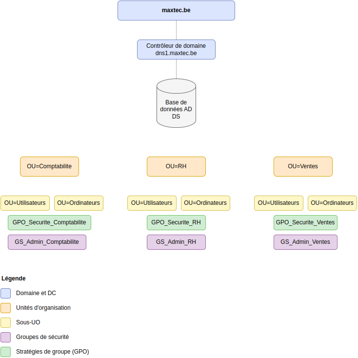

- [1. Les réseaux décentralisées VS centralisés avec Active Directory](#1-les-réseaux-décentralisées-vs-centralisés-avec-active-directory)
  - [1.1. Centralisation avec Active Directory](#11-centralisation-avec-active-directory)
  - [Exercice 1.1 - Centraliser ou ne pas centraliser ?](#exercice-11---centraliser-ou-ne-pas-centraliser-)
- [2. Windows Server](#2-windows-server)
  - [2.1. Les machines virtuelles ?](#21-les-machines-virtuelles-)
  - [2.2. Installation de Windows Server avec Hyper-V (Windows)](#22-installation-de-windows-server-avec-hyper-v-windows)
    - [2.2.1. Activation de Hyper-V dans Windows](#221-activation-de-hyper-v-dans-windows)
    - [2.2.3. Création des réseaux virtuels en Hyper-V](#223-création-des-réseaux-virtuels-en-hyper-v)
    - [2.2.2. Téléchargement de Windows Server](#222-téléchargement-de-windows-server)
    - [2.2.4. Nomenclature des machines](#224-nomenclature-des-machines)
    - [2.2.5. Installation de Windows Server](#225-installation-de-windows-server)
  - [2.2. Console de Gestion du Serveur](#22-console-de-gestion-du-serveur)
- [3. Machines clientes Windows 10](#3-machines-clientes-windows-10)
  - [3.1. Pourquoi avons-nous besoin des VM clients Windows 10 ?](#31-pourquoi-avons-nous-besoin-des-vm-clients-windows-10-)
  - [3.2. Installation d'une machine cliente Windows 10](#32-installation-dune-machine-cliente-windows-10)
  - [Exercice 3.2 - Installation d'une seconde machine cliente](#exercice-32---installation-dune-seconde-machine-cliente)

# 1. Les réseaux décentralisées VS centralisés avec Active Directory

Imaginez, par exemple, que **vous êtes le responsable informatique d'un magasin d'électronique** d'une entreprise **Computer Electronics** (computerelectronics.be). 
Vous avez actuellement 10 ordinateurs, 2 imprimantes et 2 serveurs (pour la base de données et pour la messagerie). 

Vous **devez gérer chaque ordinateur individuellement**, en vous assurant que chaque utilisateur a le bon mot de passe, que chaque imprimante est configurée correctement, que chaque serveur est mis à jour, etc.

Vous **allez vite vous trouver en difficulté**. Pourquoi?

- Chaque fois qu'un employé part, il est difficile de s'assurer que son compte est supprimé sur tous les ordinateurs et serveurs.
- Si vous ajoutez une nouvelle imprimante, vous devez configurer chaque ordinateur séparément pour qu'il puisse l'utiliser. Si vous oubliez un ordinateur, les utilisateurs de cet ordinateur ne pourront pas imprimer. 
- Pareil pour les serveurs. Si vous avez des unités de stockage dans serveurs, vous devez refaire le mapping sur chaque ordinateur.

## 1.1. Centralisation avec Active Directory

Active Directory **arrange ce problème en centralisant** la gestion des utilisateurs et des ordinateurs: **cela implique de stocker toutes les informations dans une seule base de données qui se trouvera sur un serveur** (et non sur chaque ordinateur).

**Active Directory** est une technologie de Microsoft qui permet de créer et gérer une base de données qui fonctionne comme un "annuaire téléphonique d'entreprise" numérique qui stocke des informations sur :
- Les **utilisateurs** (ex: employés, prestataires, etc.)
- Les **ordinateurs** et autres ressources réseau (ex: serveurs, imprimantes, etc.)
- Les **permissions** et droits d'accès (ex: connexion, lecture, écriture, etc.)
- Les stratégies de **sécurité** (ex: permissions de connexion, politiques de mot de passe, etc.)

Tous ces aspects **peuvent être gérés depuis un seul endroit, le serveur Active Directory**.
**AD fonctionne sur Windows**. Nous allons l'utiliser concrètement sur **Windows Server**.

## Exercice 1.1 - Centraliser ou ne pas centraliser ?

Vous vous posez la question : "Est-ce une bonne idée de centraliser toute la gestion?"
Qu'est-ce que vous en pensez? Ne regardez pas la solution!

Solution 1.1

**Les bons côtés** :
1. C'est plus simple à gérer
   - Tout se fait depuis un seul endroit
   - Plus besoin de faire le tour des ordinateurs, on peut applique de changements à tous les ordinateurs en une seule fois
   - Les mises à jour se font en une fois

2. C'est plus sécurisé
   - Les mots de passe sont gérés au même endroit
   - On voit facilement qui a accès à quoi
   - On peut suivre qui fait quoi sur le réseau

3. Ça fait gagner du temps et de l'argent
   - Moins de temps perdu en maintenance
   - Moins de déplacements entre les postes
   - On paie moins de licences logicielles

**Les risques** :
1. Si le serveur central tombe en panne c'est la catastrophe
   - Plus personne ne peut travailler
   - Tous les services sont affectés en même temps

2. Question de sécurité
   - Si un virus infecte le serveur, c'est toute l'entreprise qui est touchée
   - Il faut très bien protéger ce serveur

3. Dépendance au réseau
   - Il faut une bonne connexion réseau partout
   - Sans réseau, pas d'accès aux informations

**La solution pour computerelectronics.be** :
Pour éviter les problèmes, on peut :
- Installer un deuxième serveur de secours
- Faire des sauvegardes régulières
- Avoir un plan en cas de panne

# 2. Windows Server 

Pour **centraliser le contrôle** de notre réseau d'entreprise **nous allons utiliser Windows Server** en combinaison avec **Active Directory (AD)**. 

**Windows Server est un système d'exploitation** conçu spécifiquement pour les serveurs d'entreprise. Il offre :
- Des fonctionnalités avancées de **gestion de réseau**
- La possibilité d'installer des **services d'entreprise comme Active Directory**
- Une **sécurité renforcée** adaptée aux environnements professionnels
- Des **outils d'administration centralisés**
- La possibilité de **gérer de nombreux utilisateurs** et connexions simultanées

## 2.1. Les machines virtuelles ?

**Nous devons nous assurer que nos expériences ne modifient pas la configuration de notre ordinateur**. Nous devons également **pouvoir facilement restorer une configuration de départ** si nous faisons des erreurs.

**La solution est d'utiliser des machines virtuelles**. Les avantages sont :
* **Chaque machine virtuelle sera indépendante de l'autre et de notre ordinateur physique**.
* Nous pourrons ainsi **modifier la configuration de chaque machine virtuelle sans craindre de modifier notre ordinateur physique**.
* De plus, **nous pourrons facilement supprimer une machine virtuelle et en créer une nouvelle si nous faisons des erreurs**.

## 2.2. Installation de Windows Server avec Hyper-V (Windows)

Important: si vous n'utilisez pas Windows, vous pouvez utiliser VirtualBox. Allez sur le fichier [Installation-Windows-Server-2022-VirtualBox.md](Installation-Windows-Server-2022-VirtualBox.md).

Nous allons créer une première machine virtuelle et y installer Windows Server.

L'outil de virtualisation que nous allons utiliser est **Hyper-V**.

### 2.2.1. Activation de Hyper-V dans Windows

- Dans la barre de recherche de Windows, tapez **Activer ou desactiver des fonctionnalités Windows**
- Cliquez sur **Activer ou desactiver des fonctionnalités Windows**
- Cochez la case **Hyper-V** et cliquez sur **OK**
- Redémarrez Windows

### 2.2.3. Création des réseaux virtuels en Hyper-V

Avant de créer la machine virtuelle contenant Windows Server, nous allons créer deux réseaux virtuels, car l'installation de Windows Server demandera de choisir la configuration des réseaux.

Nos machines virtuelles seront connectées à Internet via le réseau **WAN-VM** et elles se connecteront entre elles via le réseau **LAN-VM**

- Un réseau qui servira à permettre **la communication entre les appareils dans notre réseau interne** (ex: clients, serveurs, etc)
- Un réseau pour que nos machines virtuelles communiquent avec Internet

Il y a trois types de réseau :

- *External* : permet la communication entre tous les équipements physiques de notre réseau et les machines virtuelles qui y sont installées
- *Internal* : permet la communication entre notre équipement physique et les machines virtuelles installées dans l'équipement. On ne peut pas communiquer avec d'autres machines en dehors de la nôtre, ni avec des machines virtuelles installées dans d'autres équipements physiques 
- *Private* : permet la communication uniquement entre les machines virtuelles installées dans l'équipement, même pas entre l'équipement et ces machines virtuelles

Commençons par créer le réseau interne :

1. Lancez le Hyper-V Manager depuis la barre des tâches de Windows
2. Cliquez sur Virtual Switch Manager
3. Choisissez Private
4. Cliquez sur Create Virtual Switch
5. Nommez le réseau **LAN-VM**
6. Cliquez sur OK

Puis créons le réseau qui connectera les machines virtuelles à Internet :

1. Cliquez sur Virtual Switch Manager
2. Choisissez External
3. Cliquez sur Create Virtual Switch
4. Nommez le réseau **WAN-VM**
5. Adaptateur : Choisissez l'adaptateur qui vous connecte à Internet (câble ou wifi). Cliquez sur OK et ignorez l'avertissement
6. Cliquez sur OK

### 2.2.2. Téléchargement de Windows Server

Vous pouvez télécharger Windows Server 2022 depuis [cette page](https://www.microsoft.com/en-us/evalcenter/download-windows-server-2022). Il s'agit d'une version d'évaluation de 180 jours

### 2.2.4. Nomenclature des machines

Avant de commencer l'installation, il est important de définir les noms des machines qui constitueront notre infrastructure :

- **Serveur Windows Server** :
  - Nom : `dns1.computerelectronics.be`
  
- **Poste client** :
  - Nom : `ws-compta-01.computerelectronics.be`
 
Ces noms sont cohérents avec notre infrastructure finale (voir le schéma réseau) et seront utilisés tout au long du cours.

### 2.2.5. Installation de Windows Server 

Une fois les réseaux ont été créés, on peut créer une première machine virtuelle qui sera notre serveur Windows Server.

1. Dans le Hyper-V manager, cliquez sur **New->Virtual Machine** (menu à droite)
   
2. Cliquez sur Next une fois

3. Choisissez un nom (ex: WindowsServerVM)

4. Choisissez l'emplacement des fichiers de la machine virtuelle (cliquez sur Browse), puis Next

5. Choisissez le type de machine virtuelle: Generation 2 car on travaille qu'avec des machines virtuelles de 64 bits, puis Next

6. Choisissez la quantité de RAM pour la machine virtuelle (4 GB ou un quart de la RAM de la machine physique si elle a moins de 16 GB)

7. Choisissez la connexion réseau de la machine virtuelle (LAN-VM, notre réseau pour les machines virtuelles), puis Next

8. La taille du disque dur de la machine virtuelle (ex: 50 GB), puis Next

Maintenant on va lancer la machine virtuelle qui contient le support d'installation de Windows Server

1. Cliquez sur **Install an operating System from a bootable image file**
2. Cliquez Browse et cherchez l'image .ISO de Windows Server (ne vous trompez pas d'image 😊), puis Next
3. Révisez le résumé de la machine virtuelle, puis cliquez sur Finish

La machine apparaît dans la liste (**WindowsServerVM**)
Appuyez sur **Connect** et puis sur **Start**, puis sur n'importe quelle touche. Vous allez voir l'écran de démarrage d'installation de Windows Server , notre machine virtuelle est lancée et on va installer Windows Server!

Appuyez sur n'importe quelle touche pour démarrer l'installation de Windows Server. 

*Note*: Si vous n'avez pas eu le temps, redemarrer la machine virtuelle depuis le menu supérieur.

Dès que l'installation finit:

1. Choisissez la langue, région et type du clavier (tout par défaut)
2. Choisissez **Windows Server 2022 Standard Evaluation (Desktop Experience)**, car autrement vous n' aurez pas l'interface graphique pour gérer le serveur
3. Cliquez sur Next
4. Cliquez sur *Personnalisé: installer uniquement...5. Choisissez le disque dur qui a été crée pendans la creation de la machine virtuelle et pui Next
   
L'installation prendra quelques minutes. Après quelques démarrages, l'installation vous demandera un mot de passe pour l'administrateur du serveur (**Password1** dans notre cas, vous pouvez le changer plus tard).

**Ce password es pour le compte Administrateur**. Si vous choisissez un autre... **ne le perdez pas**!

Une fois le système démarré vous allez voir l'application **Gestionnaire du Serveur** qui nous permet de configurer tous les paramètres du serveur. Fermez cette fenêtre pour le moment.

L'interface de Windows Server est très similaire à celle des autres versions de Windows. Le navigateur Edge est installé par défaut. Si vous l'ouvrez, vous verrez qu'il n'y a **pas de connexion à Internet**... car notre **machine virtuelle n'est pas configurée** pour se connecter à Internet pour le moment. 

Allez dans le menu de Hyper-V (**en dehors de la machine virtuelle**) et accédez aux paramètres de la machine virtuelle en faisant un clic droit. Allez dans la section **Network Adapter** et sélectionnez le réseau **WAN**. Cliquez sur **OK**. La VM devra pouvoir se connecter à l'internet.

## 2.2. Console de Gestion du Serveur

C'est une console qui permet de configurer et de gérer les rôles et les caractéristiques du serveur, ainsi que la configuration du réseau.

Cliquez sur **Démarrer** et tapez **Gestionnaire du Serveur** dans la barre de commande. 

Notre serveur n'est pas configuré pour le moment.

Commençons par donner un nom au serveur. Notre serveur sera **dns1.computerelectronics.be**.

1. Ouvrez à nouveau le **Gestionnaire de serveur** et cliquez sur **Serveur local**
2. Cliquez sur le nom actuel du serveur
3. Dans la fenêtre Propriétés système, cliquez sur **Modifier**
4. Dans le champ "Nom de l'ordinateur", tapez : **dns1**
5. Dans le champ "Suffixe DNS principal de l'ordinateur", tapez : **computerelectronics.be**
6. Cliquez sur **OK**
7. Redémarrez le serveur pour appliquer les changements

Le serveur aura maintenant le nom complet (FQDN) : dns1.computerelectronics.be

**FQDN** = Fully Qualified Domain Name (Nom de domaine complet)

# 3. Machines clientes Windows 10

Nous avons une VM pour le serveur, mais nous devons créer des VM pour les machines clientes (au moins une!).    

## 3.1. Pourquoi avons-nous besoin des VM clients Windows 10 ?

Les départements de l'entreprise (Comptabilité, RH, Ventes) ont des besoins différents. Par exemple :
- La Comptabilité a besoin d'accéder aux logiciels financiers
- Les RH doivent gérer les dossiers du personnel
- Les Ventes utilisent des applications commerciales

Pour bien comprendre comment gérer ces différents besoins, **nous allons créer deux ordinateurs virtuels Windows 10** qui simuleront :

1. **Un poste de travail pour chaque département**

2. **Des règles différentes pour chaque poste**
   - Par exemple : le poste de la Comptabilité pourra accéder aux dossiers financiers
   - Tandis que le poste des RH aura accès aux dossiers du personnel

3. **Un mini-réseau d'entreprise**
   - Comme une vraie entreprise en plus petit
   - Parfait pour apprendre sans risque
   - Idéal pour tester différentes configurations

C'est un peu comme avoir une "maquette" de l'entreprise : on peut tout tester en toute sécurité avant de le faire dans une vraie situation !

## 3.2. Installation d'une machine cliente Windows 10

Voici la procédure pour installer la première machine cliente :

1. Dans Hyper-V Manager, créez une nouvelle machine virtuelle :
   - Nom : **ws-compta-01**
   - Génération : 2 (64 bits)
   - Mémoire : 4 GB (si possible)
   - Réseau : LAN
   - Disque dur virtuel : 30 GB
   - ISO : Image Windows 10

2. Démarrez la machine virtuelle et suivez l'assistant d'installation :
   - Langue : Français
   - Version : Windows 10 Pro
   - Installation personnalisée
   - Créez un compte local: **user1compta**, password **Password1**

3. Une fois l'installation terminée :
   - Installez les mises à jour Windows
   - Renommez l'ordinateur avec le nom standardisé (ex: **ws-compta-01**)

## Exercice 3.2 - Installation d'une seconde machine cliente

Pour mettre en pratique vos connaissances, installez une seconde machine cliente en suivant ces critères :

- Nom de la VM : **ws-rh-01**
- Créez un compte local: **user1rh**, password **Password1** 
- Nom d'ordinateur : **ws-rh-01**
- Hardware: pareil que la première machine
  

