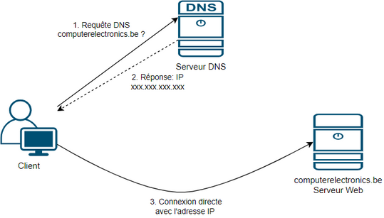
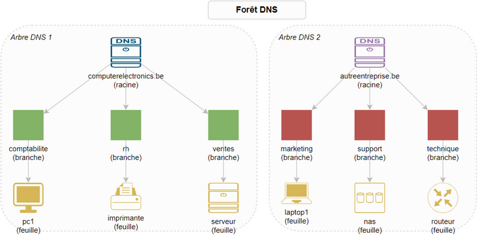
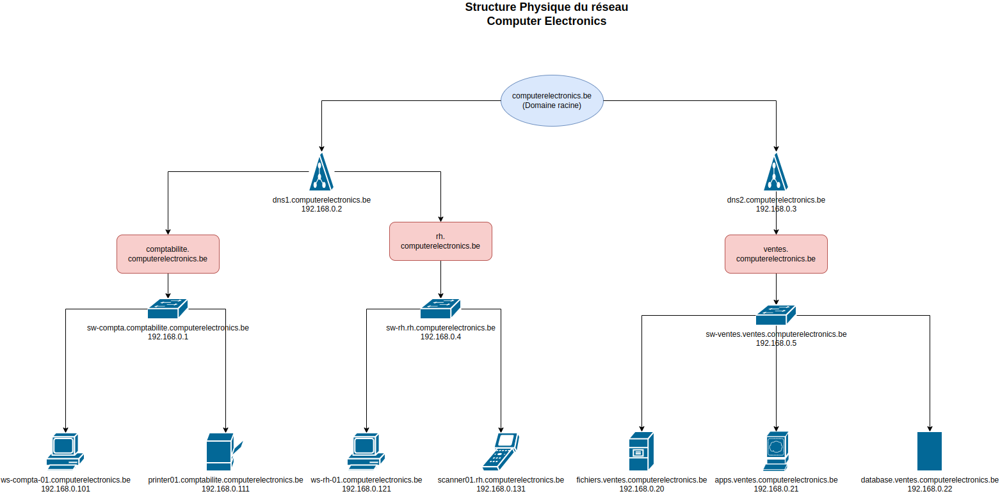
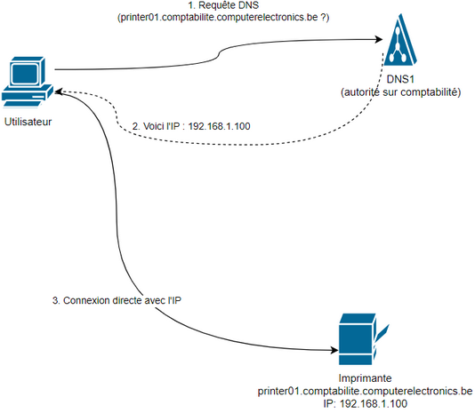
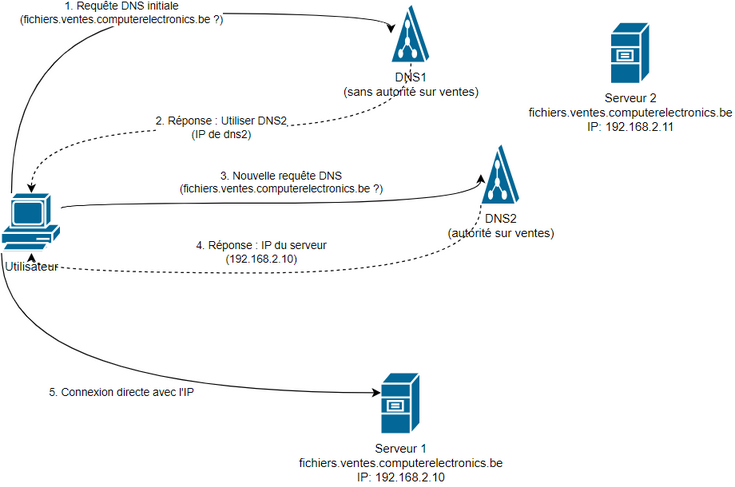
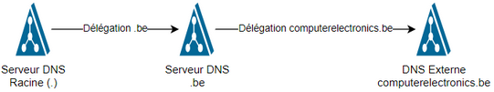

# Comprendre le DNS : Une Introduction Simple

## 1. Qu'est-ce que le DNS ?

Le **DNS** (Domain Name System)** est comme **l'annuaire téléphonique d'Internet**. Son rôle principal est de **transformer les noms de domaine** que nous utilisons (comme `www.computerelectronics.be`) **en adresses IP** (comme `192.168.2.10`). Une adresse IP est **un numéro unique qui identifie un ordinateur sur Internet**.

Exemple:

- **Nom de domaine** : `computerelectronics.be`
- **Adresse IP** : `192.168.2.10`

Pour mieux comprendre, ouvrez une console et faites `ping lesoir.be` pour voir l'adresse IP de lesoir.be

### 1.1 Analogie Simple

Imaginez que vous voulez envoyer une lettre à un ami. Vous connaissez son nom (comme `www.computerelectronics.be`), mais pour que la poste livre la lettre, il faut son adresse complète (comme l'adresse IP `192.168.2.10`). Le DNS fait exactement ça : il traduit les noms en adresses. Si on n'avait pas le DNS, il faudrait que chaque personne connaisse l'adresse IP de chaque site web qu'elle visite!!

### 1.2 Processus de Résolution DNS



Le diagramme ci-dessus illustre le processus de résolution DNS pour accéder au site computerelectronics.be :

1. Le client envoie une requête DNS au serveur DNS pour obtenir l'adresse IP de computerelectronics.be
2. Le serveur DNS répond avec l'adresse IP correspondante
3. Le client peut alors établir une connexion directe avec le serveur web computerelectronics.be en utilisant l'adresse IP reçue

Ce processus est fondamental pour la navigation web, car il permet de traduire les noms de domaine en adresses IP utilisables.

## 2. L'Espace de Noms DNS et sa Structure Arborescente

Un espace de noms **est un système d'organisation hiérarchique des noms**, **similaire à l'organisation des dossiers sur votre ordinateur**. 
Cette structure forme naturellement un **arbre DNS**, avec :
- Une racine (le domaine principal)
- Des branches (les sous-domaines)
- Des feuilles (les appareils finaux)

**Plusieurs arbres DNS peuvent coexister** et former une **forêt DNS** lorsque plusieurs organisations collaborent tout en gardant leur indépendance administrative.

Dans le diagramme suivant on peut voir une forêt DNS avec plusieurs arbres DNS, chaque arbre correspond à une entreprise 




### 2.1 Composants de l'Arbre DNS

Dans l'arbre DNS on trouve :

- **Domaine** : racine de l'entreprise
- **Sous-domaine** : branches de l'arbre (des noms de départements comme comptabilite.computerelectronics.be, rh.computerelectronics.be, etc.)
- **Appareil** : feuilles de l'arbre (ordinateur, serveur, imprimante, etc.)

### 2.2 Structure d'un espace de noms concret

Considérons à nouveau l'entreprise Computer Electronics qui a comme nom de domaine `computerelectronics.be` et qui a plusieurs départements:


- Comptabilité
- RH
- Ventes

Ce diagramme correspond à la structure physique de son reseau (on voit les serveurs, imprimantes, etc.)



Observez maintenant la structure de son espace de noms DNS, car elle ne correspond pas à ce qu'on visualise sur le diagramme physique (expliquée plus bas):


```
computerelectronics.be                      # **Domaine** racine de l'entreprise
├── comptabilite.computerelectronics.be     # **Sous-domaine** du département comptabilité
│   ├── pc01.comptabilite.computerelectronics.be    # Poste de travail comptabilité (appareil)
│   └── printer01.comptabilite.computerelectronics.be    # Imprimante comptabilité (appareil)
├── dns1.computerelectronics.be             # Serveur DNS gérant les adresses de comptabilité et RH 
│                                           # directement dans le domaine racine sans sous-domaine (appareil)
├── dns2.computerelectronics.be             # Serveur DNS gérant ventes (appareil)
│                                           # directement dans le domaine racine sans sous-domaine (appareil)
├── rh.computerelectronics.be               # **Sous-domaine** du département RH
|   ├── pc01.rh.computerelectronics.be      # Poste de travail RH (appareil)
|   └── scanner01.rh.computerelectronics.be # Scanner du service RH (appareil)
└── ventes.computerelectronics.be           # **Sous-domaine** du département ventes
    ├── fichiers.ventes.computerelectronics.be    # Serveur de fichiers partagés (appareil)
    ├── apps.ventes.computerelectronics.be        # Serveur hébergeant les applications (appareil)
    ├── database.ventes.computerelectronics.be    # Serveur de bases de données (appareil)
    ├── server1.ventes.computerelectronics.be     # Serveur répliqué pour load balancing (appareil)
    ├── server2.ventes.computerelectronics.be     # Serveur répliqué pour redondance (appareil)
    ├── pc01.ventes.computerelectronics.be        # Poste de travail ventes (appareil)
    └── printer01.ventes.computerelectronics.be   # Imprimante ventes (appareil)
```


### 2.3 Analyse de la Structure

Analysons cette structure niveau par niveau :

- **Premier niveau (domaine racine)**
  - Le domaine `computerelectronics.be` est la racine de l'entreprise
  - Tous les appareils et services de l'entreprise en font partie

- **Deuxième niveau (sous-domaines)** 
  - `comptabilite.computerelectronics.be` : Sous-domaine du département comptabilité
  - `rh.computerelectronics.be` : Sous-domaine du département RH
  - `ventes.computerelectronics.be` : Sous-domaine du département ventes
  - Chaque département a son propre sous-domaine
  - Permet d'organiser et de gérer séparément les ressources

- **Dernier niveau (appareils)**
  - Infrastructure DNS :
    - `dns1.computerelectronics.be` : Serveur DNS gérant comptabilité et RH
    - `dns2.computerelectronics.be` : Serveur DNS gérant ventes
  - Serveurs départementaux
  - Postes de travail et périphériques
**Important**: cette structure DNS est une **organisation logique** qui peut être **totalement indépendante de l'emplacement physique des ressources**. 


# Exercices Section 2

## Exercice 2.1 - Structure DNS
Dessinez la structure DNS de votre département "Formation" qui contient :
- 2 serveurs d'applications
- 3 postes de travail
- 1 imprimante réseau
En suivant la nomenclature de computerelectronics.be

<details>
<summary>Solution 2.1</summary>

```
formation.computerelectronics.be                      # Sous-domaine Formation
├── app1.formation.computerelectronics.be            # Premier serveur d'applications
├── app2.formation.computerelectronics.be            # Deuxième serveur d'applications
├── pc01.formation.computerelectronics.be            # Premier poste de travail
├── pc02.formation.computerelectronics.be            # Deuxième poste de travail
├── pc03.formation.computerelectronics.be            # Troisième poste de travail
└── printer01.formation.computerelectronics.be       # Imprimante réseau
```
</details>

## Exercice 2.2 - Analyse
Dans la structure actuelle de computerelectronics.be, identifiez :
- Tous les appareils qui sont directement rattachés au domaine racine
- Tous les appareils qui appartiennent au sous-domaine ventes
- Expliquez pourquoi les serveurs DNS sont dans le domaine racine

<details>
<summary>Solution 2.2</summary>

1. Appareils rattachés au domaine racine :
   - dns1.computerelectronics.be
   - dns2.computerelectronics.be

2. Appareils du sous-domaine ventes :
   - fichiers.ventes.computerelectronics.be
   - apps.ventes.computerelectronics.be
   - database.ventes.computerelectronics.be
   - server1.ventes.computerelectronics.be
   - server2.ventes.computerelectronics.be
   - pc01.ventes.computerelectronics.be
   - printer01.ventes.computerelectronics.be

3. Les serveurs DNS sont dans le domaine racine car :
   - Ils gèrent l'ensemble des sous-domaines
   - Ils doivent être facilement accessibles par tous les sous-domaines
   - Cela simplifie la configuration DNS globale
</details>

## Exercice 2.3 - Nommage
Pour un nouveau département "Marketing", proposez des noms DNS complets pour :
- Le sous-domaine
- Un serveur web
- Deux postes de travail
- Une imprimante couleur
En respectant la convention de nommage existante

<details>
<summary>Solution 2.3</summary>

```
marketing.computerelectronics.be                    # Sous-domaine Marketing
├── web.marketing.computerelectronics.be           # Serveur web
├── pc01.marketing.computerelectronics.be          # Premier poste de travail
├── pc02.marketing.computerelectronics.be          # Deuxième poste de travail
└── printer01.marketing.computerelectronics.be     # Imprimante couleur
```
</details>

### Exercice 2.4 - Comparaison
Comparez la structure physique (diagramme) et la structure logique (arborescence DNS) de computerelectronics.be :
- Identifiez 2 différences principales

<details>
<summary>Solution 2.4</summary>

Différences principales entre structure physique et logique :

1. Position des serveurs DNS :
   - Physiquement : dans la salle serveur avec les autres équipements
   - Logiquement : directement sous le domaine racine

2. Organisation des départements :
   - Physiquement : selon leur emplacement dans les bâtiments
   - Logiquement : hiérarchie pure basée sur les sous-domaines


</details>


## 3. Résolution DNS 

Mais comment fonctionne la résolution DNS ? On l'explique dans cette section!

### 3.1 Types de Requêtes et Autorité DNS

#### 3.1.1 Types de Requêtes DNS

Il existe deux types principaux de requêtes DNS :

1. **Requêtes récursives**
   - Le serveur DNS prend en charge tout le processus de résolution
   - Il fournit soit l'adresse IP finale, soit une erreur
   - Le serveur effectue lui-même les requêtes nécessaires
   - Le client ne fait qu'une seule requête

2. **Requêtes itératives**
   - Le serveur DNS répond avec les informations qu'il possède
   - Il renvoie une référence vers d'autres serveurs si nécessaire
   - Le client doit contacter lui-même les serveurs référencés
   - Plusieurs requêtes sont nécessaires de la part du client

**Exemple de requête récursive :**
```
1. Un poste client demande à dns1.computerelectronics.be de résoudre "www.google.com"
2. dns1 n'ayant pas cette information :
   - Contacte un serveur racine pour obtenir l'adresse des serveurs .com
   - Contacte un serveur .com pour obtenir l'adresse des serveurs google.com
   - Contacte un serveur google.com pour obtenir l'IP
3. dns1 renvoie directement l'IP finale au poste client
=> Le client n'a fait qu'une seule requête !
```

**Exemple de requête itérative :**
```
1. Le client demande l'IP de www.google.com au serveur racine
2. Le serveur racine répond : "Je ne sais pas, mais voici la liste des serveurs .com"
3. Le client demande l'IP de www.google.com à un serveur .com
4. Le serveur .com répond : "Je ne sais pas, mais voici la liste des serveurs google.com"
5. Le client demande l'IP de www.google.com à un serveur google.com
6. Le serveur google.com répond avec l'IP finale
=> Le client a dû faire plusieurs requêtes lui-même !
```


#### 3.1.2 Autorité sur les Espaces de Nom

Les serveurs DNS peuvent avoir **deux niveaux d'autorité** sur les espaces de nom :

##### Serveur DNS avec Autorité

Un serveur DNS ayant autorité sur un espace de nom peut :
- Renvoyer directement l'adresse IP demandée s'il dispose de l'information
- Affirmer avec certitude qu'un nom n'existe pas dans son espace de nom

**Exemple avec autorité :**
```
dns1.computerelectronics.be possède l'autorité sur comptabilite.computerelectronics.be :
- Il peut directement répondre que pc01.comptabilite.computerelectronics.be → 192.168.1.101
- Il peut affirmer avec certitude que pc99.comptabilite.computerelectronics.be n'existe pas
```

##### Serveur DNS sans Autorité

Un serveur DNS n'ayant pas autorité sur un espace de nom peut renvoyer une réponse :
- Provenant de son cache DNS
- Obtenue via un serveur DNS redirecteur
- Obtenue en consultant les serveurs racine

**Exemple sans autorité :**
```
dns1.computerelectronics.be n'a pas l'autorité sur ventes.computerelectronics.be :
- Il doit rediriger la requête vers dns2 qui gère ce sous-domaine
- Il peut mettre en cache la réponse reçue de dns2 pour optimiser les futures requêtes
- En cas d'indisponibilité de dns2, il doit signaler une erreur de résolution
```


En résumé :
Les requêtes DNS peuvent être :
- **Récursives** : le client fait une seule requête au serveur DNS qui s'occupe de tout le processus de résolution
- **Itératives** : le client fait lui-même plusieurs requêtes, chaque serveur DNS ne fournissant que l'information dont il dispose

L'autorité DNS définit le niveau de confiance d'un serveur :
- **Avec autorité** : peut répondre directement pour sa zone et affirmer qu'un nom n'existe pas
- **Sans autorité** : doit rediriger ou utiliser son cache pour les zones qu'il ne gère pas


### 3.2 Exemple d'Impression

1. Pour imprimer un document :
   - L'utilisateur effectue une recherche dans le sous-domaine comptabilité (`comptabilite.computerelectronics.be`)
   - Il accède à l'imprimante (`printer01.comptabilite.computerelectronics.be`)
   - La résolution DNS traduit ce nom en adresse IP en suivant la hiérarchie des domaines

   Dans ce cas :
   - La requête peut être **récursive** : le poste client demande à `dns1` de résoudre l'adresse complète
   - `dns1` a **autorité** sur le sous-domaine `comptabilite.computerelectronics.be`, il peut donc répondre directement avec l'IP de l'imprimante

   

### 3.3 Exemple d'Accès aux Applications

2. Pour accéder à une application :
   - Un utilisateur du domaine effectue une recherche dans le sous-domaine ventes (`ventes.computerelectronics.be`)
   - Il se connecte au serveur de fichiers (`fichiers.ventes.computerelectronics.be`)
   - La résolution DNS redirige vers un serveur répliqué (`serveur1` ou `serveur2`)
   - En cas de panne, le système bascule automatiquement vers l'autre serveur

   Dans ce cas :
   - La requête peut être **itérative** : 
     1. Le poste client demande à `dns1` l'adresse de `fichiers.ventes.computerelectronics.be` au lieu de demander à `dns2` (qui a l'autorité sur le sous-domaine ventes)
     2. `dns1` n'ayant pas **autorité** sur `ventes.computerelectronics.be`, répond au client avec l'adresse de `dns2`
     3. Le client fait une nouvelle requête à `dns2` qui a **autorité** sur le sous-domaine ventes
     4. `dns2` répond avec l'IP du serveur de fichiers

   

# Exercices Section 3

## Exercice 3.1 - Autorité DNS
Dans le contexte de computerelectronics.be, indiquez pour chaque scénario si le serveur dns1 a autorité ou non :
- Une requête pour pc01.comptabilite.computerelectronics.be
- Une requête pour www.google.com
- Une requête pour pc01.ventes.computerelectronics.be

<details>
<summary>Solution 3.1</summary>

1. Requête pour pc01.comptabilite.computerelectronics.be :
   - dns1 a autorité car il gère le sous-domaine comptabilité
   - Il peut donc répondre directement avec l'adresse IP ou affirmer que le nom n'existe pas

2. Requête pour www.google.com :
   - dns1 n'a pas autorité sur le domaine google.com
   - Il devra soit utiliser son cache, soit faire appel à un redirecteur ou aux serveurs racine

3. Requête pour pc01.ventes.computerelectronics.be :
   - dns1 n'a pas autorité car c'est dns2 qui gère le sous-domaine ventes
   - Il devra rediriger la requête vers dns2
</details>

## Exercice 3.2 - Types de Requêtes
Pour chaque scénario, identifiez s'il s'agit d'une requête récursive ou itérative :

1. Un poste de travail demande à son serveur DNS de résoudre www.google.com
2. Un serveur DNS contacte un serveur racine pour trouver le serveur DNS de .com
3. Un serveur DNS contacte le serveur DNS de google.com

<details>
<summary>Solution 3.2</summary>

1. Poste de travail → Serveur DNS (www.google.com) :
   - Requête récursive
   - Le poste attend une réponse complète de son serveur DNS

2. Serveur DNS → Serveur racine (.com) :
   - Requête itérative
   - Le serveur DNS accepte une réponse partielle (référence vers les serveurs .com)

3. Serveur DNS → Serveur DNS google.com :
   - Requête itérative
   - Le serveur DNS accepte une réponse directe du serveur autoritaire
</details>

## 4. La Délégation DNS

La délégation DNS est un mécanisme qui permet de répartir la responsabilité de la gestion des zones DNS entre différents serveurs. Dans notre infrastructure, la délégation s'organise sur plusieurs niveaux :

### 4.1 Niveau Internet (DNS Public)
- Le registrar du domaine `computerelectronics.be` configure les serveurs DNS publics
- Ces serveurs contiennent les enregistrements NS (Name Server) qui pointent vers les serveurs DNS autoritaires pour le domaine
- Ils gèrent principalement les services accessibles depuis l'extérieur (site web, email, etc.)



### 4.2 Niveau Entreprise (DNS Interne)
- `dns1.computerelectronics.be` et `dns2.computerelectronics.be` sont configurés comme serveurs autoritaires pour les sous-domaines
- La délégation est configurée ainsi :
  ```
  # Sur dns1 :
  comptabilite.computerelectronics.be.  IN  NS  dns1.computerelectronics.be.
  rh.computerelectronics.be.            IN  NS  dns1.computerelectronics.be.

  # Sur dns2 :
  ventes.computerelectronics.be.        IN  NS  dns2.computerelectronics.be.
  ```

# Exercices Section 4

## Exercice 4.1 - Configuration de Délégation
Vous devez configurer la délégation DNS pour un nouveau département "logistique" :
- Le département sera géré par dns2
- Créez les enregistrements de délégation nécessaires

<details>
<summary>Solution 4.1</summary>

Configuration à ajouter sur dns2 :
```
logistique.computerelectronics.be.  IN  NS  dns2.computerelectronics.be.
```

Explication :
- L'enregistrement NS délègue l'autorité du sous-domaine logistique à dns2
- dns2 devient responsable de la résolution de tous les noms dans ce sous-domaine
- Les autres serveurs DNS redirigeront les requêtes pour ce sous-domaine vers dns2
</details>

## Exercice 4.2 - Analyse de Délégation
Analysez la configuration de délégation actuelle et répondez aux questions :
- Quel serveur DNS est responsable de la résolution des noms dans le sous-domaine ventes ?
- Si dns1 reçoit une requête pour pc01.ventes.computerelectronics.be, que se passe-t-il ?

<details>
<summary>Solution 4.2</summary>

1. Responsabilité du sous-domaine ventes :
   - dns2 est le serveur responsable
   - Cela est défini par l'enregistrement NS dans la configuration

2. Processus de résolution via dns1 :
   - dns1 reçoit la requête pour pc01.ventes.computerelectronics.be
   - dns1 consulte sa configuration et voit que dns2 a l'autorité
   - dns1 renvoie au client l'adresse de dns2
   - Le client doit faire une nouvelle requête à dns2
</details>

## 5. Les Zones DNS

Nous avons vu la structure complète de l'espace de noms.

Une **zone DNS est une partie de l'espace de noms** DNS qu'un administrateur ou une organisation gère. Une **zone DNS est associée à au moins un serveur DNS** qui connaît les adresses des appareils qui se trouvent dans la zone. 

### 5.1 Types de Zones DNS

#### 5.1.1 Zones Principales (Primary Zones)

Une zone principale est la source autoritaire pour un domaine où les enregistrements sont créés, modifiés et supprimés directement. Chaque **zone principale a un numéro de série unique** qui s'incrémente à chaque modification.

Dans notre exemple précédent, nous avons **deux zones principales** :

- **Zone 1** : Contient les sous-domaines `comptabilite.computerelectronics.be` et `rh.computerelectronics.be`
  - Gérée par le serveur `dns1.computerelectronics.be`
  
- **Zone 2** : Contient le sous-domaine `ventes.computerelectronics.be`
  - Gérée par le serveur `dns2.computerelectronics.be`

#### 5.1.2 Zones Secondaires (Secondary Zones)

Une zone secondaire est une **copie en lecture seule** d'une zone principale. Elle est utilisée pour :
- Assurer la redondance en cas de panne du serveur principal
- Répartir la charge des requêtes DNS
- Améliorer les performances en rapprochant géographiquement les serveurs DNS des clients

Les zones secondaires se synchronisent automatiquement avec leur zone principale via un processus appelé **transfert de zone**.

### 5.2 Types de Zones DNS selon leur fonction

#### 5.2.1 Zones de Recherche Directe (Forward Lookup Zones)

Une **zone de recherche directe** convertit les noms d'hôtes en adresses IP. Elle contient plusieurs types d'enregistrements essentiels :

- **Enregistrements A** : Nom d'hôte → IPv4 
  - Exemple : `serveur.monentreprise.com` → `192.168.1.10`
- **Enregistrements AAAA** : Nom d'hôte → IPv6
  - Exemple : `serveur.monentreprise.com` → `2001:0db8:85a3:0000:0000:8a2e:0370:7334`
- **Enregistrements CNAME** : Alias vers un autre nom d'hôte
  - Exemple : `www.monentreprise.com` → `serveur.monentreprise.com`
- **Enregistrements MX** : Serveurs de messagerie
  - Exemple : `monentreprise.com` → `mail.monentreprise.com` (priorité 10)
- **Enregistrements SRV** : Services (comme Active Directory)
  - Exemple : `_ldap._tcp.monentreprise.com` → `dc01.monentreprise.com:389`

#### 5.2.2 Zones de Recherche Inverse (Reverse Lookup Zones)

Une **zone de recherche inverse** permet de convertir une adresse IP en nom d'hôte. Elle est importante pour :
- La sécurité (validation des connexions)
- Le débogage réseau (ex de fonctionnement: `nslookup 192.168.1.1` pour obtenir le nom d'hôte correspondant)
- Les logs système

### 5.3. Relation entre les Types de Zones

Une zone DNS peut être à la fois :
- Principale ou secondaire (pour son autorité sur les données)
- De recherche directe ou inverse (pour le type de conversion des enregistrements)

## 5.4. Modifications de la zone principale

On peut modifier la zone principale en ajoutant ou en supprimant des informations et des appareils.

Exemple pratique :

  Cas pratique 1 - Ajout de deux scanners en Comptabilité :
  1. Dans la zone principale uniquement :
     scanner02.comptabilite.computerelectronics.be → 192.168.1.21
     scanner03.comptabilite.computerelectronics.be → 192.168.1.22

  2. Vérification après quelques minutes :
     Zone Principale    : scanner02.comptabilite.computerelectronics.be et scanner03.comptabilite.computerelectronics.be présents
     Zones Secondaires : scanner02.comptabilite.computerelectronics.be et scanner03.comptabilite.computerelectronics.be présents
     ✓ Synchronisation réussie

  Cas pratique 2 - Ajout de deux serveurs de fichiers dans le département ventes :
  1. Dans la zone principale uniquement :
     fichiers02.ventes.computerelectronics.be → 192.168.4.50
     fichiers03.ventes.computerelectronics.be → 192.168.4.51

  2. Vérification après quelques minutes :
     Zone Principale    : fichiers02.ventes.computerelectronics.be et fichiers03.ventes.computerelectronics.be présents
     Zones Secondaires : fichiers02.ventes.computerelectronics.be et fichiers03.ventes.computerelectronics.be présents
     ✓ Synchronisation réussie

## Annexe: Types d'Enregistrements DNS

Les enregistrements DNS sont les éléments fondamentaux qui composent une zone DNS. Chaque type d'enregistrement a un rôle spécifique. Ils sont stockés dans la zone DNS, concrement dans un fichier sur un disque du serveur DNS.

### A (Address)
- **Fonction** : Associe un nom d'hôte à une adresse IPv4
- **Exemple** : 
  ```
  pc01.comptabilite.computerelectronics.be.    IN    A    192.168.1.10
  ```
- **Utilisation** : C'est l'enregistrement le plus courant, utilisé pour la résolution directe des noms d'hôtes

### AAAA (IPv6 Address)
- **Fonction** : Associe un nom d'hôte à une adresse IPv6
- **Exemple** : 
  ```
  pc01.comptabilite.computerelectronics.be.    IN    AAAA    2001:0db8:85a3:0000:0000:8a2e:0370:7334
  ```
- **Utilisation** : Version IPv6 de l'enregistrement A

### CNAME (Canonical Name)
- **Fonction** : Crée un alias pour un autre nom d'hôte
- **Exemple** : 
  ```
  www.computerelectronics.be.    IN    CNAME    server1.ventes.computerelectronics.be.
  ```
- **Utilisation** : Utile pour avoir plusieurs noms pointant vers le même serveur

### MX (Mail Exchange)
- **Fonction** : Définit les serveurs de messagerie pour un domaine
- **Exemple** : 
  ```
  computerelectronics.be.    IN    MX    10    mail.computerelectronics.be.
  ```
- **Utilisation** : Essentiel pour le routage des emails
- **Priorité** : Le nombre (10 dans l'exemple) indique la priorité (plus petit = plus prioritaire)

### NS (Name Server)
- **Fonction** : Indique les serveurs DNS autoritaires pour une zone
- **Exemple** : 
  ```
  computerelectronics.be.    IN    NS    dns1.computerelectronics.be.
  computerelectronics.be.    IN    NS    dns2.computerelectronics.be.
  ```
- **Utilisation** : Définit quels serveurs DNS sont responsables du domaine

### SOA (Start of Authority)
- **Fonction** : Définit les paramètres de la zone DNS
- **Contient** :
  - Serveur DNS maître
  - Contact administrateur
  - Numéro de série : Date de dernière modification
  - Rafraîchissement : Intervalle de mise à jour des serveurs secondaires
  - Nouvelle tentative : Délai avant nouvelle tentative en cas d'échec
  - Expiration : Durée maximale de validité d'une zone secondaire
  - TTL minimum : Durée de mise en cache minimale

# Exercices Section 5

## Exercice 5.1 - Types de Zones
Pour chacun des sous-domaines suivants, indiquez quel type de zone DNS serait le plus approprié et pourquoi :
- comptabilite.computerelectronics.be
- ventes.computerelectronics.be (avec réplication entre server1 et server2)

<details>
<summary>Solution 5.1</summary>

1. comptabilite.computerelectronics.be :
   - Type : Zone principale (Primary Zone)
   - Justification : 
     - Un seul serveur DNS (dns1) gère ce sous-domaine
     - Pas besoin de réplication
     - Modifications directes possibles sur dns1

2. ventes.computerelectronics.be :
   - Type : Zone de réplication (Secondary Zone)
   - Justification :
     - Besoin de haute disponibilité avec server1 et server2
     - La réplication assure la cohérence des données
     - Permet le basculement automatique en cas de panne
</details>

## Exercice 5.2 - Enregistrements DNS
Créez les enregistrements DNS nécessaires pour :
- Un nouveau serveur web dans le département ventes (www.ventes.computerelectronics.be)
- Une nouvelle imprimante dans le département RH avec IPv4 et IPv6

<details>
<summary>Solution 5.2</summary>

1. Serveur web ventes (sur dns2) :
```
www.ventes.computerelectronics.be.    IN    A      192.168.3.100
www.ventes.computerelectronics.be.    IN    CNAME  server1.ventes.computerelectronics.be.
```

2. Imprimante RH (sur dns1) :
```
printer02.rh.computerelectronics.be.    IN    A      192.168.2.150
printer02.rh.computerelectronics.be.    IN    AAAA   2001:0db8:85a3:0000:0000:8a2e:0370:7335
```
</details>
