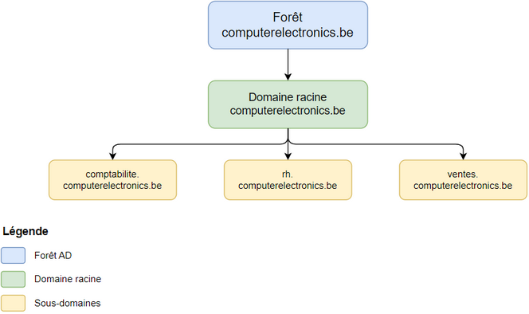
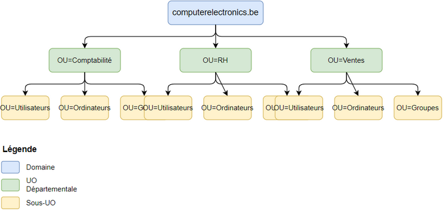
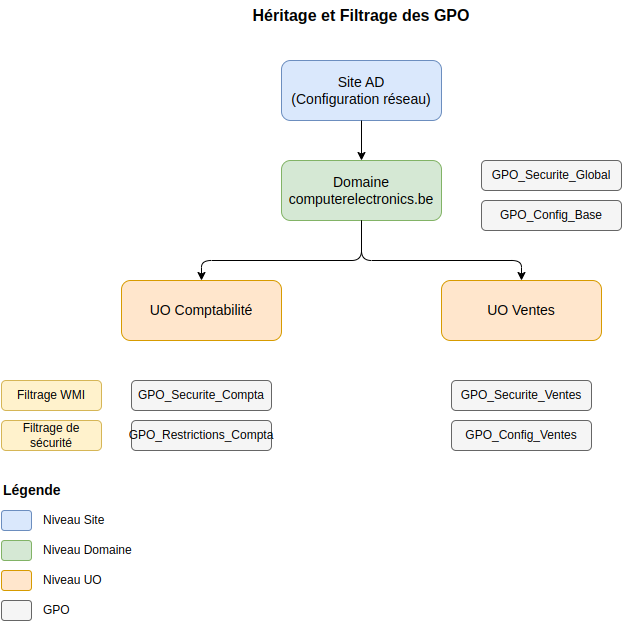
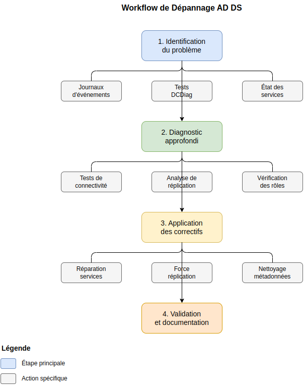

# Services de Domaine Active Directory (AD DS)

## 1. Introduction à Active Directory Domain Services

### 1.1 Concepts fondamentaux

Active Directory Domain Services (AD DS) est le **service d'annuaire central de Windows Server**. Il fonctionne comme une grande base de données qui stocke et organise tous les éléments d'un réseau d'entreprise : utilisateurs, ordinateurs, imprimantes et autres ressources.

**La force d'Active Directory** réside dans sa capacité à **centraliser l'administration**. Au lieu de gérer chaque ordinateur individuellement, les administrateurs peuvent appliquer des politiques et des configurations à partir d'un point central.



Active Directory s'organise selon deux structures complémentaires :
- La **structure logique** permet d'organiser les ressources selon les besoins administratifs

Exemple de structure logique: 
- La direction (UO) est divisée en plusieurs services (comptabilité, RH, ventes)
- Chaque service est divisé en plusieurs équipes (comptabilité: équipe 1 et équipe 2, RH: équipe 1 et équipe 2, etc.)
- Les équipes sont composées d'utilisateurs (Marie, Pierre, Jacques, etc.)

- La **structure physique** reflète l'organisation réelle du réseau et optimise le trafic

Exemple de structure physique: 
Exemple de structure physique: 
- Les serveurs sont installés dans deux salles (A et B)
- Les ordinateurs des utilisateurs sont répartis dans les différents bâtiments (A, B, C)


### 1.2 Structure AD et domaines

L'organisation d'Active Directory suit une hiérarchie précise, comme illustré dans le diagramme ci-dessus :

**La forêt** est le conteneur le plus large, regroupant tous les domaines d'une organisation. Dans notre cas, la forêt computerelectronics.be englobe toute l'infrastructure.

**Les domaines** sont les unités administratives principales. Le domaine racine (computerelectronics.be) héberge les services centraux, tandis que les sous-domaines (comptabilite, rh, ventes) gèrent leurs départements respectifs.

**Les relations d'approbation** permettent aux utilisateurs d'un domaine d'accéder aux ressources d'un autre domaine :
- Bidirectionnelles : confiance mutuelle entre domaines
- Unidirectionnelles : confiance à sens unique
- Transitives : la confiance s'étend automatiquement
- Non-transitives : confiance limitée entre deux domaines

Le **catalogue global** est une base de données partielle contenant des informations sur tous les objets de la forêt, permettant des recherches rapides et l'authentification même en cas d'indisponibilité du contrôleur principal.

### 1.3 Analogie pour comprendre AD DS

Pour simplifier la compréhension d'AD DS, on peut le comparer à la structure d'une entreprise :

- Le siège social (domaine racine) définit les politiques générales
- Les filiales (sous-domaines) gèrent leurs ressources locales
- Les départements (UO) organisent les services
- Le système de badges (relations d'approbation) contrôle les accès

Cette analogie aide à visualiser comment AD DS organise et sécurise les ressources informatiques d'une organisation.

### Exercice 1.1 - Structure AD

Expliquez comment est organisée la structure AD de computerelectronics.be, en identifiant le domaine racine, les sous-domaines et leur rôle respectif.

<details>
<summary>Solution 1.1</summary>

Structure de computerelectronics.be :

1. Domaine racine (computerelectronics.be)
   - Administration centrale
   - Politiques globales
   - Contrôle d'accès général

2. Sous-domaines spécialisés
   - comptabilite : gestion financière
   - rh : gestion du personnel
   - ventes : opérations commerciales

3. Organisation
   - Chaque domaine gère ses propres ressources
   - Applications des politiques de sécurité
   - Délégation des droits administratifs
</details>

## 2. Installation et Configuration des Contrôleurs de Domaine


### 2.2 Installation du premier contrôleur de domaine

L'installation se déroule en deux phases principales :

**Installation du rôle AD DS**
1. Ouvrir le Gestionnaire de serveur
2. Sélectionner "Ajouter des rôles"
3. Choisir "Services AD DS"
4. Installer les fonctionnalités requises

**Promotion en contrôleur de domaine**
1. Lancer l'Assistant de configuration AD DS
2. Sélectionner "Ajouter une nouvelle forêt"
3. Configurer le nom de domaine
4. Définir le mot de passe DSRM
5. Configurer les chemins de base de données

Les rôles FSMO (Flexible Single Master Operation) sont automatiquement attribués au premier contrôleur :
- Maître de schéma : gère les modifications du schéma AD
- Maître d'attribution des noms : gère les changements de structure
- Maître RID : attribue des identificateurs uniques
- Maître d'infrastructure : gère les références entre domaines
- Émulateur PDC : assure la compatibilité descendante

### 2.3 Réplication et contrôleurs additionnels

La réplication est essentielle pour la disponibilité et la redondance :

**Installation des contrôleurs secondaires**
1. Installer le rôle AD DS comme précédemment
2. Choisir "Ajouter à un domaine existant"
3. Fournir les informations d'identification
4. Configurer les options de réplication

**Configuration des sites**
- Créer des sites AD pour chaque localisation physique
- Définir les sous-réseaux associés
- Configurer les liens de sites
- Planifier les horaires de réplication

### Exercice 2.1 - Installation DC

Installez le premier contrôleur de domaine pour computerelectronics.be avec les paramètres suivants :
- Nom NetBIOS : CEBDC01
- Base de données : C:\Windows\NTDS
- Logs : C:\Windows\NTDS
- SYSVOL : C:\Windows\SYSVOL

<details>
<summary>Solution 2.1</summary>

1. Prérequis
   - Vérifier la configuration IP statique
   - Tester la connexion réseau
   - Vérifier l'espace disque disponible

2. Installation
   ```powershell
   # Installation du rôle AD DS
   Install-WindowsFeature AD-Domain-Services -IncludeManagementTools

   # Promotion en contrôleur de domaine
   Import-Module ADDSDeployment
   Install-ADDSForest `
     -DomainName "computerelectronics.be" `
     -DomainNetbiosName "CEBDC01" `
     -DatabasePath "C:\Windows\NTDS" `
     -LogPath "C:\Windows\NTDS" `
     -SysvolPath "C:\Windows\SYSVOL" `
     -ForestMode "WinThreshold" `
     -DomainMode "WinThreshold" `
     -InstallDns:$true `
     -NoRebootOnCompletion:$false
   ```

3. Vérifications post-installation
   - Test des services AD DS et DNS
   - Vérification des zones DNS intégrées
   - Test d'authentification
</details>

## 3. Structure Organisationnelle

### 3.1 Unités d'Organisation (UO)

Les Unités d'Organisation (UO) sont les conteneurs fondamentaux pour organiser les ressources dans Active Directory. Elles permettent de créer une structure hiérarchique adaptée aux besoins de l'entreprise.



Dans notre infrastructure, chaque département (Comptabilité, RH, Ventes) dispose de sa propre UO, subdivisée en trois sous-UO :
- **Utilisateurs** : stocke les comptes utilisateurs du département
- **Ordinateurs** : contient les postes de travail
- **Groupes** : héberge les groupes de sécurité et de distribution

Cette organisation permet :
- Une **délégation administrative** efficace
- Une **application ciblée** des stratégies de groupe
- Une **gestion simplifiée** des droits d'accès

### 3.2 Création et gestion des UO

Pour créer une nouvelle UO via PowerShell :

```powershell
# Création d'une UO
New-ADOrganizationalUnit -Name "Comptabilité" -Path "DC=computerelectronics,DC=be" -ProtectedFromAccidentalDeletion $true

# Création des sous-UO
$departement = "Comptabilité"
$sousUO = @("Utilisateurs", "Ordinateurs", "Groupes")

foreach ($ou in $sousUO) {
    New-ADOrganizationalUnit -Name $ou `
        -Path "OU=$departement,DC=computerelectronics,DC=be" `
        -ProtectedFromAccidentalDeletion $true
}
```

### 3.3 Délégation administrative

La délégation permet d'attribuer des droits d'administration spécifiques aux responsables de chaque département :

```powershell
# Création du groupe de délégation
New-ADGroup -Name "GS_Admin_Comptabilité" `
    -Path "OU=Groupes,OU=Comptabilité,DC=computerelectronics,DC=be" `
    -GroupScope Global `
    -GroupCategory Security

# Attribution des droits de délégation
$ou = "OU=Comptabilité,DC=computerelectronics,DC=be"
$groupe = "GS_Admin_Comptabilité"
$droits = "GenericAll"

$acl = Get-Acl -Path "AD:\$ou"
$sid = (Get-ADGroup $groupe).SID
$rule = New-Object System.DirectoryServices.ActiveDirectoryAccessRule($sid, $droits, "Allow")
$acl.AddAccessRule($rule)
Set-Acl -Path "AD:\$ou" -AclObject $acl
```

### Exercice 3.1 - Création d'une structure UO

Créez la structure UO complète pour le département des Ventes, incluant les sous-UO et un groupe de délégation administrative.

<details>
<summary>Solution 3.1</summary>

```powershell
# Variables
$departement = "Ventes"
$domainDN = "DC=computerelectronics,DC=be"
$sousUO = @("Utilisateurs", "Ordinateurs", "Groupes")

# 1. Création de l'UO principale
New-ADOrganizationalUnit -Name $departement `
    -Path $domainDN `
    -ProtectedFromAccidentalDeletion $true

# 2. Création des sous-UO
foreach ($ou in $sousUO) {
    New-ADOrganizationalUnit -Name $ou `
        -Path "OU=$departement,$domainDN" `
        -ProtectedFromAccidentalDeletion $true
}

# 3. Création du groupe d'administration
$groupeName = "GS_Admin_$departement"
New-ADGroup -Name $groupeName `
    -Path "OU=Groupes,OU=$departement,$domainDN" `
    -GroupScope Global `
    -GroupCategory Security

# 4. Configuration de la délégation
$ou = "OU=$departement,$domainDN"
$acl = Get-Acl -Path "AD:\$ou"
$sid = (Get-ADGroup $groupeName).SID
$rule = New-Object System.DirectoryServices.ActiveDirectoryAccessRule($sid, "GenericAll", "Allow")
$acl.AddAccessRule($rule)
Set-Acl -Path "AD:\$ou" -AclObject $acl

# 5. Vérification
Get-ADOrganizationalUnit -Filter "Name -like '*$departement*'" | Format-Table Name, DistinguishedName
Get-ADGroup -Identity $groupeName | Format-Table Name, DistinguishedName
```
</details>

### Exercice 3.2 - Délégation des droits

Configurez la délégation pour permettre au groupe GS_Admin_Ventes de :
1. Réinitialiser les mots de passe
2. Créer/supprimer des comptes utilisateurs
3. Gérer les groupes

<details>
<summary>Solution 3.2</summary>

```powershell
# Variables
$departement = "Ventes"
$domainDN = "DC=computerelectronics,DC=be"
$groupeName = "GS_Admin_$departement"
$ouPath = "OU=$departement,$domainDN"

# Droits de délégation
$droits = @(
    @{
        ObjectType = "bf967a86-0de6-11d0-a285-00aa003049e2" # Utilisateur
        ActiveDirectoryRights = "CreateChild, DeleteChild"
    },
    @{
        ObjectType = "00000000-0000-0000-0000-000000000000" # Tous les objets
        ActiveDirectoryRights = "GenericRead"
    },
    @{
        ObjectType = "bf967a9c-0de6-11d0-a285-00aa003049e2" # Mot de passe
        ActiveDirectoryRights = "ExtendedRight"
    }
)

# Application des droits
$acl = Get-Acl -Path "AD:\$ouPath"
$sid = (Get-ADGroup $groupeName).SID

foreach ($droit in $droits) {
    $rule = New-Object System.DirectoryServices.ActiveDirectoryAccessRule(
        $sid,
        $droit.ActiveDirectoryRights,
        "Allow",
        $droit.ObjectType
    )
    $acl.AddAccessRule($rule)
}

Set-Acl -Path "AD:\$ouPath" -AclObject $acl

# Vérification des droits
(Get-Acl -Path "AD:\$ouPath").Access | Where-Object {
    $_.IdentityReference -like "*$groupeName*"
} | Format-Table IdentityReference, ActiveDirectoryRights, ObjectType
```
</details>{{ ... }}

## 5. Stratégies de Groupe (GPO)

### 5.1 Concepts fondamentaux

Les stratégies de groupe (Group Policy Objects - GPO) permettent de configurer et de contrôler l'environnement des utilisateurs et des ordinateurs de manière centralisée.



Comme illustré dans le diagramme ci-dessus, les GPO s'appliquent selon une hiérarchie précise :

**Niveaux d'application**
- Site AD : configurations spécifiques au site physique
- Domaine : politiques globales pour computerelectronics.be
- Unité d'Organisation : paramètres départementaux
- Objets : configurations individuelles

**Ordre de traitement**
1. Stratégies locales (paramètres Windows de base)
2. Stratégies de site (configurations réseau)
3. Stratégies de domaine (sécurité globale)
4. Stratégies d'UO (du parent vers l'enfant)

### 5.2 Configuration des GPO

Pour maintenir une structure cohérente, nous utilisons une nomenclature standardisée :
- Préfixe "GPO_"
- Type de stratégie (Securite, Configuration, Restrictions)
- Département concerné si applicable

```powershell
# Création d'une nouvelle GPO
New-GPO -Name "GPO_Securite_Comptabilite" -Comment "Stratégies de sécurité pour le département comptabilité"

# Liaison de la GPO à une UO
$gpo = Get-GPO -Name "GPO_Securite_Comptabilite"
$ou = "OU=Comptabilité,DC=computerelectronics,DC=be"
New-GPLink -Name $gpo.DisplayName -Target $ou -LinkEnabled Yes

# Configuration d'un paramètre
Set-GPRegistryValue -Name "GPO_Securite_Comptabilite" `
    -Key "HKLM\Software\Policies\Microsoft\Windows\System" `
    -ValueName "DisableCMD" `
    -Type DWord `
    -Value 1
```

### 5.3 Stratégies recommandées

**Sécurité des mots de passe**
```powershell
# Configuration de la politique de mot de passe
$domain = "DC=computerelectronics,DC=be"
Set-ADDefaultDomainPasswordPolicy -Identity $domain `
    -ComplexityEnabled $true `
    -MinPasswordLength 12 `
    -PasswordHistoryCount 24 `
    -MaxPasswordAge (New-TimeSpan -Days 90) `
    -MinPasswordAge (New-TimeSpan -Days 1)
```

**Restrictions logicielles**
```powershell
# Création d'une GPO pour les restrictions
$gpoName = "GPO_Restrictions_Logicielles"
New-GPO -Name $gpoName

# Configuration des chemins autorisés
$paths = @(
    "C:\Program Files\*",
    "C:\Program Files (x86)\*",
    "C:\Windows\*"
)

foreach ($path in $paths) {
    Set-GPRegistryValue -Name $gpoName `
        -Key "HKLM\SOFTWARE\Policies\Microsoft\Windows\Safer\CodeIdentifiers\262144\Paths\{$(New-Guid)}" `
        -ValueName "ItemData" `
        -Type String `
        -Value $path
}
```

### Exercice 5.1 - Configuration de base

Créez une GPO pour le département Ventes qui :
1. Désactive l'accès au Panneau de configuration
2. Masque le lecteur C: dans l'Explorateur
3. Configure un fond d'écran d'entreprise

<details>
<summary>Solution 5.1</summary>

```powershell
# Variables
$gpoName = "GPO_Configuration_Ventes"
$ouPath = "OU=Ventes,DC=computerelectronics,DC=be"

# 1. Création de la GPO
New-GPO -Name $gpoName -Comment "Configuration de base pour le département Ventes"

# 2. Configuration des paramètres
$registrySettings = @(
    @{
        Key = "HKCU\Software\Microsoft\Windows\CurrentVersion\Policies\Explorer"
        ValueName = "NoControlPanel"
        Type = "DWord"
        Value = 1
    },
    @{
        Key = "HKCU\Software\Microsoft\Windows\CurrentVersion\Policies\Explorer"
        ValueName = "NoDrives"
        Type = "DWord"
        Value = 4  # Masque le lecteur C:
    },
    @{
        Key = "HKCU\Software\Microsoft\Windows\CurrentVersion\Policies\System"
        ValueName = "Wallpaper"
        Type = "String"
        Value = "\\\\computerelectronics.be\NETLOGON\Wallpaper\company.png"
    }
)

foreach ($setting in $registrySettings) {
    Set-GPRegistryValue -Name $gpoName `
        -Key $setting.Key `
        -ValueName $setting.ValueName `
        -Type $setting.Type `
        -Value $setting.Value
}

# 3. Liaison de la GPO à l'UO
New-GPLink -Name $gpoName -Target $ouPath -LinkEnabled Yes

# 4. Vérification
Get-GPO -Name $gpoName | Format-List DisplayName, CreationTime, ModificationTime
Get-GPOReport -Name $gpoName -ReportType Html -Path "$env:USERPROFILE\Desktop\GPOReport.html"
```
</details>

### Exercice 5.2 - Sécurité avancée

Créez une GPO de sécurité qui :
1. Force l'authentification NTLMv2
2. Désactive les protocoles SMB1 et SMB2
3. Active la journalisation avancée

<details>
<summary>Solution 5.2</summary>

```powershell
# Variables
$gpoName = "GPO_Securite_Avancee"
$domainDN = "DC=computerelectronics,DC=be"

# 1. Création de la GPO
New-GPO -Name $gpoName -Comment "Paramètres de sécurité avancée"

# 2. Configuration des paramètres de sécurité
$securitySettings = @(
    @{
        Key = "HKLM\System\CurrentControlSet\Control\Lsa"
        ValueName = "LmCompatibilityLevel"
        Type = "DWord"
        Value = 5  # Force NTLMv2
    },
    @{
        Key = "HKLM\System\CurrentControlSet\Services\LanmanServer\Parameters"
        ValueName = "SMB1"
        Type = "DWord"
        Value = 0
    },
    @{
        Key = "HKLM\System\CurrentControlSet\Services\LanmanServer\Parameters"
        ValueName = "SMB2"
        Type = "DWord"
        Value = 0
    },
    @{
        Key = "HKLM\Software\Policies\Microsoft\Windows\EventLog\Security"
        ValueName = "MaxSize"
        Type = "DWord"
        Value = 102400  # 100 MB
    }
)

foreach ($setting in $securitySettings) {
    Set-GPRegistryValue -Name $gpoName `
        -Key $setting.Key `
        -ValueName $setting.ValueName `
        -Type $setting.Type `
        -Value $setting.Value
}

# 3. Liaison au domaine
New-GPLink -Name $gpoName -Target $domainDN -LinkEnabled Yes

# 4. Configuration de l'ordre de lien
Set-GPLink -Name $gpoName -Target $domainDN -Order 1

# 5. Vérification et rapport
gpupdate /force
Get-GPOReport -Name $gpoName -ReportType Html -Path "$env:USERPROFILE\Desktop\SecurityGPOReport.html"
```
</details>

**Note importante :** Après chaque modification de GPO, il est recommandé de :
1. Générer un rapport HTML pour documentation
2. Tester les paramètres sur un groupe pilote
3. Forcer une mise à jour avec `gpupdate /force`
4. Vérifier les journaux d'événements pour les erreurs

## 6. Dépannage et Résolution des Problèmes

### 6.1 Outils de diagnostic



Le diagramme ci-dessus illustre le workflow standard pour le dépannage d'Active Directory. Suivez ces étapes systématiquement pour une résolution efficace des problèmes.

Active Directory fournit plusieurs outils de diagnostic essentiels :

**DCDiag**
```powershell
# Test complet du contrôleur de domaine
dcdiag /v

# Test spécifique de la réplication
dcdiag /test:replications

# Vérification des services AD
dcdiag /test:services
```

**Repadmin**
```powershell
# État de la réplication entre tous les DC
repadmin /showrepl

# Synchronisation forcée
repadmin /syncall /APed

# Vérification des métadonnées de réplication
repadmin /showmeta
```

**Analyseur de réplication AD**
```powershell
# Installation de l'outil
Add-WindowsFeature RSAT-AD-Tools

# Lancement de l'analyseur
repadmin /replsummary
```

### 6.2 Problèmes courants

**Erreurs de réplication**
```powershell
# Identification des erreurs
$errors = Get-ADReplicationFailure -Target computerelectronics.be
$errors | Format-Table Server, FirstFailureTime, FailureCount, LastError

# Réinitialisation de la réplication
repadmin /syncall /AdeP
```

**Problèmes d'authentification**
```powershell
# Vérification des journaux d'authentification
Get-EventLog -LogName Security -InstanceId 4625 -Newest 10 |
    Select-Object TimeGenerated, Message

# Test de connexion Kerberos
Test-ComputerSecureChannel -Repair
```

**Nettoyage des métadonnées**
```powershell
# Suppression des métadonnées d'un DC supprimé
ntdsutil "metadata cleanup" "remove selected server <DC-Name>" quit quit
```

### Exercice 6.1 - Diagnostic de réplication

Créez un script PowerShell pour :
1. Vérifier l'état de la réplication
2. Identifier les erreurs éventuelles
3. Générer un rapport de diagnostic

<details>
<summary>Solution 6.1</summary>

```powershell
# Variables
$rapportPath = "$env:USERPROFILE\Desktop\DiagnosticAD_$(Get-Date -Format 'yyyy-MM-dd').txt"

# Fonction de diagnostic
function Test-ADReplication {
    param (
        [string]$DomainName = "computerelectronics.be"
    )

    # En-tête du rapport
    $rapport = @"
Rapport de diagnostic AD DS
Date: $(Get-Date)
Domaine: $DomainName
========================================

"@

    # 1. Test DCDiag
    $rapport += "Tests DCDiag`n"
    $rapport += "-----------`n"
    $dcdiag = dcdiag /test:replications
    $rapport += "$dcdiag`n`n"

    # 2. État de la réplication
    $rapport += "État de la réplication`n"
    $rapport += "--------------------`n"
    $repl = repadmin /showrepl
    $rapport += "$repl`n`n"

    # 3. Erreurs de réplication
    $rapport += "Erreurs de réplication`n"
    $rapport += "---------------------`n"
    try {
        $errors = Get-ADReplicationFailure -Target $DomainName -ErrorAction Stop
        if ($errors) {
            $rapport += $errors | Format-Table Server, FirstFailureTime, FailureCount, LastError |
                Out-String
        } else {
            $rapport += "Aucune erreur de réplication détectée.`n"
        }
    }
    catch {
        $rapport += "Erreur lors de la vérification des échecs de réplication : $($_.Exception.Message)`n"
    }

    # 4. Services AD
    $rapport += "État des services`n"
    $rapport += "-----------------`n"
    $services = @(
        "NTDS",          # Service AD DS
        "DNS",           # Service DNS
        "Netlogon",      # Service Netlogon
        "KDC",           # Service Kerberos
        "W32Time"        # Service de temps Windows
    )

    foreach ($service in $services) {
        $status = Get-Service -Name $service -ErrorAction SilentlyContinue
        if ($status) {
            $rapport += "{0,-20} : {1}`n" -f $service, $status.Status
        }
    }

    # Enregistrement du rapport
    $rapport | Out-File -FilePath $rapportPath -Encoding UTF8
    return $rapportPath
}

# Exécution du diagnostic
$resultatPath = Test-ADReplication
Write-Host "Rapport de diagnostic enregistré dans : $resultatPath"

# Affichage des résultats critiques
Get-Content $resultatPath | Select-String -Pattern "fail|error|warning" -Context 2,2
```
</details>

### Exercice 6.2 - Résolution des problèmes

Résolvez les problèmes suivants dans l'environnement de test :
1. Un contrôleur de domaine ne réplique plus
2. Les utilisateurs ne peuvent pas se connecter
3. Le catalogue global est inaccessible

<details>
<summary>Solution 6.2</summary>

```powershell
# 1. Résolution des problèmes de réplication
# Vérification de la connectivité réseau
Test-NetConnection -ComputerName dc1.computerelectronics.be -Port 389
Test-NetConnection -ComputerName dc1.computerelectronics.be -Port 3268

# Réinitialisation de la réplication
repadmin /syncall /AdeP
Start-Sleep -Seconds 30
repadmin /replsummary

# 2. Problèmes d'authentification
# Vérification des SPN
setspn -L computerelectronics.be
setspn -T computerelectronics.be -Q */*

# Test et réparation du canal sécurisé
Test-ComputerSecureChannel -Repair
nltest /sc_verify:computerelectronics.be

# 3. Catalogue global
# Vérification du rôle
Get-ADDomainController -Filter * | 
    Select-Object Name, Domain, Forest, IsGlobalCatalog

# Promotion en catalogue global si nécessaire
$config = Get-ADDomainController -Identity $env:COMPUTERNAME
if (-not $config.IsGlobalCatalog) {
    Set-ADDomainController -Identity $config.HostName -GlobalCatalog $true
    Restart-Service NTDS
}

# Vérification des ports du catalogue global
Test-NetConnection -ComputerName dc1.computerelectronics.be -Port 3268
Test-NetConnection -ComputerName dc1.computerelectronics.be -Port 3269

# Rapport final
$report = @"
Rapport de résolution des problèmes
==================================
$(Get-Date)

1. État de la réplication
$((repadmin /showrepl) -join "`n")

2. État des services
$((Get-Service -Name "NTDS", "DNS", "Netlogon", "KDC" | 
    Format-Table Name, Status, StartType -AutoSize | 
    Out-String).Trim())

3. État du catalogue global
$((Get-ADDomainController -Filter * | 
    Select-Object Name, IsGlobalCatalog | 
    Format-Table -AutoSize | 
    Out-String).Trim())
"@

$report | Out-File "$env:USERPROFILE\Desktop\ResolutionReport.txt"
```
</details>

**Note importante :** Pour tout problème critique :
1. Documenter l'état initial et les symptômes
2. Sauvegarder les journaux d'événements pertinents
3. Tester les changements dans un environnement de test
4. Planifier une fenêtre de maintenance si nécessaire