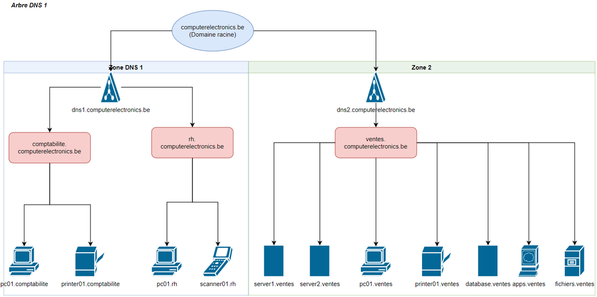
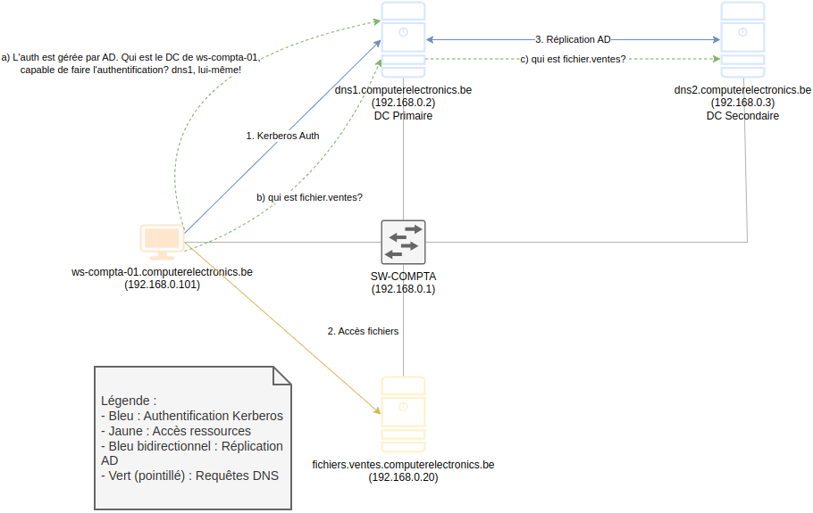
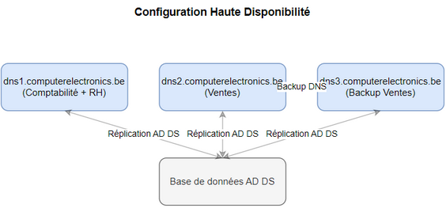
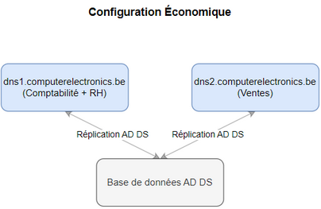
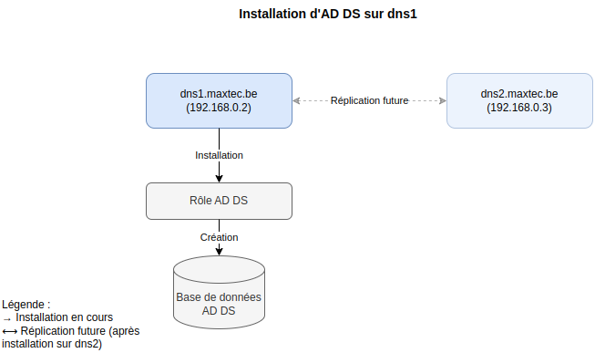

# 1. Active Directory et ses composants

Active Directory est une suite de services qui permettent de gérer :
 
* La gestion des utilisateurs
* La gestion des ordinateurs
* La gestion des ressources
* La gestion des stratégies de sécurité
* La gestion des services réseau
etc...

**On le confond souvent avec** **AD DS** (le service de base qui crée et gère la base de données d'AD), mais AD est plus large car il contient :
 
1. **AD DS** **(Active Directory Domain Services)** : Service principal gérant l'authentification et l'autorisation des ressources dans le réseau.
2. **AD LDS** (Lightweight Directory Services) : Version allégée d'AD DS fonctionnant sans domaine Windows.
3. **AD CS** (Certificate Services) : Gestion des certificats numériques et de l'infrastructure à clé publique (PKI).
4. **AD RMS** (Rights Management Services) : Protection et contrôle des droits d'accès aux documents.
5. **AD FS** (Federation Services) : Authentification unique (SSO) et fédération d'identités entre organisations.

**La force d'Active Directory** réside dans sa capacité à **centraliser l'administration**. Au lieu de gérer chaque ordinateur individuellement, les administrateurs peuvent appliquer des politiques et des configurations à partir d'un point central.

# 2. Infrastructure du cours

Pour la partie pratique, nous utiliserons une infrastructure virtualisée :

1. **Configuration de base**
   - Une machine hôte avec 32GB RAM
   - Windows Server 2022
   - Hyper-V avec deux réseaux virtuels :
     * LAN (réseau local)
     * WAN (réseau étendu)

2. **Machines virtuelles initiales**
   - Un serveur (futur contrôleur de domaine)
   - Un poste client
   - Possibilité d'ajouter un second DC ultérieurement

Cette infrastructure nous permettra de mettre en place progressivement les concepts d'Active Directory dans un environnement isolé et sécurisé, tout en visant la structure finale de computerelectronics.be.

# 3. Exemple de fonctionnement d'AD : appel client-serveur

Considérez notre structure de réseau :



Voyons un flux client-serveur avec Active Directory.

Dans cet exemple, un utilisateur essaie d'accéder au serveur de fichiers.
Observez les flèches en bleu, jaune et bleu bidirectionnel.
**Pas les flèches vertes pour le moment**



1. **Authentification** (flèche bleue)
   - `pc01-comptabilite` (`10.0.1.101`) demande une authentification à `dns1` (`10.0.1.10`)
   - `dns1.computerelectronics.be`, en tant que contrôleur de domaine, traite la demande
   - L'authentification utilise le protocole Kerberos
   - La communication passe par le switch départemental (`SW-COMPTA`, `10.0.1.1`)

2. **Accès aux ressources** (flèche jaune)
   - Une fois authentifié, `pc01-comptabilite` accède au serveur `fichiers.ventes`
   - `dns2` fournit l'adresse IP de `fichiers.ventes` (`10.0.2.20`)
   - Le serveur `fichiers.ventes` autorise l'accès aux ressources demandées

3. **Réplication AD** (flèche bleue bidirectionnelle)
   - `dns1` (`10.0.1.10`) et `dns2` (`10.0.1.11`) synchronisent leurs bases AD DS
   - Cette réplication assure :
     * La cohérence des données entre les contrôleurs
     * La disponibilité du service même si un DC tombe en panne !

Les flèches vertes rajoutées montrent les **requêtes** DNS permettant la résolution des noms (DNS) nécessaire à chaque étape. On ne voit pas les réponses pour ne plus compliquer le diagramme :

1. Le PC interroge `dns1` pour chercher son DC, qui gère l'authentification
2. Une fois authentifié, le PC interroge `dns1` pour chercher l'adresse IP du serveur de fichiers. `dns1` ne le connaît pas 
3. `dns1` interroge alors `dns2`
4. `dns2` fournit l'adresse IP du serveur de fichiers. Le PC accède au serveur de fichiers.

<br>

# 4. Active Directory Domain Services (AD DS)

Dans ce cours, **nous nous concentrerons sur AD DS car c'est le service fondamental** pour la gestion de l'infrastructure de computerelectronics.be. 

**Le service AD DS est un service d'AD qui crée et gère la base de données d'AD.**. 

1. AD DS permet :
   - L'authentification centralisée des utilisateurs
   - La gestion des ressources réseau
   - L'application des stratégies de sécurité
   - L'organisation hiérarchique des ressources

2. AD DS stocke les informations sur :
   - Les utilisateurs (employés, prestataires, etc.)
   - Les ordinateurs (postes de travail, serveurs)
   - Les ressources partagées (imprimantes, dossiers)
   - Les stratégies de sécurité
   - Les services réseau

Pour bien comprendre le déploiement d'AD DS dans notre entreprise, commençons par examiner la structure DNS existante, car AD DS s'appuie fortement sur DNS pour son fonctionnement.

## 4.1. Structure DNS actuelle du réseau

### 4.1.1. Forêt, arbres, zones DNS

Nous avons actuellement : 

- Un seul arbre DNS (l'autre arbre de la forêt appartient à une autre entreprise)
- Deux zones DNS dans l'arbre (l'une pour comptabilité et RH, l'autre pour ventes)
- Deux serveurs DNS :
  * `dns1.computerelectronics.be` (`10.0.1.10`) pour gérer les départements de Comptabilité et RH
  * `dns2.computerelectronics.be` (`10.0.1.11`) pour gérer le département de Ventes

### 4.1.2. AD DS et la localisation de la base de données d'AD 

**Le service AD DS est un service d'AD qui crée et gère la base de données d'AD.**

Cette base de données doit être stockée dans (au moins) un **appareil serveur** qu'on appellera **Contrôleur de Domaine (DC)**.

**Ce suffirait pour gérer les ressources de tout l'arbre DNS, mais** on ne peut pas prendre le risque de perdre la base de données si le serveur tombe en panne ! 

**IMPORTANT** : Ne confondez pas le service DNS et le service AD DS ! **Notez** que le service DNS (transformer les noms en IP et vice versa) est indépendant de la base de données d'AD (base de données contenant toutes les informations sur les utilisateurs, ordinateurs, imprimantes, etc.). 

**On pourrait avoir toute sorte de combinaisons :**
- 3 serveurs DNS et 2 serveurs AD :
  * 2 serveurs pour gérer les DNS de Ventes (1 de backup)
  * 1 serveur pour gérer les DNS de Comptabilité et RH
  * 2 serveurs AD (1 de backup). Les deux serveurs contiennent la même base de données d'AD (qui contient l'AD pour tout l'arbre DNS)

### 4.1.3. Exercice - Analyse des combinaisons DNS-AD DS

**Tant le service DNS comme le service AD DS** doivent fonctionner **sans arrêt** ! Cela veut dire que si un serveur tombe en panne, il faut qu'un autre serveur prenne son rôle. En plus... si un serveur est surchargé, il faut qu'un autre serveur prenne son rôle ! Quoi faire ? **Rajouter des serveurs DNS et des serveurs AD**.


### 4.1.4. Exercices

#### 4.1.4.1. Exercice - Configuration haute disponibilité
Le département des ventes est critique et nécessite une haute disponibilité. Proposez une configuration qui assure :
- Une haute disponibilité pour le service DNS des ventes
- Une redondance suffisante pour l'AD DS
- Une répartition de charge efficace

<details>
<summary>Solution</summary>

Configuration proposée :
- 3 serveurs DNS :
  * dns1 : zones DNS pour comptabilité et RH
  * dns2 : zone DNS pour ventes
  * dns3 : backup de dns2 pour ventes
- 2 serveurs AD DS avec réplication bidirectionnelle complète



Avantages :
- Double redondance DNS pour ventes (département critique)
- Réplication AD DS entre tous les DC
- Répartition de charge possible pour DNS ventes

Inconvénients :
- Coût plus élevé (3 serveurs au total)
- Complexité de gestion accrue

</details>

#### 4.1.4.2. Exercice - Configuration économique
L'entreprise a des contraintes budgétaires mais souhaite maintenir un minimum de redondance. Proposez une configuration économique qui assure :
- Un service minimal pour tous les départements
- Une redondance de base pour l'AD DS

<details>
<summary>Solution 2</summary>

Configuration proposée :
- 2 serveurs DNS :
  * dns1 : zones DNS pour comptabilité et RH
  * dns2 : zone DNS pour ventes
- 2 serveurs AD DS avec réplication bidirectionnelle complète



Avantages :
- Solution économique (2 serveurs)
- Structure simple et claire
- Réplication AD DS assurée

Inconvénients :
- Pas de backup DNS pour les départements
- Risque d'interruption de service DNS en cas de panne
- Pas de répartition de charge possible
</details>

# 5. Contrôleurs de Domaine

## 5.1. Relations entre DNS et AD DS

Nous allons installer les services d'AD DS sur notre serveur `dns1.computerelectronics.be`.
Il va devenir un **contrôleur de domaine** (DC).

Concernant les services de DNS, **chaque serveur continue à gerer une zone** :
- `dns1` pour comptabilité et RH
- `dns2` pour ventes

Dans une situation réelle on installera AD aussi sur `dns2.computerelectronics.be`, **qui contiendrai une réplique de la base de données d'AD**. Ou peut-être même sur d'autres serveurs si on les avait !

Ce diagramme representera l'installation de AD sur `dns1.computerelectronics.be` :



## 5.2. Procédure d'installation dans notre environnement virtuel

L'installation se déroulera sur notre infrastructure de test :

**Prérequis sur la machine virtuelle serveur**
1. Windows Server 2022 installé
2. Configuration réseau :
   - Adresse IP statique sur le réseau LAN via l'interface graphique (Serveur Local->Section Ethernet->Propriétés->Protocole IPv4). On lui donnera `192.168.0.2` au lieu d'une adresse automatique.
   - Nom d'ordinateur configuré via les Paramètres système
     - Dans le champ "Nom de l'ordinateur", tapez : **dns1**
     - Dans le champ "Suffixe DNS principal de l'ordinateur", tapez : **computerelectronics.be**
   - Pour le serveur DNS, on lui donnera `192.168.0.2` (notre choix) au lieu d'une adresse automatique (il cherchera les noms DNS chez lui-même, y incluant le sien: `dns1.computerelectronics.be`)

Notez que votre machine virtualisée perd la connexion internet. 

**Installation du rôle AD DS**
1. Ouvrir le Gestionnaire de serveur
2. Cliquer sur "Gérer" puis "Ajouter des rôles et fonctionnalités"
3. Cliquez sur "Installation basée sur un rôle ou une fonctionnalité"
4. Choisissez le serveur `dns1.computerelectronics.be`
5. Suivre l'Assistant jusqu'à "Rôles de serveurs"
6. Cocher "Services AD DS"
7. Accepter l'ajout des fonctionnalités requises
8. Continuez jusqu'à la fin de l'installation


**Promotion en contrôleur de domaine**
1. Dans le Gestionnaire de serveur, cliquer sur le drapeau avec le triangle jaune
2. Sélectionner "Promouvoir ce serveur en contrôleur de domaine"
3. Choisir "Ajouter une nouvelle forêt"
4. Saisir le nom de domaine : computerelectronics.be
5. Choisir le niveau fonctionnel de la forêt et du domaine (la plus récente)
6. Définir le mot de passe du mode de restauration des services d'annuaire (DSRM) (Password1!)
7. Continuez et ignorez l'avertissement sur les délégations
8. Choisissez le nom pour le domain NETBIOS ( "COMPUTERRELECTRONICS")
9. Vérifier les chemins de la base de données, des journaux et de SYSVOL
10. Examiner les options sélectionnées et lancer l'installation


## 5.2.1. Vérification post-promotion

Une fois la promotion terminée et le serveur redémarré, il est essentiel de vérifier que tout fonctionne correctement. Voici les étapes de vérification à suivre. Ouvrez le Gestionnaire de serveur et cliquez sur le nouveau menu: **AD DS**. 

### 5.2.1.1. Vérification des services nécessaires

Dans la section Services du menu **AD DS**, vérifiez que les services suivants sont en cours d'exécution :
   - Active Directory Domain Services
   - DNS Server
   - DFS Replication
   - Intersite Messaging
   - Kerberos Key Distribution Center
   - NetLogon
   - Windows Time

En PowerShell:

```powershell
Get-Service -DisplayName "*Active Directory*", "*DNS*", "*DFS*", "*Messagerie*", "*Kerberos*", "*Netlogon*", "*Temps*"
```


### 5.2.1.2. Vérification DNS

1. Ouvrez la console DNS
2. Vérifiez la présence des zones suivantes :
   - Zone directe : computerelectronics.be
   - Zones de recherche inversée pour 192.168.0.x
3. Vérifiez les enregistrements SRV dans computerelectronics.be :
   - _ldap._tcp
   - _kerberos._tcp
   - _gc._tcp

### 5.2.1.3. Vérification AD DS

1. Ouvrez l'outil "Utilisateurs et ordinateurs Active Directory"
2. Vérifiez la présence des conteneurs par défaut :
   - Domain Controllers
   - Users
   - Computers
3. Vérifiez que votre serveur apparaît dans "Domain Controllers"

### 5.2.1.4. Tests de base

1. Test DNS et AD DS :
   ```powershell
   dcdiag /test:dns
   dcdiag /test:connectivity
   dcdiag /test:netlogons
   dcdiag /test:services
   ```

2. Test de résolution DNS :
   ```powershell
   nslookup dns1.computerelectronics.be
   nslookup -type=SRV _ldap._tcp.computerelectronics.be
   ```

3. Vérification SYSVOL :
   ```powershell
   net share
   ```
   Vérifiez la présence du partage SYSVOL

### 5.2.1.5. Résolution des problèmes courants

Si vous rencontrez des erreurs :

1. Problèmes DNS :
   - Vérifiez la configuration IP (statique 192.168.0.2)
   - Vérifiez que le serveur DNS pointe vers lui-même
   - Redémarrez le service DNS si nécessaire

2. Problèmes de services :
   - Vérifiez les dépendances des services
   - Consultez l'observateur d'événements
   - Redémarrez les services dans l'ordre : DNS -> Netlogon -> AD DS

3. Problèmes SYSVOL :
   - Vérifiez les permissions du dossier
   - Redémarrez le service DFS Replication
