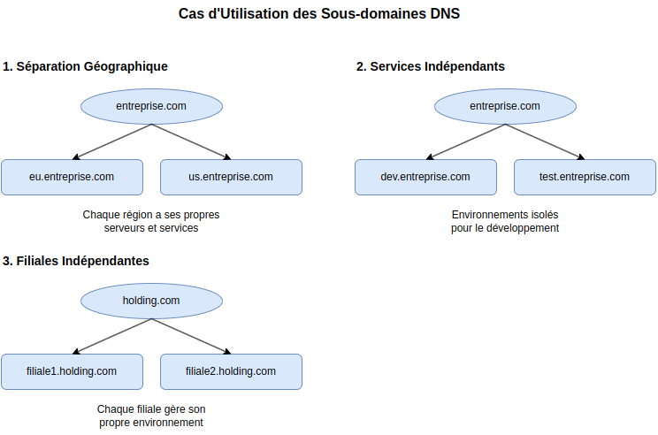
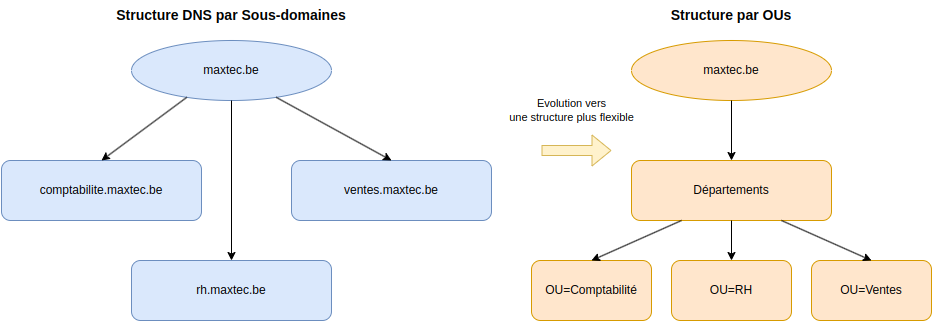
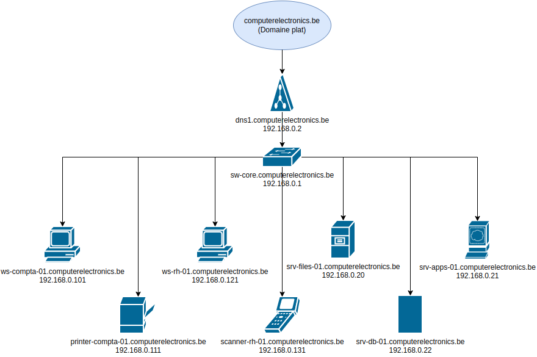

# 1. Organizational Units (OUs)

## 1. Introduction aux OUs

### 1.1. Qu'est-ce qu'une OU ?

Une Unité d'Organisation (OU) **est un conteneur dans Active Directory qui permet d'organiser les objets de manière administrative**. Ces objets peuvent être :
- Des comptes **utilisateurs**
- Des **ordinateurs**
- Des **groupes**
- Des **imprimantes**
- D'autres **OUs** (imbrication)

### 1.2. Objectifs Pédagogiques

À la fin de ce chapitre, vous serez capable de :
1. Créer et organiser une structure d'OUs
2. Déléguer des droits d'administration
3. Gérer la sécurité des OUs
4. Implémenter les bonnes pratiques

### 1.3. Des Sous-domaines DNS aux OUs

Dans le chapitre DNS, nous avons organisé notre infrastructure avec des sous-domaines pour chaque département :


- comptabilite.computerelectronics.be
- rh.computerelectronics.be
- ventes.computerelectronics.be

Les sous-domaines DNS sont une solution **parfaitement valide** et largement utilisée dans certains scénarios :



1. **Séparation Géographique**
   - Bureaux dans différents pays (eu.entreprise.com, us.entreprise.com)
   - Chaque région a ses propres serveurs et services

2. **Services Indépendants**
   - Environnements de développement (dev.entreprise.com)
   - Plateformes de test (test.entreprise.com)

3. **Filiales Indépendantes**
   - Entreprises distinctes dans un groupe
   - Administration séparée

**Dans notre cas pédagogique, nous avons utilisé les sous-domaines** car ils rendent la structure DNS **plus visible et plus facile à comprendre**. C'est une excellente façon d'apprendre les concepts DNS et de voir comment les différents éléments s'interconnectent.
On aurait pu expliquer les sous-domaines dans par exemple un contexte de séparation géographique, mais le sujet est trop complexe et abstrait pour un premier contact.

#### Évolution vers les OUs

Cependant, pour une seule entreprise avec des départements internes, **la tendance moderne est d'utiliser une structure plus flexible**:



La solution moderne consiste à utiliser :
- Un domaine DNS **plat** : tous les ordinateurs dans `computerelectronics.be`

On n'aura plus `ws-compta-01.comptabilite.computerelectronics.be` mais `ws-compta-01.computerelectronics.be`
On n'aura plus `printer-compta-01.comptabilite.computerelectronics.be` mais `printer-compta-01.computerelectronics.be`
etc...

Voici la nouvelle structure physique. On a passé de:


à 



On créera: 

- Des **OUs** pour l'organisation administrative 
- Des **groupes** pour les permissions (on les étudie plus tard)

Cette approche offre, pour une seule entreprise, 
- Une gestion **plus simple**
- Une meilleure **flexibilité**
- Une administration **plus efficace**

## 2. Structure des OUs pour le laboratoire

### 2.1. Planification
Pour notre environnement de test avec un DC et deux clients, nous allons créer une structure basique :

`computerelectronics.be`
├── Comptabilité
│   ├── Ordinateurs
│   └── Utilisateurs
├── RH
│   ├── Ordinateurs
│   └── Utilisateurs
├── Ventes
│   ├── Ordinateurs
│   └── Utilisateurs
└── Infrastructure
    ├── Serveurs
    └── AdminComptes


**IMPORTANT**: tous les ordinateurs seront dans le domaine `computerelectronics.be`.

- La création des OU est **totalement indépendante de la hiérarchie DNS**
- Les **sous-dossiers dans la structure OU ne créent PAS de sous-domaines** DNS

- Par exemple, un ordinateur dans l'OU `Comptabilité/Ordinateurs` aura toujours un nom DNS du type `ws-compta-01.computerelectronics.be`, et non pas `ws-compta-01.comptabilite.computerelectronics.be`

Pour de divisions départementales, on va créer des OUs et pas de sous-domains.

Cette structure nous permettra de :
1. Organiser les ordinateurs par département
2. Regrouper les utilisateurs par service
3. Appliquer des stratégies différentes selon les besoins


### 2.2. Exercice pratique - Création de la structure de base

1. **Objectif** : Créer la structure d'OUs pour notre laboratoire
2. **Outils** : Utilisateurs et ordinateurs Active Directory (dsa.msc)
3. **Note importante** : 
   - Par défaut, Active Directory crée certains conteneurs prédéfinis, dont 'Computers'
   - Ces conteneurs par défaut ne sont pas des OUs et ont des fonctionnalités limitées
   - Nous allons créer notre propre structure d'OUs pour une meilleure organisation
4. **Étapes** :
   ```
   a. Ouvrez 'Utilisateurs et ordinateurs Active Directory'
   b. Cliquez-droit sur le domaine -> Nouveau -> Unité d'organisation
   c. Créez les OUs départementales (Comptabilité, RH, Ventes)
   d. Dans chaque OU départementale, créez une sous-OU 'Ordinateurs'
   ```
5. **Validation** : 
   - Vérifiez que la structure correspond au schéma
   - Ne pas confondre avec le conteneur 'Computers' par défaut

### 2.3. Exercice pratique - Délégation d'administration

1. **Scénario** : Le responsable RH doit pouvoir gérer les comptes et ordinateurs de son service
2. **Objectif** : Déléguer les droits d'administration sur l'OU 'RH' 
3. **Étapes** :
   ```
   a. Créez un compte pour le responsable RH (voir chapitre 3.5)
   b. Cliquez-droit sur l'OU RH -> Déléguer le contrôle
   c. Sélectionnez le compte du responsable RH
   d. Accordez les droits de :
      - Création/suppression de comptes utilisateur dans 'RH/Utilisateurs'
      - Réinitialisation des mots de passe
      - Gestion des ordinateurs dans 'RH/Ordinateurs'
   ```
4. **Test** : 
   - Connectez-vous avec le compte RH
   - Vérifiez que vous pouvez gérer les utilisateurs et les ordinateurs
   - Vérifiez que vous ne pouvez pas accéder aux autres départements

### 2.4. Exercice pratique - Migration d'objets

1. **Scénario** : Un utilisateur change de département (Comptabilité → RH)
2. **Objectif** : Déplacer le compte utilisateur et son poste de travail
3. **Étapes** :
   ```
   a. Identifiez l'utilisateur dans 'Comptabilité/Utilisateurs'
   b. Identifiez son poste de travail dans 'Comptabilité/Ordinateurs'
   c. Déplacez le compte utilisateur vers 'RH/Utilisateurs'
   d. Déplacez le poste de travail vers 'RH/Ordinateurs'
   e. Vérifiez que les stratégies de groupe s'appliquent correctement
   ```
4. **Validation** : 
   - L'utilisateur doit avoir accès aux ressources RH
   - L'ordinateur doit avoir les configurations du département RH

## 3. Bonnes pratiques pour la gestion des OUs

1. **Nommage cohérent**
   - Utilisez des noms descriptifs et professionnels (Utilisateurs, Ordinateurs)
   - Évitez les caractères spéciaux sauf les accents nécessaires (é)
   - Gardez une convention de nommage cohérente avec la langue choisie

2. **Structure logique**
   - Limitez la profondeur à 3-4 niveaux maximum
   - Groupez par fonction plutôt que par localisation
   - Pensez à la facilité de délégation

3. **Sécurité**
   - Appliquez le principe du moindre privilège
   - Documentez toutes les délégations
   - Auditez régulièrement les permissions
   - Gérez les accès aux ressources partagées (voir chapitre [3.1 Gestion des Utilisateurs, Groupes et Permissions](3.1.User_Groups_and_Permissions.md#4-permissions-et-partages))

## 4. Exercice final - Restructuration complète

**Scénario** : L'entreprise souhaite déplacer les comptes administratifs dans une nouvelle OU dédiée

1. **Planification**
   - Identifiez tous les comptes administratifs
   - Planifiez la nouvelle structure sous Infrastructure/AdminComptes
   - Listez les groupes de sécurité nécessaires

2. **Implémentation**
   ```
   a. Dans Infrastructure/AdminComptes, créez les sous-OUs :
      - AdminDomaine (pour les administrateurs AD)
      - AdminDépartements (pour les responsables de service)
   b. Créez les groupes de sécurité correspondants
   c. Migrez les comptes administratifs
   d. Mettez à jour les délégations de contrôle
   ```

3. **Test et validation**
   - Vérifiez les permissions
   - Testez la création de comptes
   - Confirmez l'application des stratégies

4. **Documentation**
   - Mettez à jour le schéma d'OUs
   - Documentez les nouvelles délégations
   - Notez les stratégies appliquées
    ├── IT
    └── Standard Users
```

### 2.2. Création des OUs

1. Ouvrez "Utilisateurs et ordinateurs Active Directory" :
   ```
   Gestionnaire de serveur -> Outils -> Utilisateurs et ordinateurs Active Directory
   ```

2. Créez les OUs principales :
   - Clic droit sur `computerelectronics.be` -> Nouveau -> Unité d'organisation
   - Créez dans l'ordre :
     ```
     OU=Computers
     OU=Users
     ```

3. Créez les sous-OUs :
   - Dans `Computers` :
     ```
     OU=Clients
     OU=Servers
     ```
   - Dans `Users` :
     ```
     OU=IT
     OU=Standard Users
     ```

## 3. Exercices Pratiques

### 3.1. Organisation des Objets

1. Déplacez les objets existants :
   - Déplacez le DC `dns1` vers `Computers/Servers`
   - Déplacez `ws-compta-01` et `ws-rh-01` vers `Computers/Clients`

2. Créez des utilisateurs de test :
   - Dans `Users/IT` :
     ```
     CN=Admin IT,OU=IT,OU=Users,DC=computerelectronics,DC=be
     ```
   - Dans `Users/Standard Users` :
     ```
     CN=User1,OU=Standard Users,OU=Users,DC=computerelectronics,DC=be
     CN=User2,OU=Standard Users,OU=Users,DC=computerelectronics,DC=be
     ```

### 3.2. Délégation d'Administration

1. Donnez des droits à l'Admin IT :
   - Clic droit sur OU=Standard Users -> Déléguer le contrôle
   - Ajoutez l'utilisateur Admin IT
   - Sélectionnez :
     - Réinitialiser les mots de passe utilisateur
     - Créer, supprimer et gérer les comptes d'utilisateurs

2. Test de délégation :
   - Connectez-vous en tant qu'Admin IT
   - Essayez de créer un nouvel utilisateur dans Standard Users
   - Réinitialisez le mot de passe d'un utilisateur existant

## 4. Bonnes Pratiques

1. Protection des OUs :
   ```powershell
   Set-ADOrganizationalUnit -Identity "OU=IT,OU=Users,DC=computerelectronics,DC=be" -ProtectedFromAccidentalDeletion $true
   ```

2. Nommage :
   - Utilisez des noms courts mais descriptifs
   - Évitez les caractères spéciaux
   - Maintenez une convention cohérente
