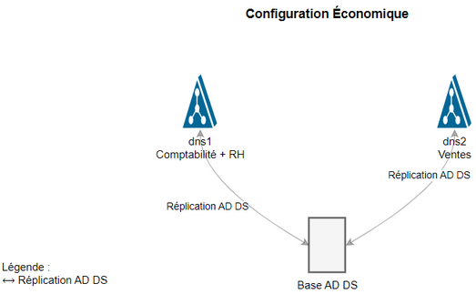

# 1. Active Directory et ses composants

## 1.1. Objectifs Pédagogiques

À la fin de ce chapitre, vous serez capable de :
1. Installer et configurer AD DS sur Windows Server 2022
2. Créer et gérer un domaine `computerelectronics.be`

## 1.2. Introduction à Active Directory

Active Directory est une suite de services qui permettent de gérer :
 
* La gestion des utilisateurs
* La gestion des ordinateurs
* La gestion des ressources
* La gestion des stratégies de sécurité
* La gestion des services réseau
etc...

**On le confond souvent avec** **AD DS** (le service de base qui crée et gère la base de données d'AD), mais AD est plus large car il contient :
 
1. **AD DS** **(Active Directory Domain Services)** : Service principal gérant l'authentification et l'autorisation des ressources dans le réseau.
2. **AD LDS** (Lightweight Directory Services) : Version allégée d'AD DS fonctionnant sans domaine Windows.
3. **AD CS** (Certificate Services) : Gestion des certificats numériques et de l'infrastructure à clé publique (PKI).
4. **AD RMS** (Rights Management Services) : Protection et contrôle des droits d'accès aux documents.
5. **AD FS** (Federation Services) : Authentification unique (SSO) et fédération d'identités entre organisations.

**La force d'Active Directory** réside dans sa capacité à **centraliser l'administration**. Au lieu de gérer chaque ordinateur individuellement, les administrateurs peuvent appliquer des politiques et des configurations à partir d'un point central.

# 2. Infrastructure du cours


Ceci est l'infrastructure de réseau de Computerelectronics.be:


Pour le moment on a... un serveur virtualisé (dns1.computerelectronics.be) et un client virtualisé (ws-compta-01.computerelectronics.be). Ce n'est pas beaucoup mais ceci nous permettra déjà de mettre en place Active Directory et de voir comment fonctionne l'authentification et l'autorisation des ressources dans le réseau... entre autre multiples actions!


## 2.1. Vue d'ensemble

L'infrastructure de computerelectronics.be est organisée en zones géographiques et fonctionnelles :

1. **Zone Primaire** (192.168.0.0/24)
   - Contrôleurs de domaine et services centraux
   - `dns1.computerelectronics.be` (192.168.0.2)
   - `dns2.computerelectronics.be` (192.168.0.3)

2. **Zones Géographiques**
   - **Zone EU** (192.168.10.0/24)
     * Services : 192.168.10.1-127
     * Postes de travail : 192.168.10.128-254
   - **Zone US** (192.168.20.0/24)
     * Services : 192.168.20.1-127
     * Postes de travail : 192.168.20.128-254

3. **Zones de Service**
   - **Zone DEV** (192.168.30.0/24)
     * Environnement de développement
   - **Zone PROD** (192.168.40.0/24)
     * Environnement de production

## 2.2. Environnement de Laboratoire

Pour la partie pratique du cours, nous utiliserons une version simplifiée :

1. **Configuration de base**
   - Une machine hôte avec 32GB RAM
   - Windows Server 2022
   - Hyper-V avec réseau local (LAN)

2. **Machines virtuelles initiales**
   - Contrôleur de domaine : `dns1.computerelectronics.be` (192.168.0.2)
   - Poste client : `ws-compta-01.computerelectronics.be` (192.168.10.128)

Cette configuration simplifiée nous permettra d'apprendre les concepts fondamentaux, tout en comprenant la structure complète de l'entreprise.

# 3. Exemple de fonctionnement d'AD : appel client-serveur

Considérez notre structure de réseau :


Voyons un flux client-serveur avec Active Directory.

Dans cet exemple, un utilisateur essaie d'accéder au serveur de fichiers.
Observez les flèches en bleu, jaune et bleu bidirectionnel.
**Pas les flèches vertes pour le moment**


1. **Authentification** (flèche bleue)
   - `ws-compta-01` (`192.168.0.101`) demande une authentification à `dns1` (`192.168.0.2`)
   - `dns1.computerelectronics.be`, en tant que contrôleur de domaine, traite la demande
   - L'authentification utilise le protocole Kerberos
   - La communication passe par le switch départemental (`SW-COMPTA`, `192.168.0.1`)

2. **Accès aux ressources** (flèche jaune)
   - Une fois authentifié, `ws-compta-01` accède au serveur `fichiers.ventes`
   - `dns2` fournit l'adresse IP de `fichiers.ventes` (`192.168.0.41`)
   - Le serveur `fichiers.ventes` autorise l'accès aux ressources demandées

3. **Réplication AD** (flèche bleue bidirectionnelle)
   - `dns1` (`192.168.0.2`) et `dns2` (`192.168.0.3`) synchronisent leurs bases AD DS
   - Cette réplication assure :
     * La cohérence des données entre les contrôleurs
     * La disponibilité du service même si un DC tombe en panne !

Les flèches vertes rajoutées montrent les **requêtes** DNS permettant la résolution des noms (DNS) nécessaire à chaque étape. On ne voit pas les réponses pour ne plus compliquer le diagramme :

1. Le PC interroge `dns1` pour chercher son DC, qui gère l'authentification
2. Une fois authentifié, le PC interroge `dns1` pour chercher l'adresse IP du serveur de fichiers. `dns1` ne le connaît pas 
3. `dns1` interroge alors `dns2`
4. `dns2` fournit l'adresse IP du serveur de fichiers. Le PC accède au serveur de fichiers.

<br>

# 4. Active Directory Domain Services (AD DS)

Dans ce cours, **nous nous concentrerons sur AD DS car c'est le service fondamental** pour la gestion de l'infrastructure de computerelectronics.be. 

**Le service AD DS est un service d'AD qui crée et gère la base de données d'AD.**. 

1. AD DS permet :
   - L'authentification centralisée des utilisateurs
   - La gestion des ressources réseau
   - L'application des stratégies de sécurité
   - L'organisation hiérarchique des ressources

2. AD DS stocke les informations sur :
   - Les utilisateurs (employés, prestataires, etc.)
   - Les ordinateurs (postes de travail, serveurs)
   - Les ressources partagées (imprimantes, dossiers)
   - Les stratégies de sécurité
   - Les services réseau

Pour bien comprendre le déploiement d'AD DS dans notre entreprise, commençons par examiner la structure DNS existante, car AD DS s'appuie fortement sur DNS pour son fonctionnement.

## 4.1. Structure DNS actuelle du réseau


### 4.1.1. Forêt, arbres, zones DNS

Nous avons actuellement : 

- Un seul arbre DNS (l'autre arbre de la forêt appartient à une autre entreprise)
- Deux zones DNS dans l'arbre (l'une pour comptabilité et RH, l'autre pour ventes)
- Deux serveurs DNS :
  * `dns1.computerelectronics.be` (`192.168.0.2`) pour gérer les départements de Comptabilité et RH
  * `dns2.computerelectronics.be` (`192.168.0.3`) pour gérer le département de Ventes

### 4.1.2. AD DS et la localisation de la base de données d'AD 

**Le service AD DS est un service d'AD qui crée et gère la base de données d'AD.**

Cette base de données doit être stockée dans (au moins) un **appareil serveur** qu'on appellera **Contrôleur de Domaine (DC)**.

**Ce suffirait pour gérer les ressources de tout l'arbre DNS, mais** on ne peut pas prendre le risque de perdre la base de données si le serveur tombe en panne ! 

**IMPORTANT** : Ne confondez pas le service DNS et le service AD DS ! **Notez** que le service DNS (transformer les noms en IP et vice versa) est indépendant de la base de données d'AD (base de données contenant toutes les informations sur les utilisateurs, ordinateurs, imprimantes, etc.). 

**On pourrait avoir toute sorte de combinaisons :**
- 3 serveurs DNS et 2 serveurs AD :
  * 2 serveurs pour gérer les DNS de Ventes (1 de backup)
  * 1 serveur pour gérer les DNS de Comptabilité et RH
  * 2 serveurs AD (1 de backup). Les deux serveurs contiennent la même base de données d'AD (qui contient l'AD pour tout l'arbre DNS)

### 4.1.3. Exercice - Analyse des combinaisons DNS-AD DS

**Tant le service DNS comme le service AD DS** doivent fonctionner **sans arrêt** ! Cela veut dire que si un serveur tombe en panne, il faut qu'un autre serveur prenne son rôle. En plus... si un serveur est surchargé, il faut qu'un autre serveur prenne son rôle ! Quoi faire ? **Rajouter des serveurs DNS et des serveurs AD**.


### 4.1.4. Exercices

#### 4.1.4.1. Exercice - Configuration haute disponibilité
Le département des ventes est critique et nécessite une haute disponibilité. Proposez une configuration qui assure :
- Une haute disponibilité pour le service DNS des ventes
- Une redondance suffisante pour l'AD DS
- Une répartition de charge efficace

<details>
<summary>Solution</summary>

Configuration proposée :
- 3 serveurs DNS :
  * dns1 : zones DNS pour comptabilité et RH
  * dns2 : zone DNS pour ventes
  * dns3 : backup de dns2 pour ventes
- 2 serveurs AD DS avec réplication bidirectionnelle complète


Avantages :
- Double redondance DNS pour ventes (département critique)
- Réplication AD DS entre tous les DC
- Répartition de charge possible pour DNS ventes

Inconvénients :
- Coût plus élevé (3 serveurs au total)
- Complexité de gestion accrue

</details>

#### 4.1.4.2. Exercice - Configuration économique
L'entreprise a des contraintes budgétaires mais souhaite maintenir un minimum de redondance. Proposez une configuration économique qui assure :
- Un service minimal pour tous les départements
- Une redondance de base pour l'AD DS

<details>
<summary>Solution 2</summary>

Configuration proposée :
- 2 serveurs DNS :
  * dns1 : zones DNS pour comptabilité et RH
  * dns2 : zone DNS pour ventes
- 2 serveurs AD DS avec réplication bidirectionnelle complète


Avantages :
- Solution économique (2 serveurs)
- Structure simple et claire
- Réplication AD DS assurée

Inconvénients :
- Pas de backup DNS pour les départements
- Risque d'interruption de service DNS en cas de panne
- Pas de répartition de charge possible
</details>

# 5. Contrôleurs de Domaine

## 5.1. Relations entre DNS et AD DS

Nous allons installer les services d'AD DS sur notre serveur `dns1.computerelectronics.be`.

Il va devenir un **contrôleur de domaine** (DC). Rappellez-vous qu'il contiendra la base de données d'AD. 

Si on a la possibilité on installera AD aussi sur `dns2.computerelectronics.be`, **qui contiendrai une réplique de la base de données d'AD**. Ou peut-être même sur d'autres serveurs si on les avait !

Concernant les services de DNS, **chaque serveur continue à gerer une zone** :
- `dns1` pour comptabilité et RH
- `dns2` (si on l'installe) pour ventes

Ce diagramme representera l'installation de AD sur `dns1.computerelectronics.be` :


## 5.2. Promotion de Windows Server en contrôleur de domaine

### 5.2.1. Configuration du DNS dans le réseau du serveur

On doit configurer le réseau du DC `dns1.computerelectronics.be`:
   - Adresse IP statique sur le réseau LAN via l'interface graphique (Serveur Local->Ethernet->Propriétés->Protocole Internet version 4 (TCP/IPv4)). On lui donnera `192.168.0.2` au lieu d'une adresse automatique.
   - Nom d'ordinateur configuré via les Paramètres système (si ce n'est pas déjà fait!)
     - Dans le champ "Nom de l'ordinateur", tapez : **dns1**
     - Dans le champ "Suffixe DNS principal", tapez : **computerelectronics.be**
   
Pour le serveur DNS, on lui donnera `192.168.0.2` au lieu d'une adresse automatique: car **il cherchera les noms DNS chez lui-même**, y incluant le sien: `dns1.computerelectronics.be`.


### 5.2.2. Installation du rôle AD DS

Cette étape va installer **le rôle** AD DS sur le serveur `dns1.computerelectronics.be`. 

Un **rôle est un ensemble de fonctionnalités, programmes et services** qui permettent au serveur d'accomplir une fonction spécifique. 

Dans ce cas, le rôle AD DS comprend plusieurs services (comme le service AD DS lui-même) qui seront activés après la promotion en contrôleur de domaine.

1. Ouvrir le **Gestionnaire de serveur**
2. Cliquer sur **"Gérer"** puis **"Ajouter des rôles et fonctionnalités"**
3. Sélectionner **"Installation basée sur un rôle ou une fonctionnalité"**
4. Choisir le serveur **`dns1.computerelectronics.be`**
5. Suivre l'Assistant jusqu'à **"Rôles de serveurs"**
6. Cocher **"Services AD DS"**
7. Accepter l'ajout des fonctionnalités requises
8. Continuez jusqu'à la fin de l'installation

### 5.2.3. Promotion en contrôleur de domaine

1. Dans le Gestionnaire de serveur, cliquer sur le **drapeau avec le triangle jaune**
2. Sélectionner **"Promouvoir ce serveur en contrôleur de domaine"**
3. Choisir **"Ajouter une nouvelle forêt"**
4. Saisir le nom de domaine : **`computerelectronics.be`**
5. Choisir le **niveau fonctionnel** de la forêt et du domaine (la plus récente)
6. Définir le **mot de passe DSRM** (Password1)
7. Continuez et ignorez l'avertissement sur les délégations
8. Choisir le nom pour le domaine NETBIOS : **"COMPUTERRELECTRONICS"**
9. Vérifier les chemins de la **base de données**, des **journaux** et de **SYSVOL**
10. Examiner les options sélectionnées et **lancer l'installation**

## 5.3. Vérification post-promotion

Une fois la promotion terminée et le serveur redémarré, il est essentiel de vérifier que tout fonctionne correctement. Voici les étapes de vérification à suivre. Ouvrez le Gestionnaire de serveur et cliquez sur le nouveau menu: **AD DS**. 

🔍 Vérification de la configuration DNS (Gestionnaire de serveur->Outils->Gestionnaire DNS):

1. Vérifiez dans le gestionnaire DNS que **l'enregistrement A** pour `dns1.computerelectronics.be` pointe correctement vers `192.168.0.2` 

2. Vérifiez la résolution du nom de domaine -> le serveur trouve l'**adresse IP** du serveur `dns1.computerelectronics.be`

```powershell
nslookup dns1.computerelectronics.be
```

3. Lancez un diagnostique complet des services DNS d'Active Directory
```powershell
dcdiag /test:dns
```

**AD DS** est **basé sur** l’utilisation d’un **espace de noms DNS** pour gérer un domaine **et impose donc l’utilisation d’un serveur DNS** au sein du réseau.
Ce serveur DNS doit être capable de prendre en charge les enregistrements de service **SRV** nécessaires à la localisation des contrôleurs de domaine.
Les serveurs DNS Windows 2KXX peuvent prendre en charge de tels enregistrements.


## 5.4. Configuration des zones DNS

Après la promotion du contrôleur de domaine, AD DS a automatiquement créé les zones DNS nécessaires. Examinons la configuration qui a été mise en place :

1. **Zone directe principale**
   - Permet **d'obtenir l'adresse IP** à partir du nom d'hôte  
   - Nom : `computerelectronics.be`
   - Serveur DNS primaire : `dns1.computerelectronics.be` (192.168.0.2)
   - Type : Zone principale Active Directory intégrée
   - Contient les enregistrements pour :
     * Le contrôleur de domaine principal (`dns1`)
     * Les enregistrements SRV pour les services AD DS
     * Les futurs postes clients

2. **Zones directes**
   - Zone racine : `computerelectronics.be`
   - Zones géographiques :
     * `eu.computerelectronics.be`
     * `us.computerelectronics.be`
   - Zones de service :
     * `dev.computerelectronics.be`
     * `prod.computerelectronics.be`

3. **Zones inverses**
   - Zone primaire : `0.168.192.in-addr.arpa` (192.168.0.0/24)
   - Zone EU : `10.168.192.in-addr.arpa` (192.168.10.0/24)
   - Zone US : `20.168.192.in-addr.arpa` (192.168.20.0/24)
   - Zone DEV : `30.168.192.in-addr.arpa` (192.168.30.0/24)
   - Zone PROD : `40.168.192.in-addr.arpa` (192.168.40.0/24)

Toutes ces zones sont essentielles pour le bon fonctionnement d'AD DS.
   - **Pourquoi est-elle nécessaire ?** AD DS utilise la résolution inverse pour la sécurité : quand un client essaie de s'authentifier, le contrôleur de domaine vérifie que l'adresse IP du client correspond bien au nom d'hôte fourni, évitant ainsi l'usurpation d'identité

> **Note pratique** : Bien que notre infrastructure de production inclue `dns2.computerelectronics.be` (192.168.0.3), nos exercices pratiques se concentreront initialement sur le contrôleur de domaine principal `dns1` pour une meilleure compréhension des concepts de base.

## 4. Communication entre zones

### 4.1. Authentification multi-zones

Dans notre infrastructure, les contrôleurs de domaine gèrent l'authentification pour toutes les zones :

1. **Flux d'authentification**
   - Un utilisateur sur `ws-compta-01.computerelectronics.be` (192.168.10.128)
   - Se connecte via le DC `dns1.computerelectronics.be` (192.168.0.2)
   - Peut accéder aux ressources de toutes les zones

2. **Résolution DNS**
   - Les requêtes DNS passent toujours par les DCs
   - Les DCs maintiennent les zones pour tous les sous-domaines
   - Exemple : accès à `fileserver-us.computerelectronics.be` depuis la zone EU

3. **Routage inter-zones**
   - Communication directe entre les réseaux via le routeur central
   - Pas de NAT entre les zones (tout en 192.168.x.0/24)
   - Les ACLs réseau peuvent filtrer le trafic si nécessaire



Les zones DNS créées sont visibles dans le diagramme de l'infrastructure :


