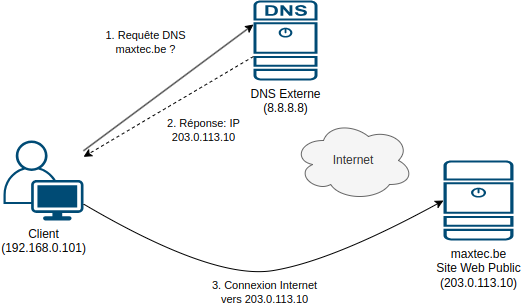
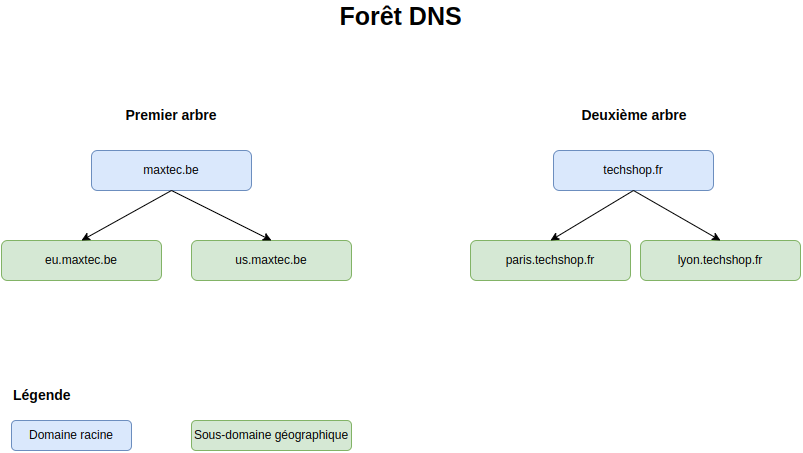
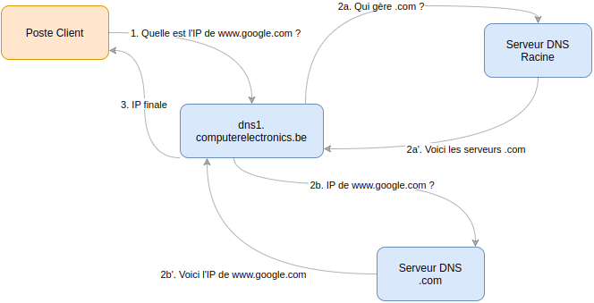
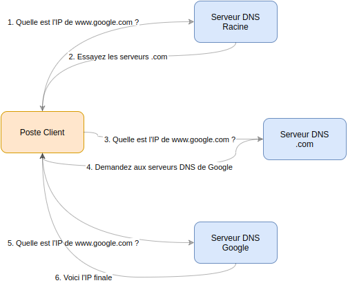

# Chapitre 3: DNS (Domain Name System)

## 🧭 Navigation du Cours
[⏮️ Chapitre Précédent: Installation VirtualBox](Chapitre%202.Installation-Windows-Server-2022-VirtualBox.md) | [🏠 Retour au Syllabus](../README.md) | [⏭️ Chapitre Suivant: Active Directory](Chapitre%204.Active%20Directory%20Domain%20Services%20(AD%20DS).md)

## 📊 Votre Progrès
- [✅] Chapitre 1: Introduction et installation
- [✅] Chapitre 2: Installation VirtualBox
- [🔄] **Chapitre 3**: DNS *(En cours)*
- [⏸️] Chapitre 4: Active Directory Domain Services

---

> 📚 **Dans ce chapitre:**
> 1. 🌐 [Le service DNS](#1-le-service-dns)
>    - Principes fondamentaux
>    - Intégration avec AD
> 2. 🔄 [Résolution DNS](#2-processus-de-résolution-dns)
>    - Étapes de résolution
>    - Types de requêtes
> 3. 🏗️ [Architecture DNS](#3-architecture-dns)
>    - Zones et domaines
>    - Hiérarchie DNS
> 4. 📝 [Configuration DNS](#4-configuration-dns-dans-windows-server)
>    - Installation du rôle
>    - Intégration AD DS

---

## 📙 Objectifs Pédagogiques

À la fin de ce chapitre, vous serez capable de :
1. Comprendre le rôle du DNS dans Active Directory
2. Configurer les zones et enregistrements DNS
3. Intégrer DNS avec AD DS
4. Résoudre les problèmes DNS courants

---
1. 🎯 Comprendre le rôle et l'**importance du DNS** dans un réseau d'entreprise
2. 📖 Connaître les différents **types d'enregistrements DNS**
3. 🔍 Comprendre le **processus de résolution DNS**

---

## 1. Le service DNS

Le **DNS** (Domain Name System) est un service fondamental qui agit comme l'**annuaire téléphonique de l'internet** (on ne parle pas de l'annuaire tel que base de données d'Active Directory!). 
**Il transforme les noms de domaine en adresses IP et vice versa**.
Il est essentiel pour deux raisons principales :

| Aspect | Description | Exemple |
|--------|-------------|----------|
| 🌐 **Internet** | Permet de naviguer sur internet en utilisant des noms au lieu d'IPs | `www.google.com` → `142.250.179.174` |
| 🏢 **Active Directory** | Sert de base pour notre infrastructure Active Directory | `dns1.maxtec.be` → `192.168.0.2` |

> 💡 **Pour débutants:** Pensez au DNS comme l'annuaire téléphonique d'internet. Au lieu de mémoriser `142.250.179.174`, vous tapez `google.com`!

> **Point clé:** Sans DNS, nous devrions mémoriser les adresses IP de chaque service et ordinateur!

Le DNS offre deux types de résolution :
- 📝 **Directe** : Nom → IP (`www.google.com` → `142.250.179.174`)
- 🔄 **Inverse** : IP → Nom (`142.250.179.174` → `www.google.com`)


### 💻 Exercice Pratique: Explorer le DNS

> **Objectif:** Comprendre comment le DNS fonctionne dans votre environnement

<details>
<summary>📙 Instructions</summary>

1. 🖥 **Préparation:**
   - Ouvrez une console PowerShell ou CMD
   - Assurez-vous d'être connecté à Internet

2. 🔍 **Tests de résolution DNS:**
   ```powershell
   # Test d'un domaine public
   ping -4 www.google.com
   
   # Test de notre futur domaine
   ping -4 maxtec.be
   ```

3. 🧐 **Analyse:**
   - Observez les adresses IP retournées
   - Notez les différences entre les réponses
   - Réfléchissez aux raisons des échecs

> **Note:** L'option `-4` force l'utilisation de l'IPv4
</details>

<details>
<summary>🔓 Solution</summary>

| Domaine | Résultat | Explication |
|---------|-----------|-------------|
| `www.google.com` | ✅ Répond | Domain public avec DNS configuré |
| `maxtec.be` | ❌ Ne répond pas | - Domaine interne de test<br>- Pas encore configuré<br>- Sera configuré dans notre infrastructure |

</details>

## 🎯 Checkpoint: Concept DNS de Base
Avant de continuer, assurez-vous de comprendre:
- [ ] Pourquoi on utilise des noms au lieu d'adresses IP
- [ ] La différence entre DNS public et DNS interne
- [ ] Pourquoi `maxtec.be` ne répond pas encore

---

## 2. Processus de Résolution DNS

### 🔍 Comment fonctionne la résolution DNS?

> **Point clé:** Le processus de résolution DNS diffère selon que la ressource est interne (une poste de travail cherche une ressource locale) ou externe (on essaie de se connecter au réseau depuis l'extérieur - l'Internet)

#### 🌐 Résolution DNS Externe

> 💡 **Conseil:** C'est quand quelqu'un de l'extérieur essaie de se connecter à notre entreprise



| Étape | Action | Détails |
|---------|---------|----------|
| 1️⃣ | **Requête Client** | Le **client** (extérieur) **demande** l'IP de `maxtec.be` |
| 2️⃣ | **DNS Public** | **Consultation** des serveurs DNS publics |
| 3️⃣ | **Réponse** | Le serveur **envoie au client l'IP** publique |
| 4️⃣ | **Connexion** | Le **client** se **connecte** via Internet |

#### 🏛️ Résolution DNS Interne

> 💡 **Conseil:** C'est quand nos employés utilisent leurs ordinateurs au bureau

| Étape | Action | Détails |
|---------|---------|----------|
| 1️⃣ | **Requête Client** | Un **poste** de travail (interne) **demande l'IP** d'une ressource locale |
| 2️⃣ | **Réponse DNS** | Notre **serveur DNS interne** (`dns1.maxtec.be`) **fournit** l'IP |
| 3️⃣ | **Connexion** | Le poste de travail se connecte directement à la ressource à l'intérieur du réseau |


## 3. L'Espace de Noms DNS 

Un **espace de noms DNS** est **l'ensemble de noms DNS** organisés sous la forme d'un **arbre DNS**, une structure hiérarchique où **chaque nœud est un domaine** (ici: `maxtec.be`, `eu.maxtec.be`, `us.maxtec.be`).


### 🏢 Structure DNS de Maxtec

| Niveau | Description | Exemples |
|--------|-------------|----------|
| 🌐 **Domaine Racine** | Domaine principal | `maxtec.be` |
| 🌎 **Zones Géographiques** | Régions | `eu.maxtec.be`<br>`us.maxtec.be` |
 💻 **Ressources** | Appareils et services | `ws-compta-01.maxtec.be`<br>`printer-01.maxtec.be` |


### 🌲 Forêts DNS

Un **forêt DNS** est un espace de noms avec plusieurs arbres.

**Exemple de fusion d'entreprises:**
- 🇪🇺 `maxtec.be` (Premier arbre)
- 🇫🇷 `techshop.fr` (Deuxième arbre)

Chaque arbre garde son indépendance tout en permettant une collaboration entre les entreprises.



**Dans notre cas du labo on a une forêt d'un arbre** (`maxtec.be`).

> 💡 **Pour débutants:** Pour ce cours, nous avons une structure simple avec un seul arbre. Les grandes entreprises peuvent en avoir plusieurs.

### 📑 Cas Pratique: Maxtec

**Maxtec** est une entreprise internationale avec:
- 🇪🇺 Opérations en Europe
- 🇺🇸 Opérations aux États-Unis

#### Organisation DNS

Voici l'arbre DNS de Maxtec, on voit aussi l'ensemble des sous-domaines et les ressources (ordinateurs, imprimantes, etc)


<details>
<summary>💡 Avantages de cette structure</summary>

- 🌐 **Séparation Géographique**
  * Meilleure gestion du trafic réseau
  * Répartition logique des ressources
- 🛠️ **Séparation des Environnements**

  * Sécurité renforcée
- 💻 **Gestion des Ressources**
  * Organisation claire
  * Maintenance simplifiée

</details>


### 📍 Structure DNS Hybride

> **Point clé:** Notre infrastructure utilise une approche hybride pour optimiser la gestion des ressources: structure plate et hiérarchique. Voici l'explication:

#### 💻 Structure Plate (Flat DNS) 

Observez que les sous-domaines (`eu`, `usa`) **ne sont pas utilisés pour les postes de travail et imprimantes**

Au lieu de 

```plaintext
ws-compta-01.eu.maxtec.be
printer-rh-01.usa.maxtec.be
```

on a 

```plaintext
ws-compta-01.maxtec.be
printer-rh-01.maxtec.be
```

C'est fait exprès: si on **utilise** le nom du **sous-domaine** on devrait **gérer des certificats SSL pour chaque ressource** et on ne veut pas le faire! C'est une **approche** professionnelle **standardisée**.

Les sous-domaines sont utilisés uniquement pour les serveurs et services (observez les adresses)

```plaintext
# Pour les serveurs et services
auth.eu.maxtec.be
```


## 4. Les Zones DNS

### 📍 Qu'est-ce qu'une Zone DNS?

Une **zone DNS** est tout simplement **une partie de l'espace de noms DNS** (une partie de l'arbre DNS) contenant les enregistrements d'un domaine spécifique. 

### 🛠️ Architecture DNS Centralisée

> **Note:** Pour un environnement de formation ou une petite/moyenne entreprise, **un seul serveur DNS** (`dns1.maxtec.be`) maître avec réplication est suffisant. Dans de plus grandes infrastructures, on pourrait avoir des serveurs DNS spécialisés par zone, mais on n'en a pas besoin dans notre cas.

| Serveur | Rôle | Fonction |
|---------|------|----------|
| 🖥 **DNS1** | Primaire | - Maître pour toutes les zones<br>- Gestion des mises à jour |
| 💻 **DNS2** | Secondaire | - Réplication automatique<br>- Redondance et charge |


### ✨ Avantages de la Division en Zones

<details>
<summary>📑 Organisation Logique</summary>

- 🌐 Séparation par région (EU, US)
- 🛠️ Séparation par environnement (DEV, PROD)
- 💻 Gestion claire des ressources
</details>

<details>
<summary>🔒 Sécurité</summary>

- 📜 Politiques par zone
- 🔐 Contrôle d'accès granulaire
- 🔑 Isolation des environnements
</details>

<details>
<summary>📈 Performance</summary>

- 🌍 Optimisation du trafic
- 📊 Répartition de charge
- 📉 Redondance améliorée
</details>

### 🏛️ Structure du Réseau


> **Note:** Ce diagramme est hybride - il montre à la fois:
> - 💻 La structure **logique** (zones DNS, sous-domaines)
> - 🖥 L'organisation **physique** (répartition géographique, adressage IP)

**Bien que les ressources soient physiquement réparties entre l'Europe et les États-Unis, la gestion DNS reste centralisée sur notre serveur principal `dns1.maxtec.be`.**


## 5. Analyse des Zones DNS

### 🌲 Structure Hiérarchique

> **Point clé:** Notre infrastructure DNS utilise une hiérarchie logique à plusieurs niveaux, mais avec une gestion centralisée

#### 🌐 Niveau Racine (`maxtec.be`)

| Type | Description |
|------|-------------|
| 💻 **Postes** | Directement sous la racine (structure plate) |
| 🖥 **Serveurs** | Dans les sous-domaines (structure hiérarchique) |
| 🔑 **Gestion** | Centralisée sur `dns1.maxtec.be` |

#### 🌎 Sous-domaines Géographiques

| Type | Sous-domaine | Usage |
|------|--------------|--------|
| 🇪🇺 **Europe** | `eu.maxtec.be` | Opérations européennes |
| 🇺🇸 **USA** | `us.maxtec.be` | Opérations américaines |

> 💡 **Point Important**: La structure DNS est une **organisation logique** qui peut être **totalement indépendante** de l'emplacement physique des ressources.

## 6. Structure Physique vs Logique

### 🏗️ Structure Physique (IP)

**Elements physiques** (machines) ayant leurs IPs.

- Infrastructure: 192.168.0.0/24 (dns1, dns2)
- Zone EU: 192.168.10.0/24 (postes EU, services EU)
- Zone US: 192.168.20.0/24 (postes US, services US)


### 🌳 Structure Logique (DNS)

**Structure de noms** (domaines et sous-domaines, ressources)

- Domaine racine: maxtec.be
- Sous-domaines géographiques: eu.maxtec.be, us.maxtec.be

- Ressources: ws-compta-01.maxtec.be, printer-rh-01.maxtec.be

> 💡 **Note:** La structure logique (DNS) permet d'organiser les ressources **indépendamment de leur emplacement physique** (IP)

## 7. Autorité DNS

> 📚 **Définition:** Un serveur DNS a l'**autorité** sur un espace de noms quand il possède les informations nécessaires pour répondre directement aux requêtes.

### 🔑 Serveur DNS avec Autorité

| Serveur | Zone d'Autorité | Sous-domaines |
|---------|-----------------|---------------|
| `dns1.maxtec.be` | `maxtec.be` | ✔️ |
| `dns2.maxtec.be` | `maxtec.be` | ✔️ |

Un serveur DNS ayant autorité sur un espace de nom :

#### 🔑 Caractéristiques d'un Serveur avec Autorité

<details>
<summary>💻 Réponses Directes</summary>

| Action | Description | Exemple |
|--------|-------------|----------|
| ✅ Réponse Positive | Renvoie l'IP immédiatement | `ws-compta-01 → 192.168.10.128` |
| ❌ Réponse Négative | Erreur si nom inexistant | `invalid-host → NXDOMAIN` |
| ⏱️ Performance | Réponse instantanée | Données en cache local |
</details>

<details>
<summary>🔍 Gestion des Requêtes</summary>

- 💾 **Données Locales**: Toutes les informations stockées localement
- 🔗 **Pas de Récursion**: Aucune consultation d'autres serveurs
- ⏳ **Réponse Rapide**: Accès direct aux données
</details>

### 🔎 Serveur DNS sans Autorité

> **💡 Note:** Un serveur sans autorité doit obtenir l'information d'autres sources via deux types de requêtes:

#### Types de Requêtes

1. **🔍 Requêtes Récursives**
   - Le serveur fait tout le travail de recherche
   - Retourne une réponse complète au client



#### 💻 Exemple de Requête Récursive

<details>
<summary>📡 Scénario: Résolution de www.google.com</summary>

| Étape | Action | Détails |
|---------|---------|----------|
| 1️⃣ Client | `ws-compta-01` demande l'IP | Envoie requête à `dns1` |
| 2️⃣ DNS1 | Vérifie ses zones | Pas d'autorité sur google.com |
| 3️⃣ DNS1 | Contacte d'autres serveurs | Cherche les serveurs racine |
| 4️⃣ DNS1 | Obtient l'IP finale | Récupère 142.250.x.x |
| 5️⃣ DNS1 | Répond au client | Renvoie l'IP trouvée |
</details>

#### 💡 Points Clés

1. **Client**
   - 🔍 Une seule requête
   - ⏳ Attend la réponse finale

2. **Serveur DNS**
   - 💻 Gère toute la résolution
   - 🔗 Contacte d'autres serveurs si nécessaire
   - 💾 Met en cache les résultats
     * Il fait toutes les requêtes nécessaires lui-même
     * Le client n'a rien à faire de plus


### 🔍 Requêtes Itératives

> 💡 **Définition:** Dans une requête itérative, chaque serveur renvoie la meilleure référence possible vers la réponse.



**Exemple de requête itérative :**

1. Le client demande l'IP de www.google.com à un serveur DNS
2. Le serveur répond : "Je ne sais pas, essayez les serveurs DNS qui gèrent .com"
3. Le client demande l'IP aux serveurs .com
4. Les serveurs .com répondent : "Demandez aux serveurs DNS de Google"
5. Le client demande l'IP aux serveurs DNS de Google
6. Les serveurs DNS de Google répondent avec l'IP finale

**Points clés des requêtes itératives :**

- Le serveur DNS qui ne connaît pas la réponse renvoie une **référence** vers d'autres serveurs
- **Le client doit faire** **plusieurs requêtes successives**
- Chaque serveur aide à se rapprocher de la réponse finale
- Plus complexe pour le client mais moins de charge sur les serveurs


### Détail d'une requête DNS sans autorité

Voici, plus en détail, la suite d'opérations pour chercher l'IP d'un serveur DNS **sans autorité**:

1. Chercher dans la **cache DNS** : Si l'IP a déjà été résolue récemment
   - Réponse immédiate sans autre requête
   - Valide jusqu'à expiration du TTL (Time To Live)

2. Transmettre la requête au **redirecteur (forwarder)** : Si configuré
   - Transmet la requête à un autre serveur DNS (souvent celui du FAI)
   - **Attend** une **réponse récursive complète**
   - Plus simple que la résolution itérative

3. Lancer une **Résolution Itérative** : **En dernier recours**
   - Interroge les serveurs DNS racine
   - Suit les références de serveur en serveur
   - Processus plus complexe mais plus autonome

<br>


### 📝 Exercice: Analyse d'Autorité DNS

> **Objectif:** Comprendre quand un serveur DNS a l'autorité sur une requête.

#### 📓 Instructions

Analysez comment `dns1.maxtec.be` répondra aux requêtes suivantes:

1. `ws-compta-01.maxtec.be` (poste de travail)
2. `www.google.com` (site externe)
3. `fileserver.us.maxtec.be` (serveur de fichiers US)

**Pour chaque cas:** 
- Indiquez si dns1 a l'autorité
- Expliquez le processus de résolution

<details>
<summary>🔧 Solution</summary>

##### 💻 Requête Interne (ws-compta-01)
```plaintext
✅ Avec Autorité
- Zone: maxtec.be
- IP: 192.168.10.128
- Réponse: Directe et immédiate
```

##### 🌍 Requête Externe (google.com)
```plaintext
❌ Sans Autorité
- Cache ? → Réponse rapide
- Sinon → Redirecteur (FAI)
- Ou → Résolution itérative
```

##### 🇺🇸 Requête Sous-domaine (us)
```plaintext
✅ Avec Autorité
- Zone: us.maxtec.be
- IP: 192.168.20.10
- Réponse: Directe (zone déléguée)
```
</details>


<br>

## 8. Délégation DNS

> 💡 **Définition:** La délégation DNS permet de distribuer la gestion des zones DNS entre différents serveurs de manière hiérarchique.

### 🌐 Architecture Multi-niveaux

<details>
<summary>🌍 Niveau Internet (DNS Public)</summary>

| Composant | Rôle |
|-----------|-------|
| 📝 Registrar | Gère `maxtec.be` |
| 💻 DNS Public | Pointe vers nos serveurs |
| 🌎 Services | Site web, email, etc. |

```plaintext
# Exemple d'enregistrements publics
maxtec.be.    NS    ns1.registrar.com
www.maxtec.be A     203.0.113.10
```
</details>

<details>
<summary>🏛️ Niveau Entreprise (DNS Interne)</summary>

| Zone | Serveur | Rôle |
|------|---------|-------|
| Racine | `dns1` (192.168.0.2) | Primaire |
| Racine | `dns2` (192.168.0.3) | Secondaire |
| EU | `dns.eu` (192.168.10.2) | Services EU |
| US | `dns.us` (192.168.20.2) | Services US |

```plaintext
# Structure de délégation interne
maxtec.be → dns1, dns2
eu.maxtec.be → dns.eu
us.maxtec.be → dns.us
```
</details>

Cette configuration sera faite dans le contexte d'Active Directory.

- `dns1.maxtec.be` est configuré comme serveur autoritaire pour l'ensemble du domaine
- Les zones géographiques et d'environnement sont configurées dans le serveur dns1 ainsi, dans un fichier de configuration DNS :
  ```
  # Configuration des zones géographiques :
  eu.maxtec.be.   IN  NS  dns1.maxtec.be.
  us.maxtec.be.   IN  NS  dns1.maxtec.be.
  ```
Nous allons voir plus tard les **enregistrements** de zone (IN, NS, etc.).

- Chaque ligne délègue la gestion d'un sous-domaine à ce serveur DNS
- Les services utiliseront ces sous-domaines (ex: `fileserver.eu.maxtec.be`)


## 9. Zones Secondaires

> 💡 **Définition:** Une zone secondaire est une copie en lecture seule synchronisée d'une zone principale.

### 🔍 Caractéristiques Principales

<details>
<summary>💻 Architecture</summary>

| Aspect | Description |
|--------|-------------|
| 📚 Données | Copie exacte de la zone principale |
| 🔄 Synchronisation | Automatique via transfert de zone |
| 🔒 Permissions | Lecture seule uniquement |
</details>

<details>
<summary>✨ Bénéfices</summary>

1. **Haute Disponibilité**
   - 🛡️ Redondance en cas de panne
   - 💻 Basculement automatique

2. **Performance**
   - ⚖️ Répartition de charge
   - 📡 Proximité géographique

3. **Sécurité**
   - 🔐 Protection des données principales
   - 🛡️ Isolation des modifications
</details>

### 💻 Exemple: Infrastructure maxtec.be

```plaintext
# Configuration des zones
Primaire: dns1.maxtec.be (192.168.0.2)
Secondaire: dns2.maxtec.be (192.168.0.3)

# Transfert de zone
Type: Incrémental
Fréquence: 15 minutes
Sécurité: Signature TSIG
```
Les zones secondaires se synchronisent automatiquement avec leur zone principale via un processus appelé **transfert de zone**.


### 9.1. 🔍 Zones de Recherche Directe

Une **zone de recherche directe** (Direct Lookup Zone) contient des **enregistrements** pour faire correspondre un nom d'hôte à une adresse IP.

Il y a deux catégories d'enregistrements :

##### Enregistrement de base

| Type | Fonction | Exemple |
|------|----------|----------|
| A | Nom → IPv4 | `ws-compta-01 → 192.168.10.128` |
| AAAA | Nom → IPv6 | `ws-compta-01 → 2001:db8::128` |
| CNAME | Alias | `www → ws-web-01` |

   
##### Enregistrement de service

| Type | Usage | Exemple |
|------|--------|----------|
| MX | Email | `maxtec.be → mail.eu (10)` |
| SRV | Services | `_ldap._tcp → dc1.eu (port 389)` |
| NS | DNS | `eu → dns.eu.maxtec.be` |
</details>

#### 💻 Exemple: Zone maxtec.be

```plaintext
# Postes de travail
ws-compta-01    IN A    192.168.10.128
ws-compta-02    IN A    192.168.10.129

# Services
mail.eu         IN A    192.168.10.11
fileserver.eu   IN A    192.168.10.10

# Alias
www             IN CNAME ws-web-01
ftp             IN CNAME ws-files-01
```

Notez que dans les enregistrements A pour les postes, nous avons uniquement le nom de la machine, sans l'extension du domaine, car le domaine est déjà défini dans la zone ! Le nom complet de la machine s’appelle « FQDN » (Fully Qualified Domain Name) et sera `ws-compta-01.maxtec.be`.


### 9.2. 🔄 Zones de Recherche Inverse

Une **zone de recherche inverse** (Reverse Lookup Zone) **convertit les adresses IP en noms** d'hôtes.

Ex: `192.168.10.128` devient `ws-compta-01.maxtec.be`.


#### 🔑 Utilisations Principales

| Aspect | Description |
|--------|-------------|
| 🔐 Authentification | Vérification des hôtes |
| 💻 Contrôle d'accès | Validation des connexions |
| 📧 Anti-spam | Vérification des serveurs mail |
Administration</summary>

| Usage | Bénéfice |
|-------|------------|
| 🔍 Dépannage | Identification rapide des hôtes |
| 📄 Journalisation | Logs plus lisibles |
| 📊 Monitoring | Surveillance du réseau |

#### 💻 Exemple: Zone 0.168.192.in-addr.arpa

```plaintext
# Zone inverse pour 192.168.0.0/24
2.0   IN PTR   dns1.maxtec.be.
3.0   IN PTR   dns2.maxtec.be.

# Zone inverse pour 192.168.10.0/24
128.10 IN PTR  ws-compta-01.maxtec.be.
129.10 IN PTR  ws-compta-02.maxtec.be.
10.10  IN PTR  fileserver.eu.maxtec.be.
```

### 9.3. 🔗 Relations entre Types de Zones (opt)

> 💡 **Concept:** Une zone DNS combine deux aspects indépendants: son autorité et sa direction de recherche.

#### 🔍 Classification des Zones

<details>
<summary>🌐 Par Autorité</summary>

| Type | Description | Exemple |
|------|-------------|----------|
| 💻 Principale | Source autoritaire | `dns1 → maxtec.be` |
| 🔄 Secondaire | Copie synchronisée | `dns2 → maxtec.be` |
</details>

<details>
<summary>🔎 Par Direction</summary>

| Type | Conversion | Exemple |
|------|------------|----------|
| ➡️ Directe | Nom → IP | `ws-compta-01 → 192.168.10.128` |
| ⬅️ Inverse | IP → Nom | `192.168.10.128 → ws-compta-01` |
</details>

#### 💻 Exemple: Configuration DNS1

```plaintext
# Zones Principales
maxtec.be      # Directe
0.168.192.in-addr.arpa     # Inverse

# Zones Déléguées
eu.maxtec.be   # Directe (EU)
us.maxtec.be   # Directe (US)
```

## 10.  Enregistrement DNS en détail (opt)

> 💡 **Concept:** Les enregistrements DNS sont les briques de base qui définissent le comportement et la structure d'une zone DNS.

### 💻 Enregistrements de Base

<details>
<summary>🔗 Adressage (A/AAAA)</summary>

| Type | Usage | Exemple |
|------|--------|----------|
| A | IPv4 | `ws-compta-01 IN A 192.168.10.128` |
| AAAA | IPv6 | `ws-compta-01 IN AAAA 2001:db8::128` |
</details>

<details>
<summary>📍 Alias (CNAME)</summary>

| Usage | Description | Exemple |
|-------|-------------|----------|
| Alias | Redirection | `www IN CNAME ws-web-01` |
| Service | Flexibilité | `mail IN CNAME mx1.eu` |
</details>

### 📡 Enregistrements de Service

<details>
<summary>💾 Infrastructure</summary>

| Type | Usage | Exemple |
|------|--------|----------|
| NS | Serveurs DNS | `eu IN NS dns.eu` |
| SOA | Zone Info | `@ IN SOA dns1 admin.ce.be` |
| PTR | IP vers Nom | `2.0 IN PTR dns1` |
</details>

<details>
<summary>📧 Services</summary>

| Type | Usage | Exemple |
|------|--------|----------|
| MX | Email | `@ IN MX 10 mail.eu` |
| SRV | Services | `_ldap._tcp IN SRV 10 389 dc1` |
| TXT | Vérification | `@ IN TXT "v=spf1 mx -all"` |
</details>

### 💻 Exemple: Zone maxtec.be

```plaintext
# SOA et NS
@             IN SOA  dns1 admin.maxtec.be.
              IN NS   dns1.maxtec.be.

# Infrastructure
dns1          IN A    192.168.0.2
dns2          IN A    192.168.0.3

# Services
mail.eu       IN A    192.168.10.11
_ldap._tcp    IN SRV  10 0 389 dc1.eu
```

## 11. Configuration DNS dans Windows Server (opt)

Cette section est optionnelle, car l'installation d'AD DS configure automatiquement le serveur DNS.
L'information ci-dessous peut juste aider à comprendre le fonctionnement du DNS une fois AD DS installé.

> 💡 **Important:** Lors de l'installation d'Active Directory Domain Services (AD DS):
> - Le rôle DNS est automatiquement installé et configuré.
> - La configuration de base est optimale pour AD DS.
> - **Aucune modification n'est nécessaire** pour le fonctionnement de base.
> - Les zones sont automatiquement mises à jour lors de l'ajout de machines au domaine.


### 🔧 Configuration via l'Interface Graphique

<details>
<summary>💻 Le Gestionnaire DNS</summary>

1. **Accès au Gestionnaire DNS**
   - Ouvrir le **Gestionnaire de serveur**
   - Sélectionner **Outils** → **DNS**

2. **Structure du Gestionnaire DNS**
   - Volet de gauche: Arborescence des zones
   - Volet de droite: Enregistrements DNS
   - Menu contextuel: Actions disponibles
</details>

<details>
<summary>🌐 Zones intégrées à l'AD</summary>

| Type | Description |
|------|-------------|
| Zone Principale | `maxtec.be` créée automatiquement |
| Zone Inverse | Pour la résolution inverse des IPs |
| Zones Spéciales | `_msdcs`, ForestDNSZones, etc. |
</details>

### 💻 Configuration Post-Installation

<details>
<summary>📡 Zones Additionnelles</summary>

1. **Créer une Zone de Sous-domaine**
   - Clic droit sur la zone avant
   - **Nouvelle Zone** → **Zone Principale**
   - Exemple: `eu.maxtec.be`

2. **Zone Inverse**
   - Clic droit sur **Zones de recherche inverse**
   - **Nouvelle Zone** → **Zone Principale**
   - Réseau: `192.168.0.0/16`
</details>

<details>
<summary>🔗 Enregistrements Courants</summary>

1. **Ajouter un Hôte (A)**
   - Clic droit dans la zone
   - **Nouvel hôte (A ou AAAA)**
   - Exemple: `ws-compta-01`

2. **Alias (CNAME)**
   - Clic droit dans la zone
   - **Nouvel alias (CNAME)**
   - Exemple: `www` → `ws-web-01`
</details>

### 📚 Vérification du DNS AD

<details>
<summary>🔍 Tests Essentiels</summary>

```plaintext
# 1. Vérification du DC
nslookup dc1.maxtec.be

# 2. Vérification des Services AD
nslookup -type=srv _ldap._tcp.maxtec.be
nslookup -type=srv _kerberos._tcp.maxtec.be

# 3. Vérification du Domaine
nslookup maxtec.be
```
</details>

<details>
<summary>🔄 Enregistrement Dynamique</summary>

```plaintext
# Quand un poste rejoint le domaine:
1. Enregistrement automatique dans DNS
2. Création d'un enregistrement A
   ws-compta-01.maxtec.be → 192.168.10.128 (par exemple)

# Vérification
nslookup ws-compta-01.maxtec.be
```
</details>

---

## 🎉 Félicitations! Chapitre 3 Terminé

### 🎯 Ce que vous avez appris:
- ✅ **Concept DNS**: L'annuaire d'internet et de notre entreprise
- ✅ **Résolution**: Comment les noms deviennent des adresses IP
- ✅ **Structure**: Organisation hiérarchique de maxtec.be
- ✅ **Zones et autorité**: Qui répond à quelles questions

### 🚀 Prochaine étape:
Maintenant que vous comprenez le DNS, vous êtes prêt(e) pour **Active Directory Domain Services**!

> 💡 **Bonne nouvelle:** Quand vous installerez AD DS, le DNS se configurera automatiquement!

## 🧭 Navigation
[⏮️ Chapitre Précédent: Installation VirtualBox](Chapitre%202.Installation-Windows-Server-2022-VirtualBox.md) | [🏠 Retour au Syllabus](../README.md) | [⏭️ Chapitre 4: Active Directory](Chapitre%204.Active%20Directory%20Domain%20Services%20(AD%20DS).md)

---

**📚 Cours Active Directory - H2EB | 👨‍💻 Pour débutants**
