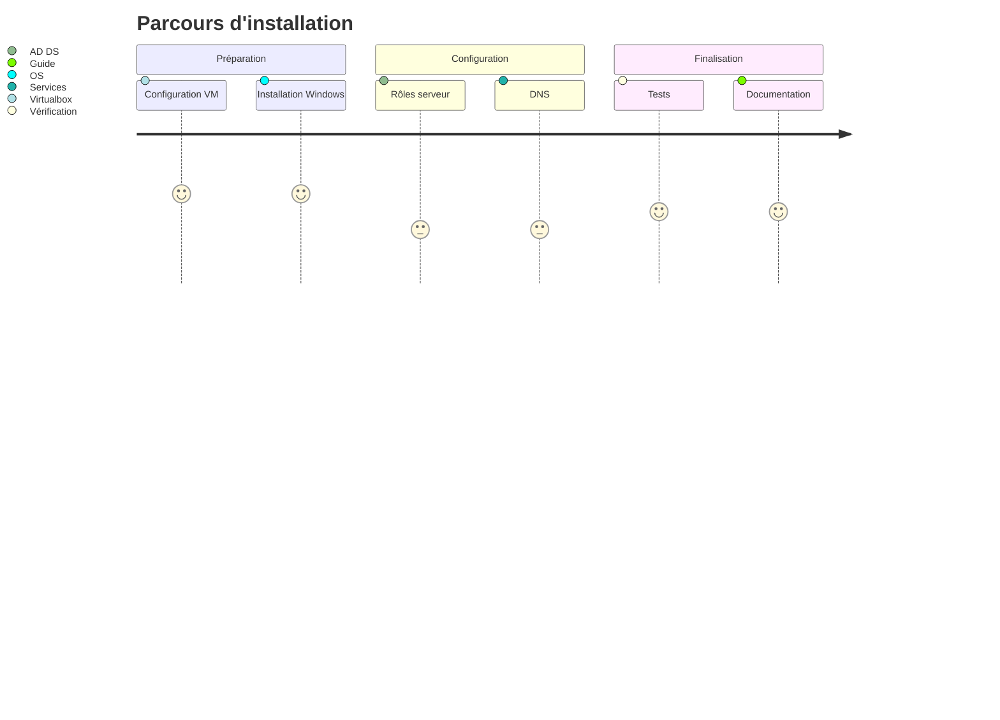

# Chapitre 1: Introduction et installation de Windows Server

> 📚 **Dans ce chapitre:**
> 1. 🔗 [Les réseaux décentralisés VS centralisés](#1-les-réseaux-décentralisés-vs-centralisés-avec-active-directory)
>    - Avantages et inconvénients
> 2. 🖥️ [Qu'est-ce que c'est Active Directory?](#2-quest-ce-que-cest-active-directory)
>    - Composants principaux
>    - Fonctionnalités clés
> 3. 💻 [Windows Server](#2-windows-server)
>    - Machines virtuelles
>    - Installation et configuration

---

## 1. Les réseaux décentralisés VS centralisés avec Active Directory

Imaginez, par exemple, que **vous êtes le responsable informatique d'un magasin d'électronique** d'une entreprise **Computer Electronics** (computerelectronics.be). 
Vous avez actuellement 10 ordinateurs, 2 imprimantes et 2 serveurs (pour la base de données et pour la messagerie). 

Vous **devez gérer chaque ordinateur individuellement**, en vous assurant que chaque utilisateur a le bon mot de passe, que chaque imprimante est configurée correctement, que chaque serveur est mis à jour, etc.

Vous **allez vite vous trouver en difficulté**. Pourquoi?

Reponse

- Chaque fois qu'un employé part, il est difficile de s'assurer que son compte est supprimé sur tous les ordinateurs et serveurs.
- Si vous ajoutez une nouvelle imprimante, vous devez configurer chaque ordinateur séparément pour qu'il puisse l'utiliser. Si vous oubliez un ordinateur, les utilisateurs de cet ordinateur ne pourront pas imprimer. 
- Pareil pour les serveurs. Si vous avez des unités de stockage dans serveurs, vous devez refaire le mapping sur chaque ordinateur.

---

## 2. Qu'est-ce que c'est Active Directory? 

🔑 Active Directory **arrange ce problème en centralisant** la gestion des utilisateurs et des ordinateurs:

> **Point clé:** Active Directory implique de stocker toutes les informations dans une seule base de données qui se trouvera sur un serveur (et non sur chaque ordinateur).

💻 **Active Directory** est une technologie de Microsoft qui fonctionne comme un "annuaire d'entreprise" numérique centralisant:

| Catégorie | Description | Exemples |
|------------|-------------|----------|
| 👤 **Utilisateurs** | Comptes du personnel | Employés, prestataires |
| 🖥️ **Ressources** | Matériel réseau | Serveurs, imprimantes |
| 🔑 **Permissions** | Droits d'accès | Lecture, écriture, connexion |
| 🛡️ **Sécurité** | Stratégies de protection | Politiques de mot de passe |

Tous ces aspects **peuvent être gérés depuis un seul endroit, le serveur Active Directory**.
**AD fonctionne sur Windows**. Nous allons l'utiliser concrètement sur **Windows Server**.

**Centraliser ou ne pas centraliser?**

Vous vous posez la question : "Est-ce une bonne idée de centraliser toute la gestion?"
Qu'est-ce que vous en pensez? Ne regardez pas la solution!

📘 Les avantages de la centralisation

### ✅ Les bénéfices clés

| Catégorie | Avantages |
|------------|------------|
| 💻 **Gestion Simplifiée** | • Administration centralisée • Déploiement simultané • Mises à jour automatisées |
| 🔐 **Sécurité Améliorée** | • Gestion centralisée des mots de passe • Contrôle d'accès précis • Traçabilité des actions |
| 💰 **Optimisation des Coûts** | • Réduction du temps de maintenance • Moins de déplacements • Optimisation des licences |

⚠️ Points d'attention et solutions

### 🔴 Risques Potentiels

| Risque | Impact | Solution |
|--------|---------|----------|
| 💥 **Panne Serveur** | • Arrêt total des services • Paralysie de l'entreprise | • Serveur de secours • Plan de continuité |
| 🦠 **Sécurité** | • Vulnérabilité centralisée • Risque de propagation | • Protection renforcée • Surveillance active |
| 🔗 **Dépendance Réseau** | • Besoin de connectivité • Accès limité hors ligne | • Réseau redondant • Cache local |

### 🔧 Stratégies de Mitégation

> 📘 **Plan de continuité:**
> - Serveur secondaire de backup
> - Sauvegardes régulières
> - Procédures d'urgence documentées

---

## 3. Windows Server 

> 📍 **Point de départ:** On a considéré que les avantages étaient plus importants que les risques ! Nous allons donc utiliser Active Directory.

### 🗓 Étapes d'implémentation

**Active Directory (AD)** est un ensemble de services qui a besoin d'être installé sur **Windows Server**. 

**Windows Server est un système d'exploitation** conçu spécifiquement pour les serveurs d'entreprise. Il offre :
- Des fonctionnalités avancées de **gestion de réseau**
- La possibilité d'installer des **services d'entreprise comme Active Directory**
- Une **sécurité renforcée** adaptée aux environnements professionnels
- Des **outils d'administration centralisés**
- La possibilité de **gérer de nombreux utilisateurs** et connexions simultanées

### 3.1. Les machines virtuelles ?

**Nous devons nous assurer que nos expériences ne modifient pas la configuration de notre ordinateur**. Nous devons également **pouvoir facilement restorer une configuration de départ** si nous faisons des erreurs.

**La solution est d'utiliser des machines virtuelles**. Les avantages sont :
* **Chaque machine virtuelle sera indépendante de l'autre et de notre ordinateur physique**.

**Exemple**: on peut créer une machine virtuelle qui contiendra Windows Server, et une autre qui contiendra un autre système d'exploitation. Ou deux machines virtuelles, chacun avec un système d'exploitation différent... les posibilités sont infinies!

* Nous pourrons ainsi **modifier la configuration de chaque machine virtuelle sans craindre de modifier notre ordinateur physique**.
 
* De plus, **nous pourrons facilement supprimer une machine virtuelle et en créer une nouvelle si nous faisons des erreurs**.

### 3.2. Installation de Windows Server avec Hyper-V (Windows)

**IMPORTANT:** si vous n'utilisez pas Windows, vous pouvez utiliser **VirtualBox** au lieu d'Hyper-V. Allez sur [Installation-Windows-Server-2022-VirtualBox.md](Installation-Windows-Server-2022-VirtualBox.md).

Nous allons créer une première machine virtuelle et y installer Windows Server.

L'outil de virtualisation que nous allons utiliser est **Hyper-V**.

### 3.2.1. Activation de Hyper-V dans Windows

- Dans la barre de recherche de Windows, tapez **Activer ou désactiver des fonctionnalités Windows**
- Cliquez sur **Activer ou désactiver des fonctionnalités Windows**
- Cochez la case **Hyper-V** et cliquez sur **OK**
- Redémarrez Windows

### 3.2.2. Création des réseaux virtuels en Hyper-V

Avant de créer la machine virtuelle contenant Windows Server, nous allons créer deux réseaux virtuels, car l'installation de Windows Server demandera de choisir la configuration des réseaux.

Nos machines virtuelles seront connectées à Internet via le réseau **WAN-VM** et elles se connecteront entre elles via le réseau **LAN-VM**

- Un réseau qui servira à permettre **la communication entre les appareils dans notre réseau interne** (ex: clients, serveurs, etc)
- Un réseau pour que nos machines virtuelles communiquent avec Internet

Il y a trois types de réseau :

- *External* : permet la communication entre tous les équipements physiques de notre réseau et les machines virtuelles qui y sont installées.
- *Internal* : permet la communication entre notre équipement physique et les machines virtuelles installées dans l'équipement. On ne peut pas communiquer avec d'autres machines en dehors de la nôtre, ni avec des machines virtuelles installées dans d'autres équipements physiques. 
- *Private* : permet la communication uniquement entre les machines virtuelles installées dans l'équipement, même pas entre l'équipement et ces machines virtuelles.

Commençons par créer le réseau interne :

1. Lancez le Hyper-V Manager depuis la barre des tâches de Windows
2. Cliquez sur Virtual Switch Manager
3. Choisissez Private
4. Cliquez sur Create Virtual Switch
5. Nommez le réseau **LAN-VM**
6. Cliquez sur OK

Puis créons le réseau qui connectera les machines virtuelles à Internet :

1. Cliquez sur Virtual Switch Manager
2. Choisissez External
3. Cliquez sur Create Virtual Switch
4. Nommez le réseau **WAN-VM**
5. Adaptateur : choisissez l'adaptateur qui vous connecte à Internet (câble ou wifi). Cliquez sur OK et ignorez l'avertissement
6. Cliquez sur OK

### 3.2.3. Téléchargement de Windows Server

Vous pouvez télécharger Windows Server 2022 depuis [cette page](https://www.microsoft.com/en-us/evalcenter/download-windows-server-2022). Il s'agit d'une version d'évaluation de 180 jours

